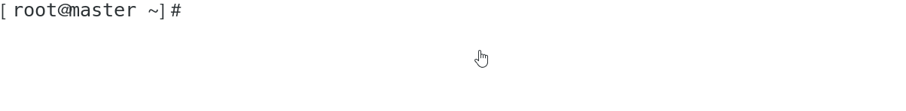

# kubernetes
本文档是kubernetes1.16.1二进制安装的第一篇

## 注意 本文所有操作均在所有节点执行

本文环境

| 名称                 | 配置          |
| -------------------- | ------------- |
| Kubernetes版本       | v1.16.1       |
| Cluster Pod CIDR     | 10.244.0.0/16 |
| Cluster Service CIDR | 10.250.0.0/24 |
| kubernetes service   | 10.250.0.1    |
| dns service          | 10.250.0.10   |

本文档主要介绍在裸机环境下以二进制的方式安装部署kubernetes

本次文档主要是对于kubernetes 1.16.1版本

内容主要有环境准备安装配置docker 升级内核 调整系统参数

## 环境准备

| 主机名 | IP            | 组件                                                         | 配置   |
| ------ | ------------- | ------------------------------------------------------------ | ------ |
| master | 192.168.10.10 | etcd、apiserver、controller-manager、schedule、kube-proxy、kubelet、docker-ce | 2核 4G |
| node1  | 192.168.10.11 | etcd、kube-proxy、kubelet、docker-ce                         | 2核 4G |
| node2  | 192.168.10.12 | etcd、kube-proxy、kubelet、docker-ce                         | 2核 4G |

以下操作除非具体说明的步骤  其他的均在所有节点执行

### 配置节点主机名 主机名解析 和免密登陆略过

测试通信

```
for i in  master node1 node2 ; do ssh root@$i "hostname";done
```



### 升级内核

  安装内核语言编译器（内核是用perl语言编写的）

	yum -y install perl

  下载密钥和yum源

  导入密钥

	rpm --import https://www.elrepo.org/RPM-GPG-KEY-elrepo.org

  安装7版本的yum源文件

	yum -y install https://www.elrepo.org/elrepo-release-7.0-4.el7.elrepo.noarch.rpm

  安装 ml版本 5版本的内核名字叫ml

	yum  --enablerepo="elrepo-kernel"  -y install kernel-ml.x86_64

附：4.4版本内核安装方法

```
yum   --enablerepo="elrepo-kernel" -y install kernel-lt.x86_64
```

然后配置从新的内核启动

	grub2-set-default 0

  然后重新生成grub2.cfg 使虚拟机使用新内核启动

	grub2-mkconfig -o /boot/grub2/grub.cfg

### 调整系统内核参数

```shell
cat > /etc/sysctl.conf <<EOF
net.bridge.bridge-nf-call-iptables=1
net.bridge.bridge-nf-call-ip6tables=1
net.ipv4.ip_forward=1
vm.swappiness=0
vm.overcommit_memory=1
vm.panic_on_oom=0
fs.inotify.max_user_instances=8192
fs.inotify.max_user_watches=1048576
fs.file-max=52706963
fs.nr_open=52706963
net.ipv6.conf.all.disable_ipv6=1
net.netfilter.nf_conntrack_max=2310720
EOF
```

  然后执行sysctl -p 使配置的内核响应参数生效

	sysctl -p


### 关闭防火墙、selinux、swap、NetworkManager 

```shell
systemctl stop firewalld
systemctl disable firewalld
iptables -F && iptables -X && iptables -F -t nat && iptables -X -t nat
iptables -P FORWARD ACCEPT
sed -i '/ swap / s/^\(.*\)$/#\1/g' /etc/fstab
setenforce 0
sed -i 's/^SELINUX=.*/SELINUX=disabled/' /etc/selinux/config
systemctl stop NetworkManager
systemctl disable NetworkManager
```

### 修改资源限制

```shell
echo "* soft nofile 65536" >> /etc/security/limits.conf
echo "* hard nofile 65536" >> /etc/security/limits.conf
echo "* soft nproc 65536"  >> /etc/security/limits.conf
echo "* hard nproc 65536"  >> /etc/security/limits.conf
echo "* soft memlock unlimited"  >> /etc/security/limits.conf
echo "* hard memlock unlimited"  >> /etc/security/limits.conf
```

### 常用软件安装

```shell
yum -y install bridge-utils chrony ipvsadm ipset sysstat conntrack libseccomp wget tcpdump screen vim nfs-utils bind-utils wget socat telnet sshpass net-tools sysstat lrzsz yum-utils device-mapper-persistent-data lvm2 tree nc lsof strace nmon iptraf iftop rpcbind mlocate ipvsadm
```

### 加载内核ipvs模块

```shell
cat > /etc/sysconfig/modules/ipvs.modules <<EOF

#!/bin/bash
modprobe -- ip_vs
modprobe -- ip_vs_rr
modprobe -- ip_vs_wrr
modprobe -- ip_vs_sh
modprobe -- nf_conntrack_ipv4

EOF
chmod 755 /etc/sysconfig/modules/ipvs.modules
bash /etc/sysconfig/modules/ipvs.modules
lsmod | grep -e ip_vs -e nf_conntrack_ipv4
```

### 安装docker-ce：

添加yun源

	tee /etc/yum.repos.d/docker-ce.repo <<-'EOF'
	[aliyun-docker-ce]
	name=aliyun-docker-ce
	baseurl=https://mirrors.aliyun.com/docker-ce/linux/centos/7/x86_64/stable/
	enable=1
	gpgcheck=1
	gpgkey=https://mirrors.aliyun.com/docker-ce/linux/centos/gpg
	EOF

安装docker-ce

	yum -y install docker-ce

  重启docker并设置为开机自启

	systemctl daemon-reload
	systemctl restart docker
	systemctl enable docker

### 然后重启系统 验证内核是否升级成功

### [下一篇   下载命令](https://github.com/mytting/kubernetes/blob/master/A-%E4%BA%8C%E8%BF%9B%E5%88%B6%E5%AE%89%E8%A3%85Kubernetes/v1.16.1-B%20%E4%B8%8B%E8%BD%BD%E5%91%BD%E4%BB%A4.md)

