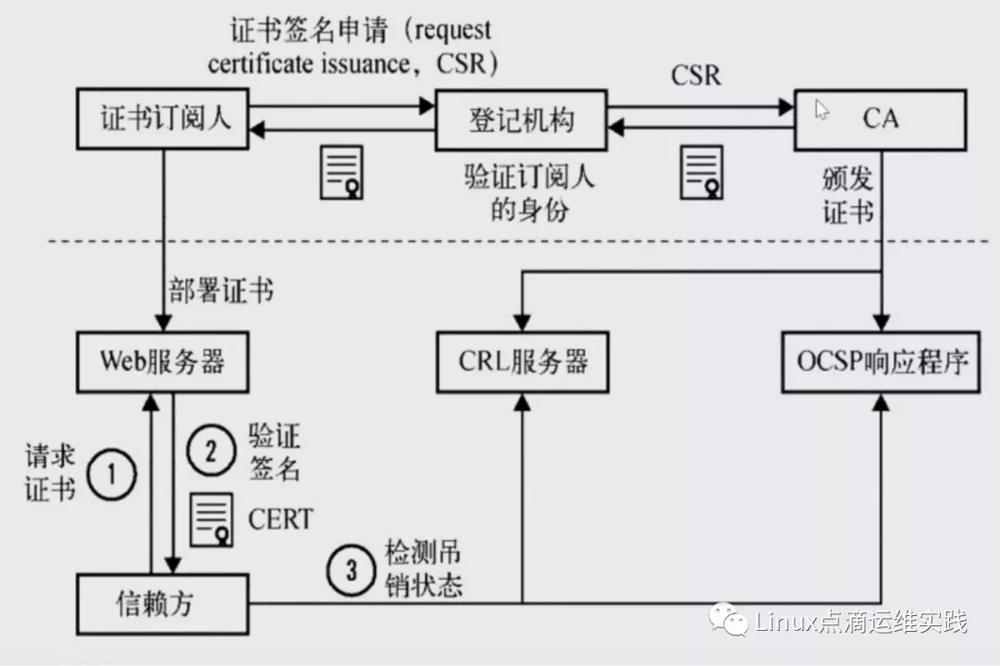

# kubernetes

本文档是kubernetes1.16.1二进制安装的第二篇

## 注意 本文所有操作均在master节点执行

### [上一篇  环境准备](https://github.com/mytting/kubernetes/blob/master/A-%E4%BA%8C%E8%BF%9B%E5%88%B6%E5%AE%89%E8%A3%85Kubernetes/v1.16.1-A%20%E7%8E%AF%E5%A2%83%E5%87%86%E5%A4%87.md)


## 下载kubectl和cfssl以及cfssljson命令

### 此举目的是下载创建证书以及配置文件需要的命令

kubectl命令是kubernetes的客户端，可以

### 下载kubectl命令


```
wget https://storage.googleapis.com/kubernetes-release/release/v1.17.3/bin/linux/amd64/kubectl
chmod +x kubectl
sudo mv kubectl /usr/local/bin/
kubectl version
```

显示1.17版本为正常 如果不显示 则重新下载  直到显示即可


显示信息


```
Client Version: version.Info{Major:"1", Minor:"16", GitVersion:"v1.16.1", GitCommit:"d647ddbd755faf07169599a625faf302ffc34458", GitTreeState:"clean", BuildDate:"2019-10-02T17:01:15Z", GoVersion:"go1.12.10", Compiler:"gc", Platform:"linux/amd64"}
The connection to the server localhost:8080 was refused - did you specify the right host or port?
```

使kubectl命令可以使用table键

```
source /usr/share/bash-completion/bash_completion 
source <(kubectl completion bash)
```


### 

**PKI基础概念**


**什么是PKI？**

公开密钥基础建设（英语：Public Key Infrastructure，缩写：PKI），又称公开密钥基础架构、公钥基础建设、公钥基础设施、公开密码匙基础建设或公钥基础架构，是一组由硬件、软件、参与者、管理政策与流程组成的基础架构，其目的在于创造、管理、分配、使用、存储以及撤销数字证书。（节选维基百科）

PKI是借助CA（权威数字证书颁发/认证机构）将用户的个人身份跟公开密钥链接在一起，它能够确保每个用户身份的唯一性，这种链接关系是通过注册和发布过程实现，并且根据担保级别，链接关系可能由CA和各种软件或在人为监督下完成。PKI用来确定链接关系的这一角色称为RA（Registration Authority, 注册管理中心），RA能够确保公开密钥和个人身份链接，可以防抵赖，防篡改。在微软的公钥基础建设下，RA又被称为CA，目前大多数称为CA。

**PKI组成要素**

从上面可以得知PKI的几个主要组成要素，用户（使用PKI的人或机构），认证机构（CA，颁发证书的人或机构），仓库（保存证书的数据库）等。

**非对称加密**

本文提到的密钥均为非对称加密，有公钥和私钥之分，并且他们总是成对出现，它们的特点就是其中一个加密的数据，只能使用另一个解密，即使它本身也无法解密，也就是说公钥加密的，私钥可以解密，私钥加密的，公钥可以解密。

**证书签名请求CSR**

它是向CA机构申请数字证书时使用的请求文件，这里的CSR不是证书，而向权威证书颁发机构获得签名证书的申请，当CA机构颁发的证书过期时，你可以使用相同的CSR来申请新的证书，此时key不变。

**数字签名**

数字签名就是“非对称加密+摘要算法”，其目的不是为了加密，而是为了防抵赖或者他们篡改数据。其核心思想是：比如A要给B发送数据，A先用摘要算法得到数据的指纹，然后用A的私钥加密指纹，加密后的指纹就是A的签名，B收到数据和A的签名后，也用同样的摘要算法计算指纹，然后用A公开的公钥解密签名，比较两个指纹，如果相同，说明数据没有被篡改，确实是A发过来的数据。假设C想改A发给B的数据来欺骗B，因为篡改数据后指纹会变，要想跟A的签名里面的指纹一致，就得改签名，但由于没有A的私钥，所以改不了，如果C用自己的私钥生成一个新的签名，B收到数据后用A的公钥根本就解不开。(来源于网络)

**数字证书格式**

数字证书格式有很多，比如.pem，.cer或者.crt等。

**PKI工作流程**

下图来源于网络，上半部分最右边就是CA机构，可以颁发证书。证书订阅人，首先去申请一个证书，为了申请这个证书，需要去登记，告诉它，我是谁，我属于哪个组织，到了登记机构，再通过CSR，发送给CA中心，CA中心通过验证通过之后 ，会颁发一对公钥和私钥，并且公钥会在CA中心存一份；证书订阅人拿到证书以后，部署在服务器；




当用户访问我们的web服务器时，它会请求我们的证书，服务器会把公钥发送给我们的客户端，客户端会去验证我们证书的合法性，客户端是如何验证证书是否有效呢？CA中心会把过期证书放在CRL服务器上面 ，这个CRL服务会把所有过期的证书形成一条链条，所以他的性能非常的差，所以又推出了OCSP程序，OCSP可以就一个证书进行查询，它是否过期，浏览器可以直接去查询OCSP响应程序，但OCSP响应程序效率还不是很高，最终往往我们会把web服务器如nginx有一个ocsp开关，当我们打开这个开关以后，会有nginx服务器主动的去ocsp服务器去查询，这样大量的客户端直接从web服务器就可以直接获取到证书是否有效。

**CFSSL介绍**

**CFSSL是什么？**

cfssl是使用go编写，由CloudFlare开源的一款PKI/TLS工具。主要程序有cfssl，是CFSSL的命令行工具，cfssljson用来从cfssl程序获取JSON输出，并将证书，密钥，CSR和bundle写入文件中。

### 安装CFSSL

可能下载时间较长

```
wget https://pkg.cfssl.org/R1.2/cfssl_linux-amd64
wget https://pkg.cfssl.org/R1.2/cfssljson_linux-amd64
wget https://pkg.cfssl.org/R1.2/cfssl-certinfo_linux-amd64
chmod +x cfssl_linux-amd64 cfssljson_linux-amd64 cfssl-certinfo_linux-amd64
mv cfssl_linux-amd64 /usr/local/bin/cfssl
mv cfssljson_linux-amd64 /usr/local/bin/cfssljson
mv cfssl-certinfo_linux-amd64 /usr/bin/cfssl-certinfo
cfssl version
```

版本应该是1.2.0及以上版本

显示信息

```
Version: 1.2.0
Revision: dev
Runtime: go1.6
```


### [下一篇   生成证书](https://github.com/mytting/kubernetes/blob/master/A-%E4%BA%8C%E8%BF%9B%E5%88%B6%E5%AE%89%E8%A3%85Kubernetes/v1.16.1-C%20%E7%94%9F%E6%88%90%E8%AF%81%E4%B9%A6.md)

