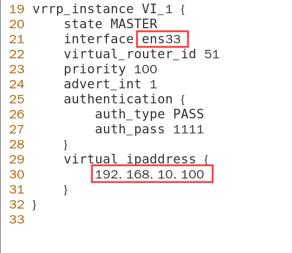
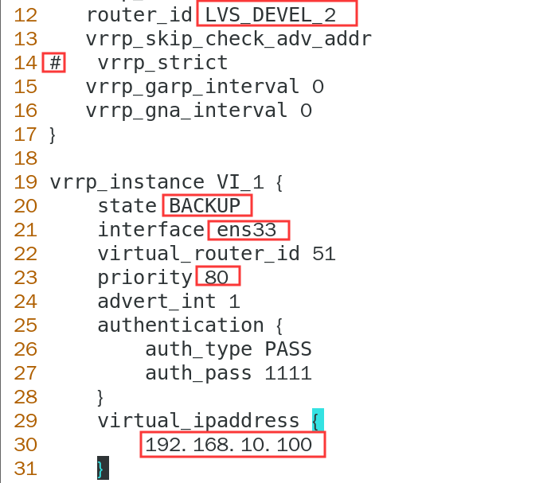
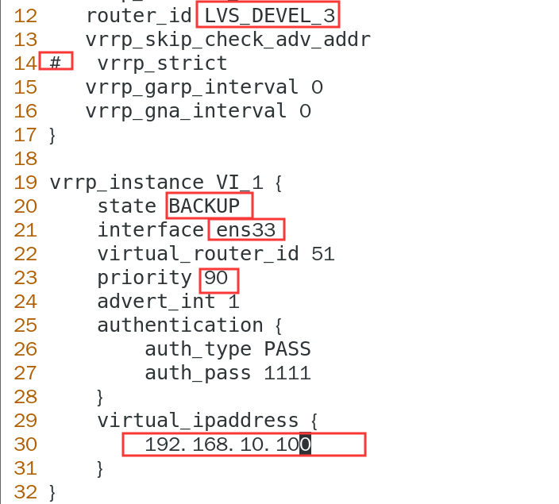
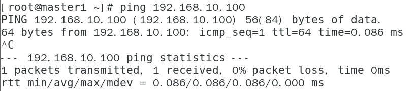

# kubernetes

本文档是kubernetes1.16.1二进制安装高可用Kubernetes集群的第六篇

## 部署keepalived+HAProxy

[上一篇 部署etcd集群](https://github.com/mytting/kubernetes/blob/master/A-%E4%BA%8C%E8%BF%9B%E5%88%B6%E5%AE%89%E8%A3%85%E9%AB%98%E5%8F%AF%E7%94%A8Kubernetes%E9%9B%86%E7%BE%A4/v1.16.1-E%20%E9%83%A8%E7%BD%B2etcd%E9%9B%86%E7%BE%A4.md)

keepalived和HAProxy对kubernetes集群的主节点进行调度和提供VIP

所有主节点安装依赖环境

```
yum -y install  libnl libnl-devel　popt-devel openssl-devel kernel-devel libnfnetlink-devel libnl-devel ipvsadm
```

加载内核模块

```
modprobe ip_vs
```

master节点安装keepalived

```
yum -y install keepalived
```

修改配置文件

```
vim /etc/keepalived/keepalived.conf
```

master1




master2




master3



### 所有master节点启动keepalived

```
systemctl enable keepalived.service
systemctl restart keepalived.service
```

ping虚拟IP



### master节点安装HAProxy

所有master节点安装依赖关系

```
yum -y install pcre-devel bzip2-devel openssl openssl-devel systemd-devel.x86_64
```

所有master节点下载软件包

```
wget https://www.haproxy.org/download/2.0/src/haproxy-2.0.5.tar.gz
```

解压 编译 配置 安装haproxy

```
tar -zxvf haproxy-2.0.5.tar.gz -C /usr/src/
cd /usr/src/haproxy-2.0.5/
make TARGET=linux53 PREFIX=/usr/local/haproxy
make install PREFIX=/usr/local/haproxy
ln -s /usr/local/haproxy/sbin/haproxy /usr/sbin/
cp /usr/src/haproxy-2.0.5/examples/haproxy.init /etc/init.d/haproxy
chmod a+x /etc/init.d/haproxy
chkconfig --add haproxy
chkconfig haproxy on
mkdir /etc/haproxy
```

添加配置文件

```
cat > /etc/haproxy/haproxy.cfg <<EOF
global#全局设置
daemon#以后台进程运行
maxconn 256#每个进程的最大连接数
nbproc 1#进程数，该值可以设置小于或等于cpu核心数
#balance                roundrobin#默认的负载均衡的方式,轮询方式
#balance source                         #默认的负载均衡的方式,类似nginx的ip_hash 
#balance leastconn                       #默认的负载均衡的方式,最小连接  
#     log  127.0.0.1 local0             #定义日志格式 log是关键字 127.0.0.1是接收日志信息的设备local0是日志服务自带的日志设备 可以用来让用户自定义日志级别
#     log 127.0.0.1  local1 notice
#     chroot /usr/share/haproxy         #指定haproxy的工作目录 如果指定该选项 则开启服务前需要创建指定的工作目录
#     uid 99                            #指定haproxy的程序用户
#     gid 99                            #指定haproxy的组
defaults#默认设置
mode tcp#设置http(七层模式)，也可设置为tcp(四层模式)，另外还有一个Health健康监测模式。对mysql进行负载均衡的话，这里记得修改为tcp
timeout connect 5000ms
timeout client 50000ms
timeout server 50000ms
#　　log global                         #日志格式继承全局
#     option dontlognull
#     option httplog
#     retries 3                          #对后端节点健康检查的重试次数超过3次没连接上则任务节点不可用（次数可自定义#）
#     redispatch

balance         source#默认的负载均衡的方式,轮询方式
frontend http-in#配置前端访问端口
bind *:8443#通过该端口进行负载均衡
default_backend servers#指定后端服务器
backend servers
server master1 192.168.10.10:6443  check inter 2000 rise 3 fall 3 weight 1 maxconn 32　　
#建议加上check，否则后台服务器A宕机了，负载均衡还会把请求发送到该宕机服务器上，inter 2000指check检测时间为2000毫秒，rise 3检测3次均正常则表示后天服务器正常，fall 3检测3次失败，则会把该后天服务器标志宕机，不再玩>该后台服务器发送请求，weight 1指权重，取消weight改为backup，则是所有后台服务器宕机后才会启用该backup后台服务器
server master2 192.168.10.11:6443  check inter 2000 rise 3 fall 3 weight 1 maxconn 32
server master3 192.168.10.12:6443  check inter 2000 rise 3 fall 3 weight 1 maxconn 32
EOF
```

启动服务

```
systemctl enable haproxy
systemctl restart haproxy
```

查看启动状态（状态为运行中即可）

```
systemctl status haproxy.service
```

### [下一篇 部署master组件](https://github.com/mytting/kubernetes/blob/master/A-%E4%BA%8C%E8%BF%9B%E5%88%B6%E5%AE%89%E8%A3%85%E9%AB%98%E5%8F%AF%E7%94%A8Kubernetes%E9%9B%86%E7%BE%A4/v1.16.1-G%20%E9%83%A8%E7%BD%B2master%E7%BB%84%E4%BB%B6.md)