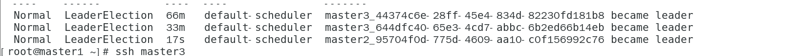

# kubernetes

本文档是kubernetes1.16.1二进制安装高可用Kubernetes集群的第七篇

## 注意 本文所有操作均在master节点执行

### [上一篇 部署keepalived+HAProxy](https://github.com/mytting/kubernetes/blob/master/A-%E4%BA%8C%E8%BF%9B%E5%88%B6%E5%AE%89%E8%A3%85%E9%AB%98%E5%8F%AF%E7%94%A8Kubernetes%E9%9B%86%E7%BE%A4/v1.16.1-F%20%E9%83%A8%E7%BD%B2keepalived%2BHAProxy.md)

本文主要介绍kubernetes master组件的安装

附 v1.16.1版本软件包的下载地址

```
https://dl.k8s.io/v1.16.1/kubernetes-server-linux-amd64.tar.gz
```

 本部分将会在控制节点上部署 Kubernetes 控制服务。每个控制节点上需要部署的服务包括：Kubernetes API Server、Scheduler 以及 Controller Manager 等。

kube-apiserver是无状态的，无需选主

 部署高可用 kube-scheduler 集群，该集群包含 3 个节点，启动后将通过竞争选举机制产生一个 leader 节点，其它节点为阻塞状态。当 leader 节点不可用后，剩余节点将再次进行选举产生新的 leader 节点，从而保证服务的可用性。

 部署高可用 kube-controller-manager 集群，该集群包含 3 个节点，启动后将通过竞争选举机制产生一个 leader 节点，其它节点为阻塞状态。当 leader 节点不可用后，剩余节点将再次进行选举产生新的 leader 节点，从而保证服务的可用性。


## 1下载并安装kubernetes组件可执行文件

kubectl 文件已经下载过了 可以选择不下载

```
wget --timestamping \
  "https://storage.googleapis.com/kubernetes-release/release/v1.16.1/bin/linux/amd64/kube-apiserver" \
  "https://storage.googleapis.com/kubernetes-release/release/v1.16.1/bin/linux/amd64/kube-controller-manager" \
  "https://storage.googleapis.com/kubernetes-release/release/v1.16.1/bin/linux/amd64/kube-scheduler" \
  "https://storage.googleapis.com/kubernetes-release/release/v1.16.1/bin/linux/amd64/kubectl"
chmod +x kube-apiserver kube-controller-manager kube-scheduler kubectl
mv kube-apiserver kube-controller-manager kube-scheduler kubectl /usr/local/bin/
```

拷贝到master2和master3节点的对应目录

```
scp /usr/local/bin/kubectl master2:/usr/local/bin/
scp /usr/local/bin/kubectl master3:/usr/local/bin/
scp /usr/local/bin/kube-scheduler master2:/usr/local/bin/
scp /usr/local/bin/kube-scheduler master3:/usr/local/bin/
scp /usr/local/bin/kube-controller-manager master2:/usr/local/bin/
scp /usr/local/bin/kube-controller-manager master3:/usr/local/bin/
scp /usr/local/bin/kube-apiserver master2:/usr/local/bin/
scp /usr/local/bin/kube-apiserver master3:/usr/local/bin/
```


## 3 生成kube-apiserver.service systemd配置文件

```
cat <<EOF | sudo tee /etc/systemd/system/kube-apiserver.service
[Unit]
Description=Kubernetes API Server
Documentation=https://github.com/kubernetes/kubernetes

[Service]
ExecStart=/usr/local/bin/kube-apiserver \\
  --advertise-address=$VIP \\
  --allow-privileged=true \\
  --audit-log-maxage=30 \\
  --audit-log-maxbackup=3 \\
  --audit-log-maxsize=100 \\
  --audit-log-path=/var/log/audit.log \\
  --authorization-mode=Node,RBAC \\
  --bind-address=0.0.0.0 \\
  --client-ca-file=/var/lib/kubernetes/ca.pem \\
  --enable-admission-plugins=NamespaceLifecycle,LimitRanger,ServiceAccount,DefaultStorageClass,DefaultTolerationSeconds,MutatingAdmissionWebhook,ValidatingAdmissionWebhook,ResourceQuota \\
  --enable-swagger-ui=true \\
  --etcd-cafile=/usr/local/etcd/ssl/ca.pem \\
  --etcd-certfile=/usr/local/etcd/ssl/etcd.pem \\
  --etcd-keyfile=/usr/local/etcd/ssl/etcd-key.pem \\
  --etcd-servers=https://$MASTER1_IP:2379,https://$MASTER2_IP:2379,https://$MASTER3_IP:2379 \\
  --event-ttl=1h \\
  --experimental-encryption-provider-config=/var/lib/kubernetes/encryption-config.yaml \\
  --insecure-bind-address=127.0.0.1 \\
  --kubelet-certificate-authority=/var/lib/kubernetes/ca.pem \\
  --kubelet-client-certificate=/var/lib/kubernetes/kubernetes.pem \\
  --kubelet-client-key=/var/lib/kubernetes/kubernetes-key.pem \\
  --kubelet-https=true \\
  --runtime-config=api/all \\
  --service-account-key-file=/var/lib/kubernetes/service-account.pem \\
  --service-cluster-ip-range=10.250.0.0/24 \\
  --service-node-port-range=30000-32767 \\
  --tls-cert-file=/var/lib/kubernetes/kubernetes.pem \\
  --tls-private-key-file=/var/lib/kubernetes/kubernetes-key.pem \\
  --v=2
Restart=on-failure
RestartSec=5

[Install]
WantedBy=multi-user.target
EOF
```

 --experimental-encryption-provider-config：启用加密特性；

\#--authorization-mode=Node,RBAC： 开启 Node 和 RBAC 授权模式，拒绝未授权的请求；

\#--enable-admission-plugins：启用 ServiceAccount 和 NodeRestriction；

\#--service-account-key-file：签名 ServiceAccount Token 的公钥文件，kube-controller-manager 的 --service-account-#private-key-file 指定私钥文件，两者配对使用；

\#--tls-*-file：指定 apiserver 使用的证书、私钥和 CA 文件。--client-ca-file 用于验证 client (kue-controller-manager、kube-scheduler、kubelet、kube-proxy 等)请求所带的证书；

\#--kubelet-client-certificate、--kubelet-client-key：如果指定，则使用 https 访问 kubelet APIs；需要为证书对应的用户(上面 kubernetes*.pem 证书的用户为 kubernetes) 用户定义 RBAC 规则，否则访问 kubelet API 时提示未授权；

\#--bind-address： 不能为 127.0.0.1，否则外界不能访问它的安全端口 6443；

\#--insecure-port=0：关闭监听非安全端口(8080)；

\#--service-cluster-ip-range： 指定 Service Cluster IP 地址段；

\#--service-node-port-range： 指定 NodePort 的端口范围；

\#--runtime-config=api/all=true： 启用所有版本的 APIs，如 autoscaling/v2alpha1；

\#--enable-bootstrap-token-auth：启用 kubelet bootstrap 的 token 认证；


拷贝到另外两台主节点

```
scp /etc/systemd/system/kube-apiserver.service master2:/etc/systemd/system/kube-apiserver.service
scp /etc/systemd/system/kube-apiserver.service master3:/etc/systemd/system/kube-apiserver.service
```


## 4 生成kube-controller-manager.service systemd配置文件


```
cat <<EOF | sudo tee /etc/systemd/system/kube-controller-manager.service
[Unit]
Description=Kubernetes Controller Manager
Documentation=https://github.com/kubernetes/kubernetes

[Service]
ExecStart=/usr/local/bin/kube-controller-manager \\
  --address=127.0.0.1 \\
  --allocate-node-cidrs=true \\
  --cluster-cidr=10.244.0.0/16 \\
  --cluster-name=kubernetes \\
  --cluster-signing-cert-file=/var/lib/kubernetes/ca.pem \\
  --cluster-signing-key-file=/var/lib/kubernetes/ca-key.pem \\
  --kubeconfig=/var/lib/kubernetes/kube-controller-manager.kubeconfig \\
  --leader-elect=true \\
  --root-ca-file=/var/lib/kubernetes/ca.pem \\
  --service-account-private-key-file=/var/lib/kubernetes/service-account-key.pem \\
  --service-cluster-ip-range=10.250.0.0/24 \\
  --use-service-account-credentials=true \\
  --v=2
Restart=on-failure
RestartSec=5

[Install]
WantedBy=multi-user.target
EOF
```

拷贝到另外两台节点

```
scp /etc/systemd/system/kube-controller-manager.service master2:/etc/systemd/system/
scp /etc/systemd/system/kube-controller-manager.service master3:/etc/systemd/system/
```


## 5 生成kube-scheduler.service systemd配置文件

```
for host in master1 master2 master3 ; \
  do ssh root@$host \
  "mkdir /etc/kubernetes/config/ -p" ; done
```

```
cat <<EOF | sudo tee /etc/kubernetes/config/kube-scheduler.yaml
apiVersion: kubescheduler.config.k8s.io/v1alpha1
kind: KubeSchedulerConfiguration
clientConnection:
  kubeconfig: "/var/lib/kubernetes/kube-scheduler.kubeconfig"
leaderElection:
  leaderElect: true
EOF
```

拷贝到另外两台节点

```
scp /etc/kubernetes/config/kube-scheduler.yaml master2:/etc/kubernetes/config/
scp /etc/kubernetes/config/kube-scheduler.yaml master3:/etc/kubernetes/config/
```


```
cat <<EOF | sudo tee /etc/systemd/system/kube-scheduler.service
[Unit]
Description=Kubernetes Scheduler
Documentation=https://github.com/kubernetes/kubernetes

[Service]
ExecStart=/usr/local/bin/kube-scheduler \\
  --config=/etc/kubernetes/config/kube-scheduler.yaml \\
  --leader-elect=true \\
  --v=2
Restart=on-failure
RestartSec=5

[Install]
WantedBy=multi-user.target
EOF
```

拷贝到另外两台节点

```
scp /etc/systemd/system/kube-scheduler.service master2:/etc/systemd/system/
scp /etc/systemd/system/kube-scheduler.service master3:/etc/systemd/system/
```


## 6 所有主节点启动各组件

```
systemctl daemon-reload
systemctl enable kube-apiserver kube-controller-manager kube-scheduler
systemctl restart kube-apiserver kube-controller-manager kube-scheduler
```

请等待10秒以便 kubernetes api server初始化

查看各组件状态

```
systemctl status kube-apiserver kube-controller-manager kube-scheduler
```


## 7 拷贝admin 的kubeconfig 为kubectl默认读取的.kube/config

```
cd
cp admin.kubeconfig .kube/config
```

查看集群信息

```
kubectl cluster-info
```

输出信息

```
Kubernetes master is running at https://127.0.0.1:6443

To further debug and diagnose cluster problems, use 'kubectl cluster-info dump'.
```

查看 cs信息

```
kubectl get cs
```

输出信息

```
NAME                 AGE
scheduler            <unknown>
controller-manager   <unknown>
etcd-0               <unknown>
etcd-1               <unknown>
etcd-2               <unknown>
```

显示unknown是因为1.16版本的问题 有点小bug

查看kube-controller-manager和kube-schedule的选举信息

```
kubectl describe endpoints -n kube-system kube-controller-manager
```

输出信息

```
Name:         kube-controller-manager
Namespace:    kube-system
Labels:       <none>
Annotations:  control-plane.alpha.kubernetes.io/leader:
                {"holderIdentity":"master2_2f421827-0e78-4de9-b728-1b6118b531a8","leaseDurationSeconds":15,"acquireTime":"2019-11-14T01:34:02Z","renewTime...
Subsets:
Events:
  Type    Reason          Age   From                     Message
  ----    ------          ----  ----                     -------
  Normal  LeaderElection  62m   kube-controller-manager  master2_a84eb871-c72e-4e91-80fd-407de4a09746 became leader
  Normal  LeaderElection  30m   kube-controller-manager  master2_2f421827-0e78-4de9-b728-1b6118b531a8 became leader
```

kube-contorller的leader领导者为master2

```
kubectl describe endpoints -n kube-system kube-scheduler
```

输出信息

```
Name:         kube-scheduler
Namespace:    kube-system
Labels:       <none>
Annotations:  control-plane.alpha.kubernetes.io/leader:
                {"holderIdentity":"master3_644dfc40-65e3-4cd7-abbc-6b2ed66b14eb","leaseDurationSeconds":15,"acquireTime":"2019-11-14T01:34:03Z","renewTime...
Subsets:
Events:
  Type    Reason          Age   From               Message
  ----    ------          ----  ----               -------
  Normal  LeaderElection  64m   default-scheduler  master3_44374c6e-28ff-45e4-834d-82230fd181b8 became leader
  Normal  LeaderElection  32m   default-scheduler  master3_644dfc40-65e3-4cd7-abbc-6b2ed66b14eb became leader
```

kube-schedule的leader为master3

如果主节点down掉了，会自动选举leader



### [下一篇 RBAC授权](https://github.com/mytting/kubernetes/blob/master/A-%E4%BA%8C%E8%BF%9B%E5%88%B6%E5%AE%89%E8%A3%85%E9%AB%98%E5%8F%AF%E7%94%A8Kubernetes%E9%9B%86%E7%BE%A4/v1.16.1-H%20RBAC%E6%8E%88%E6%9D%83.md)