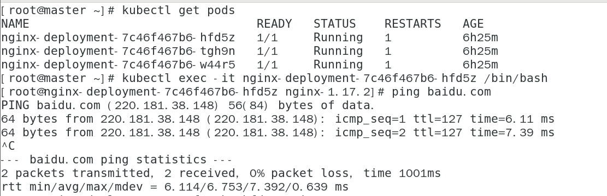

# kubernetes

本文档是kubernetes1.16.1二进制安装高可用Kubernetes集群的第十篇

## 注意 本文所有操作均在master节点执行

### [上一篇 部署工作节点](https://github.com/mytting/kubernetes/blob/master/A-%E4%BA%8C%E8%BF%9B%E5%88%B6%E5%AE%89%E8%A3%85Kubernetes/v1.16.1-H%20%E9%83%A8%E7%BD%B2%E5%B7%A5%E4%BD%9C%E8%8A%82%E7%82%B9.md)

本文主要介绍部署网络 dns 插件

本文的网络插件选用的是calico 以容器的方式运行
本文的dns'插件选用的是coredns以容器的方式运行

本文所有操作均在master1主节点上执行

## 1 下载calico网络插件的yaml文件

1.16版本的kubernetes calico网络插件应选用3.9及以上的版本

本文选用3.10

```
curl https://docs.projectcalico.org/v3.10/manifests/calico.yaml -O
```

## 2  修改网络插件yaml文件内容

```
sed -i 's|192.168.0.0|10.244.0.0|' calico.yaml
```

## 3 应用yaml文件

```
kubectl apply -f calico.yaml
```

查看pod状态

```
kubectl get pods -n kube-system
```

输出信息

```
NAME                                       READY   STATUS    RESTARTS   AGE
calico-kube-controllers-6b64bcd855-4jqnq   1/1     Running   0          2m25s
calico-node-24gjk                          1/1     Running   0          2m24s
calico-node-5gbw4                          1/1     Running   0          2m25s
calico-node-j9qmb                          1/1     Running   0          2m25s
calico-node-jvztf                          1/1     Running   0          2m24s
calico-node-mtpr8                          1/1     Running   0          2m24s
calico-node-vltcb                          1/1     Running   0          2m25s
```

网络插件安装成功

## 安装coredns插件

先下载jq命令(coredns提供的部署脚本需要使用jq命令对生成的yaml文件进行整理)

```
wget https://github.com/stedolan/jq/releases/download/jq-1.6/jq-linux64 -O /usr/bin/jq
chmod a+x /usr/bin/jq
```

克隆GitHub仓库

```
git clone https://github.com/coredns/deployment.git
```

执行

```
cd deployment/kubernetes/
```

```
./deploy.sh -i 10.250.0.10 | kubectl apply -f -
```

ip为开头写的集群dns的IP

输出信息

```
serviceaccount/coredns created
clusterrole.rbac.authorization.k8s.io/system:coredns created
clusterrolebinding.rbac.authorization.k8s.io/system:coredns created
configmap/coredns created
deployment.apps/coredns created
service/kube-dns created
```

查看pod

```
kubectl get pods -n kube-system
```

输出信息

```
NAME                                       READY   STATUS    RESTARTS   AGE
calico-kube-controllers-6d85fdfbd8-8v2hs   1/1     Running   0          91m
calico-node-984fd                          1/1     Running   0          91m
calico-node-n5kn8                          1/1     Running   0          91m
calico-node-q4p7c                          1/1     Running   0          91m
coredns-68567cdb47-6j7bb                   1/1     Running   0          5m31s
coredns-68567cdb47-7nwcg                   1/1     Running   0          5m31s
```

可以看到calico网络和coredns插件都好了


### 验证

进入pod内部 pingbaidu.com

如果能ping同 则插件部署完毕



## 安装Ingress-nginx插件

yaml[文件](https://github.com/mytting/kubernetes/blob/master/B-kubernetes%E5%9F%BA%E7%A1%80/yaml/nginx-ds.yaml)

点击上方超链接 将yaml文件的所有内容复制下来 保存到主节点的nginx-ingress.yaml文件内

然后

```
kubectl apply -f nginx-ingress.yaml
```

输出信息

```
namespace/ingress-nginx created
configmap/nginx-configuration created
configmap/tcp-services created
configmap/udp-services created
serviceaccount/nginx-ingress-serviceaccount created
clusterrole.rbac.authorization.k8s.io/nginx-ingress-clusterrole created
role.rbac.authorization.k8s.io/nginx-ingress-role created
rolebinding.rbac.authorization.k8s.io/nginx-ingress-role-nisa-binding created
clusterrolebinding.rbac.authorization.k8s.io/nginx-ingress-clusterrole-nisa-binding created
daemonset.apps/nginx-ingress-controller created
```

然后查看Pod

```
kubectl get pods -n ingress-nginx -o wide
```

输出信息 全部为Running即可

```
NAME                             READY   STATUS    RESTARTS   AGE     IP              NODE      NOMINATED NODE   READINESS GATES
nginx-ingress-controller-4xtvw   1/1     Running   3          5m13s   192.168.10.15   node3     <none>           <none>
nginx-ingress-controller-57vrv   1/1     Running   2          5m14s   192.168.10.13   node1     <none>           <none>
nginx-ingress-controller-7f4bm   1/1     Running   1          5m13s   192.168.10.10   master1   <none>           <none>
nginx-ingress-controller-fnx79   1/1     Running   1          5m14s   192.168.10.14   node2     <none>           <none>
nginx-ingress-controller-pqnrm   1/1     Running   1          5m14s   192.168.10.12   master3   <none>           <none>
nginx-ingress-controller-x274r   1/1     Running   0          5m13s   192.168.10.11   master2   <none>           <none>
```

Ingress-nginx插件安装完毕

# 集群部署完毕

