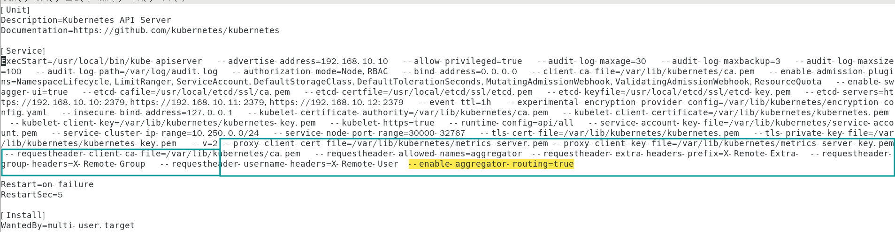
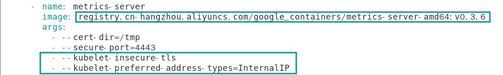

# HPA

## 1 什么是HPA

HPA(Horizontal Pod Autoscaler,水平Pod自动伸缩器)可根据观察到的CPU，内存使用率或自定义度量标准来自动扩展或缩容Pod的数量。HPA不适用于无法缩放的对象，比如Daemon Set。

HPA控制器会定期调整RC或Deployment的副本数，以使观察到的平均CPU利用率与用户指定的目标相匹配。

HPA需要metrics-server（项目地址：https://github.com/kubernetes-incubator/metrics-server）获取度量指标。

## 2 安装Metrics-server

本文基于二进制kubernetes1.16

克隆项目仓库

```shell
git clone https://github.com/kubernetes-incubator/metrics-server
```

创建集群证书

```shell
cd ssl/kubernetes/
```

创建证书签名请求

```shell
cat > metrics-server-csr.json <<EOF
{
  "CN": "aggregator",
  "hosts": [],
  "key": {
    "algo": "rsa",
    "size": 2048
  },
  "names": [
    {
      "C": "China",
      "L": "Beijing",
      "O": "Kubernetes",
      "OU": "Beijing",
      "ST": "Beijing"
    }
  ]
}
EOF
```


生成证书

```shell
cfssl gencert -ca=ca.pem -ca-key=ca-key.pem -config=ca-config.json -profile=kubernetes metrics-server-csr.json | cfssljson -bare metrics-server
```

复制证书到证书目录

```shell
cp metrics-server-key.pem metrics-server.pem  /var/lib/kubernetes/
```


配置kube-apiserver服务(我个人自定义的位置在下面 kubeadm的童鞋修改  /usr/lib/systemd/system/kube-apiserver.service（也可以修改/etc/kubernetes/apiserver文件）)

```shell
vim /etc/systemd/system/kube-apiserver.service
```

在EXECSTART

```shell
--proxy-client-cert-file=/var/lib/kubernetes/metrics-server.pem --proxy-client-key-file=/var/lib/kubernetes/metrics-server-key.pem --requestheader-client-ca-file=/var/lib/kubernetes/ca.pem   --requestheader-allowed-names=aggregator  --requestheader-extra-headers-prefix=X-Remote-Extra-  --requestheader-group-headers=X-Remote-Group   --requestheader-username-headers=X-Remote-User  --enable-aggregator-routing=true
```

最终效果如下所示



重启kube-apiserver

```shell
systemctl daemon-reload 
systemctl restart kube-apiserver.service
```

修改克隆的资源定义清单

```shell
vim metrics-server/deploy/1.8+/metrics-server-deployment.yaml
```

修改image镜像和args启动参数（如下所示）

```shell
        image: registry.cn-hangzhou.aliyuncs.com/google_containers/metrics-server-amd64:v0.3.6
        args:
          - --cert-dir=/tmp
          - --secure-port=4443
          - --kubelet-insecure-tls
          - --kubelet-preferred-address-types=InternalIP
```



应用YAML文件

```shell
kubectl apply -f metrics-server/deploy/1.8+/
```

然后查看Pod状态

```shell
kubectl get pods -n kube-system | grep me
```

如果running了则正常（可能需要等一会）

```
kubectl top nodes
NAME     CPU(cores)   CPU%   MEMORY(bytes)   MEMORY%   
master   203m         10%    2055Mi          53%       
node1    184m         9%     822Mi           21%       
node2    142m         7%     805Mi           21%
```

## 3 HPA实践

在生产环境中，总会有一些意想不到的事情发生，比如公司网站流量突然升高，此时之前创建的Pod已不足以撑住所有的访问，而运维人员也不可能24小时守着业务服务，这时就可以通过配置HPA，实现负载过高的情况下自动扩容Pod副本数以分摊高并发的流量，当流量恢复正常后，HPA会自动缩减Pod的数量。

本节将测试实现一个Web服务器的自动伸缩特性，具体步骤如下：

首先准备一组nginx的deployment（略）以及配置service

使用kubectl autoscale创建HPA：

```shell
kubectl autoscale deployment nginx-deployment --cpu-percent=10 --min=1 --max=10
```

输出信息

```shell
horizontalpodautoscaler.autoscaling/nginx-deployment autoscaled
```

此HPA将根据CPU的使用率自动增加和减少副本数量，上述设置的是CPU使用率超过10%(--cpu-percent=10 参数指定)即会增加Pod的数量，以保持所有Pod平均CPU利用率为10%。允许最大的Pod数量为10(--max)，最少的Pod数为1 (--min)

查看当前HPA状态，因为未对其发生任何请求，所以当前CPU使用率为0%

```shell
kubectl get hpa
NAME               REFERENCE                     TARGETS         MINPODS   MAXPODS   REPLICAS   AGE

nginx-server       Deployment/nginx-server       0%/10%        1         10        8          2m5s

```

查看当前的nginx-service地址

```
kubectl get service
NAME            TYPE        CLUSTER-IP    EXTERNAL-IP   PORT(S)   AGE
kubernetes      ClusterIP   10.250.0.1    <none>        443/TCP   49d
nginx-service   ClusterIP   10.250.0.63   <none>        80/TCP    7s
```

访问

```
while true; do wget -q -O- http://10.250.0.63 > /dev/null; done
```

查看hpa

```
kubectl get hpa
NAME               REFERENCE                     TARGETS         MINPODS   MAXPODS   REPLICAS   AGE
nginx-server       Deployment/nginx-server       820%/10%        1         10        8          2m5s
```

查看pod数量

```
kubectl get pods
NAME                            READY   STATUS    RESTARTS   AGE
nginx-server-5b565c44d9-6f4w2   1/1     Running   0          98s
nginx-server-5b565c44d9-6rk4n   1/1     Running   0          83s
nginx-server-5b565c44d9-6w727   1/1     Running   0          98s
nginx-server-5b565c44d9-clngb   1/1     Running   0          83s
nginx-server-5b565c44d9-gjjsp   1/1     Running   0          98s
nginx-server-5b565c44d9-kzvfp   1/1     Running   0          68s
nginx-server-5b565c44d9-ldg7l   1/1     Running   0          83s
nginx-server-5b565c44d9-ljzdt   1/1     Running   0          68s
nginx-server-5b565c44d9-q4bs4   1/1     Running   0          5m35s
nginx-server-5b565c44d9-whjcp   1/1     Running   0          83s
```

停止1分钟后再次查看HPA和deployment

会自动缩容

```
kubectl get hpa
NAME               REFERENCE                     TARGETS         MINPODS   MAXPODS   REPLICAS   AGE
nginx-server       Deployment/nginx-server       0%/10%          1         10        1         7m26s
```

