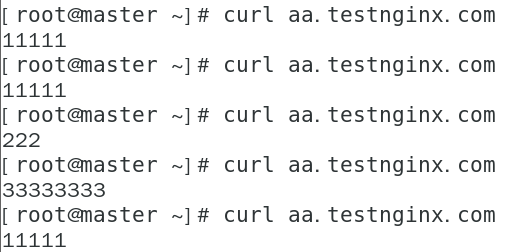
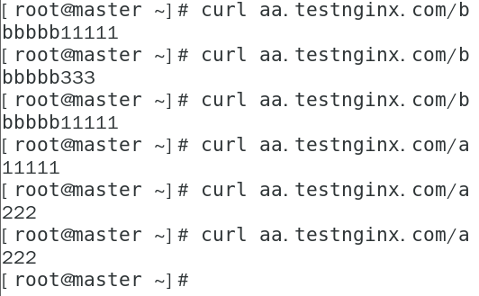
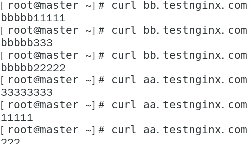
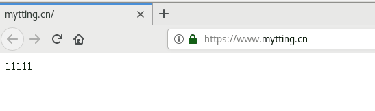

# Ingress

ingress为Kubernetes集群中的服务提供了入口，可以提供负载均衡，SSL终止和基于名称的虚拟主机，在生产环境中常用的Ingress有Treafik,Nginx,HAProxy,Istio等。

## 1 基本概念

在Kubernetes1.1版本中添加的Ingress用于从集群外部到集群内部的Service的HTTP和HTTPS路由，流量从Internet到Ingress再到Services最后到Pod上，通常情况下，Ingress部署在所有的Node节点上。

Ingress可以配置提供服务外部访问的URL，负载均衡，终止SSL，并提供基于域名的虚拟主机。但Ingress不会暴露任意端口或协议。

## 2 创建一个Ingress

前提是安装了Ingress插件,访问时将需要访问的域名指向Ingress Controller所在的节点IP

1 创建一个简单的Ingress如下：

```
apiVersion: extensions/v1beta1
kind: Ingress
metadata:
  name: nginx-test
  annotations:
    nginx.ingress.kubernetes.io/rewrite-target: /
spec:
  rules:
  - host: aa.testnginx.com
    http:
      paths:
      - backend:
          serviceName: nginx-service
          servicePort: 80
```

将此Ingress指向名为nginx-service的service（需提前确保有Service和对应的Pod）

访问测试

将aa.testnginx.com的域名解析(hosts文件)执行任意一台节点（通过DaemonSet方式部署的nginx-ingress）

直接访问域名



2 创建单个域名匹配多个path到不同的service：

```
apiVersion: extensions/v1beta1
kind: Ingress
metadata:
  name: nginx-test
  annotations:
    nginx.ingress.kubernetes.io/rewrite-target: /
spec:
  rules:
  - host: aa.testnginx.com
    http:
      paths:
      - path: /a
        backend:
          serviceName: nginx-service
          servicePort: 80
      - path: /b
        backend:
          serviceName: nginx-service2
          servicePort: 80
```

dns只需要将aa.testnginx.com指向node节点即可

部署后访问测试



上述host定义该Ingress的域名，将其解析至任意Node上即可访问

如果访问的是aa.testnginx.com/a，则被转发到nginx-service对应的Pod上的80端口

如果访问的是aa.testnginx.com/b，则被转发到nginx-service2对应的Pod上的80端口

1. Ingress Rules

   - host： 可选，一般都会配置对应的域名
   - path：每个路径都有一个对应的serviceName和servicePort，在流量到达服务之前，主机和路径都会与传入请求的内容匹配
   - backend：描述Service和Port的组合，对Ingress匹配主机和路径的HTTP与HTTPS请求将被转发到对应的后端

   2 默认后端

   没有匹配到任何规则的流量将被发送到默认后端。默认后端通常是IngressController的配置选项，并未在Ingress资源中指定

   ## 3 Ingress类型

   1 单域名

   单个域名匹配多个path到不同的service：

   ```
   apiVersion: extensions/v1beta1
   kind: Ingress
   metadata:
     name: nginx-test
     annotations:
       nginx.ingress.kubernetes.io/rewrite-target: /
   spec:
     rules:
     - host: aa.testnginx.com
       http:
         paths:
         - path: /a
           backend:
             serviceName: nginx-service
             servicePort: 80
         - path: /b
           backend:
             serviceName: nginx-service2
             servicePort: 80
   ```

   

此时，访问aa.testnginx.com/a到nginx-service的80端口访问                       aa.testnginx.com/b到nginx-service2的80端口

2 多域名

基于域名的虚拟主机支持将HTTP流量路由到同一IP地址的多个主机名：

```
apiVersion: extensions/v1beta1
kind: Ingress
metadata:
  name: nginx-test
  annotations:
    nginx.ingress.kubernetes.io/rewrite-target: /
spec:
  rules:
  - host: aa.testnginx.com
    http:
      paths:
      - backend:
          serviceName: nginx-service
          servicePort: 80
  - host: bb.testnginx.com
    http:
      paths:
      - backend:
          serviceName: nginx-service2
          servicePort: 80
```

访问时将两个域名都指向同一个node节点即可



基于TLS的Ingress

首先创建证书

```
kubectl create secret tls nginx-test-tls --key=2_mytting.cn.key --cert=1_mytting.cn_bundle.crt
```

输出信息

```
secret/nginx-test-tls created
```

定义Ingress

```
apiVersion: extensions/v1beta1
kind: Ingress
metadata:
  name: nginx-test-tls
  annotations:
    nginx.ingress.kubernetes.io/rewrite-target: /
spec:
  rules:
  - host: www.mytting.cn
    http:
      paths:
      - backend:
          serviceName: nginx-service
          servicePort: 80
  tls:
  - secretName: nginx-test-tls
```

访问验证

