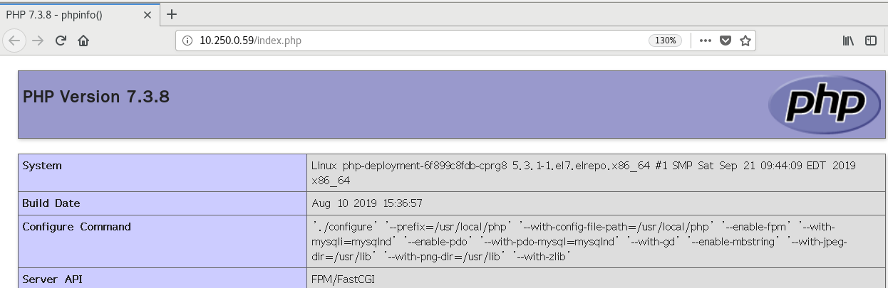
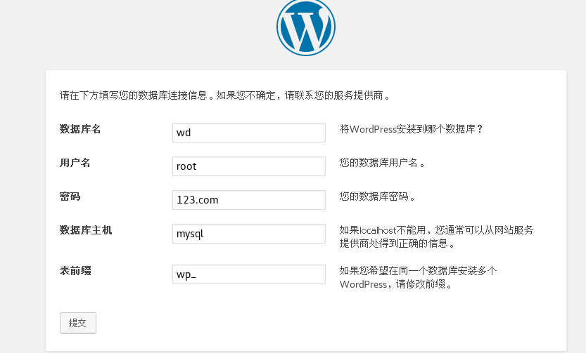
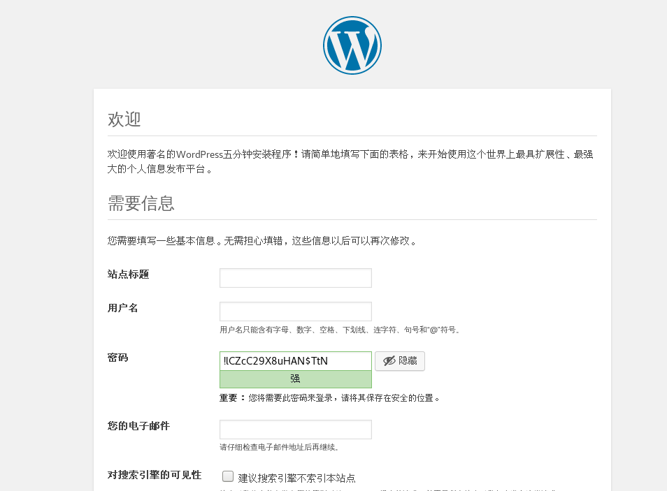
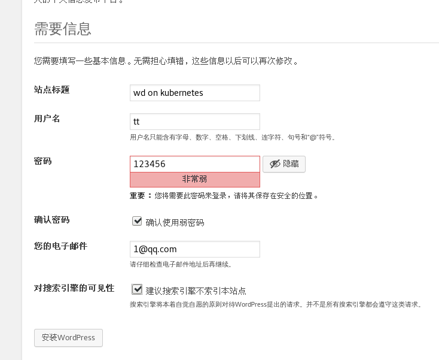
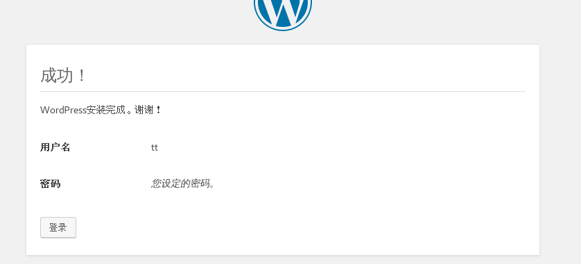
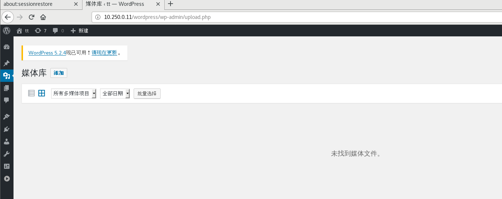

# 搭建LNMP

环境规范

nginx和php使用nfs挂载网页文件

mysql使用nfs将数据文件挂载出来

nginx： 基于CentOS的自定义nginx镜像

php：基于CentOS的自定义php镜像

mysql：基于mysql5.7官方镜像

## 1 搭建nfs服务

创建目录

```
mkdir /nfs/web/date -p
mkdir /nfs/web/db
```

启动nfs服务

```
echo "/nfs/web/ *(rw,sync,no_subtree_check,no_root_squash)" >> /etc/exports
```

```
exportfs -r
systemctl restart nfs-server
systemctl enable nfs
```

编辑网页文件

```
echo "Hello this is LNMP on kubernetes" > /nfs/web/date/index.html
```

```
echo "<?php" > /nfs/web/date/index.php
echo "phpinfo();" >> /nfs/web/date/index.php
echo "?>" >> /nfs/web/date/index.php
```

## 2 创建php的deployment和service

编辑yaml文件

```
apiVersion: v1
kind: Service
metadata:
  name: php
spec:
  selector:
    php: php
  ports:
  - protocol: TCP
    port: 9000
    targetPort: 9000
---
apiVersion: apps/v1
kind: Deployment
metadata:
  name: php-deployment                # deployment的名称
  labels:
    php: php                         # 标签用于选择节点使用 先确保节点有这个标签
spec:
  replicas: 5                                   # 副本数
  selector:  # 定义deployment如何找到要管理的pod与template的label标签相对应
    matchLabels:
      php: php
  template:
    metadata:
      labels:
        php: php  # nginx使用label（标签）标记pod
    spec:       # 表示pod运行一个名字为nginx-deployment的容器
      containers:
        - name: php-deployment
          image: 192.168.10.66:5000/php   # 使用的镜像
          volumeMounts:
          - name: php
            mountPath: /usr/local/nginx/html
      volumes:
      - name: php
        nfs:  #设置NFS服务器
          server: 192.168.10.10 #设置NFS服务器地址
          path: /nfs/web/date #设置NFS服务器路径
          readOnly: true #设置是否只读
```

应用YAML文件

```
kubectl apply -f php.yaml
```

输出信息

```
service/php created
deployment.apps/php-deployment created
```

查看创建的Pod

```
kubectl get pods
```

输出信息

```
NAME                                READY   STATUS    RESTARTS   AGE
nginx-deployment-595cfb5774-ljbm2   1/1     Running   0          2m35s
nginx-deployment-595cfb5774-mt26n   1/1     Running   0          2m35s
nginx-deployment-595cfb5774-nfntn   1/1     Running   0          2m35s
nginx-deployment-595cfb5774-nggdf   1/1     Running   0          2m35s
nginx-deployment-595cfb5774-qvk9c   1/1     Running   0          2m35s
php-deployment-6f899c8fdb-9chzb     1/1     Running   0          40s
php-deployment-6f899c8fdb-nr8sv     1/1     Running   0          40s
php-deployment-6f899c8fdb-vxnq8     1/1     Running   0          40s
php-deployment-6f899c8fdb-xgpq7     1/1     Running   0          40s
php-deployment-6f899c8fdb-zwqk2     1/1     Running   0          40s
```

查看创建的Service

```
kubectl get service
```

输出信息

```
NAME            TYPE        CLUSTER-IP     EXTERNAL-IP   PORT(S)    AGE
kubernetes      ClusterIP   10.250.0.1     <none>        443/TCP    12d
nginx-service   ClusterIP   10.250.0.183   <none>        80/TCP     3m9s
php             ClusterIP   10.250.0.16    <none>        9000/TCP   74s
```

## 3搭建nginx

编辑YAML文件 创建nginx的Service ConfigMap 和 Deployment

```
apiVersion: v1
kind: ConfigMap
metadata:
  name: nginx-dp-config
data:
  nginx.conf: |-
    worker_processes  1;
    events {
        worker_connections  1024;
    }
    http {
        include       mime.types;
        default_type  application/octet-stream;
            server_tokens off;
        sendfile        on;
        keepalive_timeout  0;
        server {
            listen       80;
            server_name  localhost;
            location / {
                root   html;
                index  index.php;
            }
            error_page   500 502 503 504  /50x.html;
            location = /50x.html {
                root   html;
            }
            location ~ \.php$ {
                root           html;        #站点Php文件应该放在php服务器上
                fastcgi_pass   php:9000;    #Php服务器的IP地址
                fastcgi_index  index.php;
                fastcgi_param  SCRIPT_FILENAME  /scripts$fastcgi_script_name;
                include        fastcgi.conf;        #Fastcgi的配置文件
            }
        }
    }
---
apiVersion: v1
kind: Service
metadata:
  name: nginx-service
spec:
  selector:
    nginx: nginx
  ports:
  - protocol: TCP
    port: 80
    targetPort: 80
---
apiVersion: apps/v1
kind: Deployment
metadata:
  name: nginx-deployment                # deployment的名称
  labels:
    nginx: nginx                            # 标签用于选择节点使用 先确保节点有这个标签
spec:
  replicas: 5                                   # 副本数
  selector:  # 定义deployment如何找到要管理的pod与template的label标签相对应
    matchLabels:
      nginx: nginx
  template:
    metadata:
      labels:
        nginx: nginx  # nginx使用label（标签）标记pod
    spec:       # 表示pod运行一个名字为nginx-deployment的容器
      containers:
        - name: nginx-deployment
          image: mytting/chang:nginx   # 使用的镜像
          volumeMounts:
          - name: www
            mountPath: /usr/local/nginx/html
          - name: nginx-config
            mountPath: /usr/local/nginx/conf/nginx.conf
            subPath: nginx.conf
      volumes:
      - name: www
        nfs:  #设置NFS服务器
          server: 192.168.10.10 #设置NFS服务器地址
          path: /nfs/web/date #设置NFS服务器路径
          readOnly: true #设置是否只读
      - name: nginx-config
        configMap:
          name: nginx-dp-config
          items:
          - key: nginx.conf
            path: nginx.conf
          defaultMode: 0755
```

应用YAML文件

```
kubectl apply -f nginx.yaml
```

输出信息

```
configmap/nginx-dp-config created
service/nginx-service created
deployment.apps/nginx-deployment created
```

查看创建的Pod

```
kubectl get pods
```

输出信息

```
NAME                                READY   STATUS    RESTARTS   AGE
nginx-deployment-595cfb5774-ljbm2   1/1     Running   0          50s
nginx-deployment-595cfb5774-mt26n   1/1     Running   0          50s
nginx-deployment-595cfb5774-nfntn   1/1     Running   0          50s
nginx-deployment-595cfb5774-nggdf   1/1     Running   0          50s
nginx-deployment-595cfb5774-qvk9c   1/1     Running   0          50s
```

## 访问nginx测试

```
curl 10.250.0.183
```

输出信息

```
Hello this is LNMP on kubernetes
```

使用火狐浏览器访问nginx的ClusterIP下的index.php文件

```
firefox 10.250.0.183/index.php
```

输出信息




## 4 搭建配置mysql

## 1 创建数据库密码secret

```
kubectl create secret generic mysql-pass --from-literal=password=123.com
kubectl create secret generic mysql-database --from-literal=datebase=wd
```

输出信息

```
secret/mysql-pass created
```

## 2 创建Deployment

yaml文件

```
apiVersion: v1
kind: Service
metadata:
  name: mysql
  labels:
    mysql: mysql
spec:
  ports:
    - port: 3306
  selector:
    mysql: mysql
    tier: mysql
---
apiVersion: v1
kind: PersistentVolume
metadata:
  name: mysql-pv
spec:
  capacity:
    storage: 10Gi
  accessModes:
    - ReadWriteMany
  nfs:
    path: /nfs/web/db
    server: 192.168.10.10
---
apiVersion: v1
kind: PersistentVolumeClaim
metadata:
  name: mysql-claim
  labels:
    app: mysql
spec:
  accessModes:
    - ReadWriteMany
  resources:
    requests:
      storage: 10Gi
---
apiVersion: apps/v1
kind: Deployment
metadata:
  name: mysql
  labels:
    mysql: mysql
spec:
  replicas: 1
  selector:
    matchLabels:
      mysql: mysql
      tier: mysql
  strategy:
    type: Recreate
  template:
    metadata:
      labels:
        mysql: mysql
        tier: mysql
    spec:
      containers:
      - image: mysql:5.7
        name: mysql57-lnmp
        env:
        - name: MYSQL_ROOT_PASSWORD
          valueFrom:
            secretKeyRef:
              name: mysql-pass
              key: password
        - name: MYSQL_DATABASE
          valueFrom:
            secretKeyRef:
              name: mysql-database
              key: datebase
        ports:
        - containerPort: 3306
          name: dz-mysql
        volumeMounts:
        - name: mysql-persistent-storage
          mountPath: /var/lib/mysql
      volumes:
      - name: mysql-persistent-storage
        persistentVolumeClaim:
          claimName: mysql-claim
```

应用YAML文件

```
kubectl create -f dp-mysql.yaml
```

输出信息

```
service/mysql created
persistentvolume/mysql-pv created
persistentvolumeclaim/mysql-claim created
deployment.apps/mysql created
```


## 3 搭建WordPress

下载源码

```
wget https://raw.githubusercontent.com/hejianlai/Docker-Kubernetes/master/Kubernetes/Project/k8s_wordporss/wordpress-4.7.4-zh_CN.tar.gz
```

解压到/nfs/web/date目录下

```
tar -xvf wordpress-4.7.4-zh_CN.tar.gz -C /nfs/web/date/
```

添加一个文件

```
vim /nfs/web/date/wordpress/wp-config.php
```

添加

```
<?php
/**
 * WordPress基础配置文件。
 *
 * 这个文件被安装程序用于自动生成wp-config.php配置文件，
 * 您可以不使用网站，您需要手动复制这个文件，
 * 并重命名为“wp-config.php”，然后填入相关信息。
 *
 * 本文件包含以下配置选项：
 *
 * * MySQL设置
 * * 密钥
 * * 数据库表名前缀
 * * ABSPATH
 *
 * @link https://codex.wordpress.org/zh-cn:%E7%BC%96%E8%BE%91_wp-config.php
 *
 * @package WordPress
 */

// ** MySQL 设置 - 具体信息来自您正在使用的主机 ** //
/** WordPress数据库的名称 */
define('DB_NAME', 'wd');

/** MySQL数据库用户名 */
define('DB_USER', 'root');

/** MySQL数据库密码 */
define('DB_PASSWORD', '123.com');

/** MySQL主机 */
define('DB_HOST', 'mysql');

/** 创建数据表时默认的文字编码 */
define('DB_CHARSET', 'utf8mb4');

/** 数据库整理类型。如不确定请勿更改 */
define('DB_COLLATE', '');

/**#@+
 * 身份认证密钥与盐。
 *
 * 修改为任意独一无二的字串！
 * 或者直接访问{@link https://api.wordpress.org/secret-key/1.1/salt/
 * WordPress.org密钥生成服务}
 * 任何修改都会导致所有cookies失效，所有用户将必须重新登录。
 *
 * @since 2.6.0
 */
define('AUTH_KEY',         'Zefr&toYwr^9KL16I-n6~BedDs>OL9|f]qfK@S*dhkCs.P$*(#m:&~R y}<3acn%');
define('SECURE_AUTH_KEY',  '[B,HxQ%[d.Bh=Vhx.h%:HXvle}o!g=pMg|)x$Al+a6=9w3IHaWCAVpY,,3jbjMvo');
define('LOGGED_IN_KEY',    'VN)Txu]68$:W,VeEe6X~Po##iobP~{8L-65?)O8SPf5i 1-O,d+GA_5E3}Mh[weq');
define('NONCE_KEY',        '!*#A~pci@*l9EWHfj(@ol^,^/nxsn_}Fv.5/fp>n<H7]wjEpJzXLFq`JS4/KO;VD');
define('AUTH_SALT',        'f.R0zhjh>^]rFh&gfU|l=4%UdMmN-.r2frJ+}+DmNt47P`zh;]i]nlHjs}6 $d(m');
define('SECURE_AUTH_SALT', 'zdE$$c`9uhIYCn*+x`8/Hw?DK_9K1pkyOeA(L]pC6qH|zz7Ugme4*pFtDg-Ix4Th');
define('LOGGED_IN_SALT',   'zlxA/PU&go+>ZiDSDuXuk+W4?(UTJPT=TPP3dJ[ZpcLN0dUrFnd-`$p59Tl!ojzW');
define('NONCE_SALT',       'NH`/m1M*p#t!$?GVcX=` ogh`rxXa+Q=ZGR?[{,Q(Xlbt.gskb$yyYGBUDTbYoQH');

/**#@-*/

/**
 * WordPress数据表前缀。
 *
 * 如果您有在同一数据库内安装多个WordPress的需求，请为每个WordPress设置
 * 不同的数据表前缀。前缀名只能为数字、字母加下划线。
 */
$table_prefix  = 'wp_';

/**
 * 开发者专用：WordPress调试模式。
 *
 * 将这个值改为true，WordPress将显示所有用于开发的提示。
 * 强烈建议插件开发者在开发环境中启用WP_DEBUG。
 *
 * 要获取其他能用于调试的信息，请访问Codex。
 *
 * @link https://codex.wordpress.org/Debugging_in_WordPress
 */
define('WP_DEBUG', false);

/**
 * zh_CN本地化设置：启用ICP备案号显示
 *
 * 可在设置→常规中修改。
 * 如需禁用，请移除或注释掉本行。
 */
define('WP_ZH_CN_ICP_NUM', true);

/* 好了！请不要再继续编辑。请保存本文件。使用愉快！ */

/** WordPress目录的绝对路径。 */
if ( !defined('ABSPATH') )
	define('ABSPATH', dirname(__FILE__) . '/');

/** 设置WordPress变量和包含文件。 */
require_once(ABSPATH . 'wp-settings.php');
```

访问安装









最后结果

