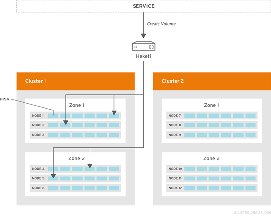
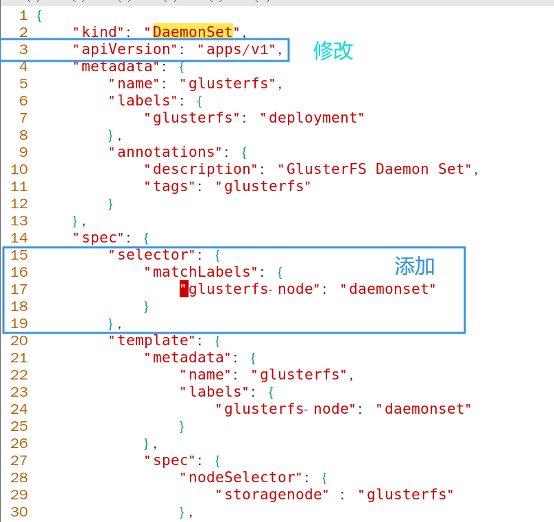
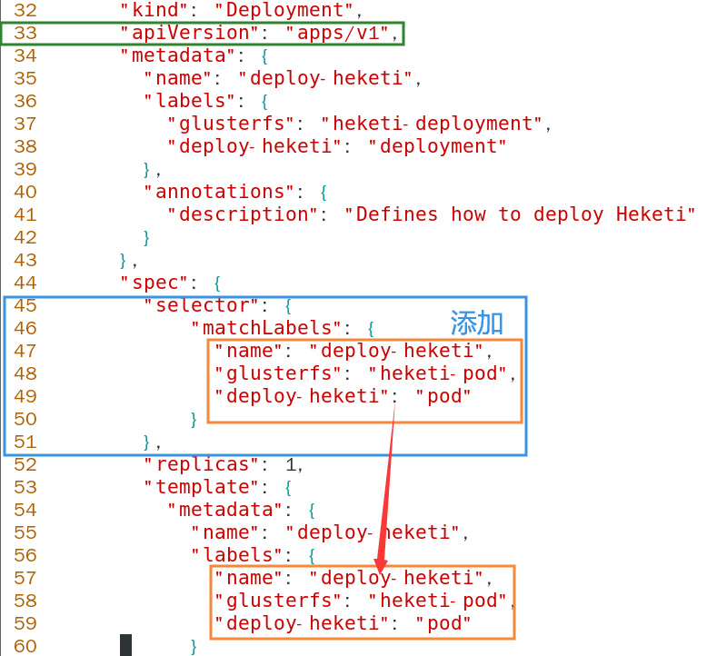
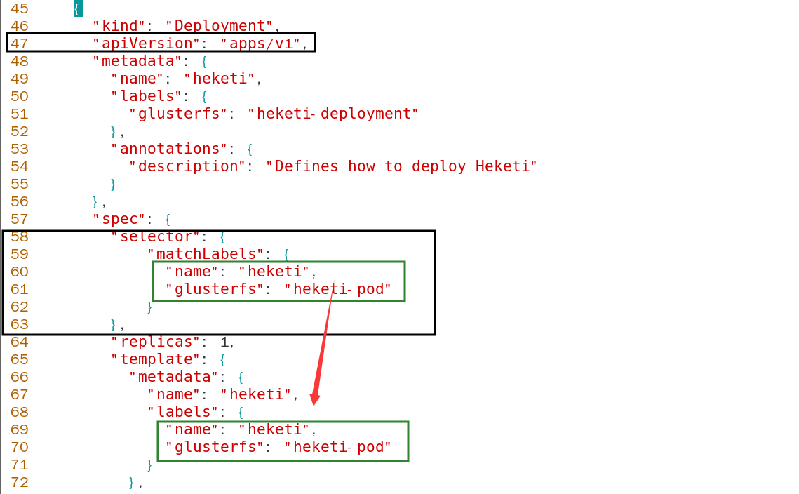
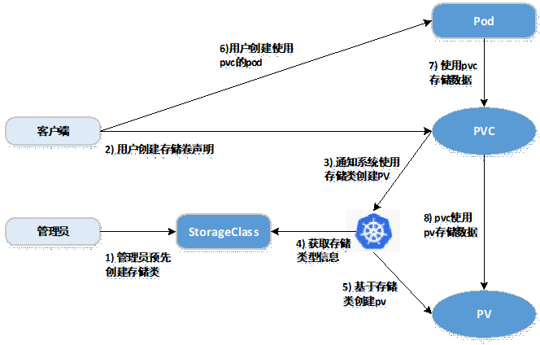

# 安装GFS到K8S集群中

在集群中，我们可以使用GFS，CEPH，NFS等为Pod提供动态持久化存储。本节动态存储主要介绍GFS的使用，静态存储方式采用NFS，其他类型的存储配置类似。

参考

https://github.com/gluster/gluster-kubernetes

# 简介

## 1 Heketi是一个提供RESTful API管理GlusterFS卷的框架，便于管理员对GlusterFS进行操作：

1. 可以用于管理GlusterFS卷的生命周期; 
2. 能够在OpenStack，Kubernetes，Openshift等云平台上实现动态存储资源供应（动态在GlusterFS集群内选择bricks构建volume）； 
3. 支持GlusterFS多集群管理。 

## **2.** 框架



1. Heketi支持GlusterFS多集群管理； 
2. 在集群中通过zone区分故障域。 

## 1 准备工作

各节点添加一块硬盘 然后重启节点 无需对硬盘格式化或分区

## 2安装步骤

### 1 为了保证Pod能够正常使用GFS作为后端存储，需要每台允许Pod的节点上提前安装GFS的客户端工具，其他存储方式也类似。

所有节点安装GFS客户端：

```
yum -y install glusterfs glusterfs-fuse
```

给需要作为GFS节点提供存储的节点打上标签

```
kubectl label node master storagenode=glusterfs 
```

输出信息

```
node/master labeled
```

另外两个节点

```
kubectl label node node1 storagenode=glusterfs 
kubectl label node node2 storagenode=glusterfs 
```

### 2 创建GFS集群

这里采用容器化方式部署GFS集群，同样也可以使用传统模式部署，在生产环境中，GFS集群最好是独立于集群之外进行部署，之后只需创建对应的Service和EndPoints即可。

本例部署采用DaemonSet方式，同时保证已经打上标签的节点上              都运行一个GFS服务，并且均有提供存储的磁盘。

下载相关安装文件：

```
wget https://github.com/heketi/heketi/releases/download/v9.0.0/heketi-client-v9.0.0.linux.amd64.tar.gz
```

创建集群

```
tar -xvf heketi-client-v9.0.0.linux.amd64.tar.gz
cd heketi-client/share/heketi/kubernetes/
```

由于kubernetes版本原因需要修改yaml文件

```
vim glusterfs-daemonset.json
```



```
        "selector": {
            "matchLabels": {
                "glusterfs-node": "daemonset"
            }
        },
```

应用yaml文件

```
kubectl create -f glusterfs-daemonset.json
```

输出信息

```
daemonset.apps/glusterfs created
```

注意

1. 此处创建的时默认的挂载方式，可使用其他磁盘作为GFS的工作目录
2. 此处创建的NameSpace为default，可按需修改
3. 可使用gluster/gluster-centos:gluster3u12_centos7镜像

查看GFS Pods

```
kubectl get pods -l glusterfs-node=daemonset
```

输出信息

```
NAME              READY   STATUS    RESTARTS   AGE
glusterfs-sv5b4   1/1     Running   0          5m4s
glusterfs-tfchd   1/1     Running   0          5m4s
glusterfs-xxr7w   1/1     Running   0          5m4s
```

### 3 创建Heketi服务

Heketi是一个提供RESTful API管理GFS卷的框架，能够在Kubernetes,OpenShift,OpenStack等云平台上实现动态存储资源供应，支持GFS多集群管理，便于管理员对GFS进行操作，在Kubernetes集群中，Pod将存储的请求发送至Heketi，然后Heketi控制GFS集群创建对应的存储卷。

创建Heketi的ServiceAccount对象（在上一节的基础上 目录没有切换）

```
kubectl create -f heketi-service-account.json
```

输出信息

```
serviceaccount/heketi-service-account created
```

```
kubectl get sa
```

输出信息

```
NAME                     SECRETS   AGE
default                  1         9d
heketi-service-account   1         102s
```

创建Heketi对应的权限和Secret：

```
kubectl create  clusterrolebinding heketi-gluster-admin --clusterrole=edit --serviceaccount=default:heketi-service-account
```

输出信息

```
clusterrolebinding.rbac.authorization.k8s.io/heketi-gluster-admin created
```

```
kubectl create secret generic heketi-config-secret --from-file=heketi.json
```

输出信息

```
secret/heketi-config-secret created
```

初始化部署Heketi:

由于kubernetes版本原因 需要修改json文件

```
vim heketi-bootstrap.json
```



```
        "selector": {
            "matchLabels": {
              "name": "deploy-heketi",
              "glusterfs": "heketi-pod",
              "deploy-heketi": "pod"
            }
        },
```

应用json文件

```
kubectl apply -f heketi-bootstrap.json
```

输出信息

```
service/deploy-heketi created
deployment.apps/deploy-heketi created
```

### 4 创建GFS集群

本节使用Heketi创建GFS集群，其管理方式更加简单和高效

复制heketi-cli至/usr/local/bin:

依然在上一节所在的目录内操作

```
cd ../../../bin/
cp -p heketi-cli /usr/local/bin/
heketi-cli -v
```

输出信息

```
heketi-cli v9.0.0
```

修改topology-sample，manage为GFS管理服务的节点(Node)主机名，storage为节点IP地址，devices为节点上的裸设备，也就是用于提供存储的磁盘最好使用裸设备：

```
cd ../share/heketi/kubernetes/
vim topology-sample.json
```

修改为下面示例 /dev/sdb为新添加的磁盘 未初始化和格式化的

```
{
  "clusters": [
    {
      "nodes": [
        {
          "node": {
            "hostnames": {
              "manage": [
                "master"
              ],
              "storage": [
                "192.168.10.10"
              ]
            },
            "zone": 1
          },
          "devices": [
            {
              "name": "/dev/sdb",
              "destroydata": false
            }
          ]
        },
        {
          "node": {
            "hostnames": {
              "manage": [
                "node1"
              ],
              "storage": [
                "192.168.10.11"
              ]
            },
            "zone": 1
          },
          "devices": [
            {
              "name": "/dev/sdb",
              "destroydata": false
            }
          ]
        },
        {
          "node": {
            "hostnames": {
              "manage": [
                "node2"
              ],
              "storage": [
                "192.168.10.12"
              ]
            },
            "zone": 1
          },
          "devices": [
            {
              "name": "/dev/sdb",
              "destroydata": false
            }
          ]
        }
      ]
    }
  ]
}
```

查看当前Heketi的ClusterIP

```
kubectl get svc | grep heketi
```

输出信息

```
deploy-heketi    ClusterIP   10.250.0.65   <none>        8080/TCP   10m
```

```
export HEKETI_CLI_SERVER=http://10.250.0.65:8080
```

加载内核模块所有节点执行

```
modprobe dm_snapshot 
modprobe dm_mirror 
modprobe dm_thin_pool
```

使用Heketi创建GFS集群

```
heketi-cli -s $HEKETI_CLI_SERVER --user admin --secret 'My Secret' topology info
```


```
heketi-cli topology load --json=topology-sample.json --user admin --secret 'My Secret'
```

输出信息 需要等待一会

```
Creating cluster ... ID: 6c12778d127658d77510801ec7f5ad4a
	Allowing file volumes on cluster.
	Allowing block volumes on cluster.
	Creating node master ... ID: 2c5e52c9df4082974c6776e91dfb7b87
		Adding device /dev/sdb ... OK
	Creating node node1 ... ID: 7c10b096cb7c38c1fbebfdabd5fea027
		Adding device /dev/sdb ... OK
	Creating node node2 ... ID: df2c7b995e2498fbbcaa2ab56e4e6ef9
		Adding device /dev/sdb ... OK
```

之前创建的Heketi未配置持久化卷，如果Heketi的Pod重启，可能会丢失之前的配置信息，所以现在创建Heketi持久化换，对Heketi的数据卷进行持久化。该持久化方式采用GFS提供的动态存储，也可以采用其他方式进行持久化：

所以节点安装device-mapper*

```
yum -y install device-mapper*
heketi-cli setup-openshift-heketi-storage --user admin --secret 'My Secret'
```

然后等待一会不要退出

输出信息

```
Saving heketi-storage.json
```


```
ls
```

会生成一个文件heketi-storage.json 

```
glusterfs-daemonset.json  heketi-deployment.json  heketi-service-account.json  README.md
heketi-bootstrap.json     heketi.json             heketi-storage.json          topology-sample.json
```

```
kubectl apply -f heketi-storage.json
```

输出信息

```
secret/heketi-storage-secret created
endpoints/heketi-storage-endpoints created
service/heketi-storage-endpoints created
job.batch/heketi-storage-copy-job created
```

删除中间产物

```
kubectl delete all,service,jobs,deployment,secret --selector="deploy-heketi"
```

输出信息

```
pod "deploy-heketi-6c687b4b84-nv6kh" deleted
service "deploy-heketi" deleted
deployment.apps "deploy-heketi" deleted
replicaset.apps "deploy-heketi-6c687b4b84" deleted
job.batch "heketi-storage-copy-job" deleted
secret "heketi-storage-secret" deleted
```

然后修改YAML文件

```
vim heketi-deployment.json
```



```
        "selector": {
            "matchLabels": {
              "name": "heketi",
              "glusterfs": "heketi-pod"
            }
        },
```

应用json文件

```
kubectl apply -f heketi-deployment.json
```

输出信息

```
secret/heketi-db-backup created
service/heketi created
deployment.apps/heketi created
```

等待Pod全部运行成功即可

```
kubectl get pods
```

输出信息

```
NAME                                READY   STATUS    RESTARTS   AGE
glusterfs-8ml5g                     1/1     Running   0          29m
glusterfs-cwtt5                     1/1     Running   0          29m
glusterfs-j9qh2                     1/1     Running   0          29m
heketi-68795ccd8-8grk7              1/1     Running   0          45s
```

查看最新部署的持久化Heketi的Service，并修改变量HEKETI_CLI_SERVER的值

```
kubectl get service
```

输出信息

```
NAME                       TYPE        CLUSTER-IP     EXTERNAL-IP   PORT(S)    AGE
heketi                     ClusterIP   10.250.0.201   <none>        8080/TCP   3m44s
heketi-storage-endpoints   ClusterIP   10.250.0.246   <none>        1/TCP      14m
kubernetes                 ClusterIP   10.250.0.1     <none>        443/TCP    13d
```


```
export HEKETI_CLI_SERVER=http://10.250.0.201:8080
```

```
curl http://10.250.0.201:8080/hello
```

输出信息

```
Hello from Heketi
```

查看GFS集群信息

```
heketi-cli topology info --user admin --secret 'My Secret'
```

输出信息

```

Cluster Id: 6affe23c80a8207178acd0f2a8740f21

    File:  true
    Block: true

    Volumes:

	Name: heketidbstorage
	Size: 2
	Id: b4cc5b1768e435f01e3f192ce978099d
	Cluster Id: 6affe23c80a8207178acd0f2a8740f21
	Mount: 192.168.10.11:heketidbstorage
	Mount Options: backup-volfile-servers=192.168.10.10,192.168.10.12
	Durability Type: replicate
	Replica: 3
	Snapshot: Disabled

		Bricks:
			Id: 6d0449eba31705789354a5c4f1ca9f2f
			Path: /var/lib/heketi/mounts/vg_5bb262156c957d71634e92accdebefec/brick_6d0449eba31705789354a5c4f1ca9f2f/brick
			Size (GiB): 2
			Node: 10677c9f96a5596d0021aaf7ea87afc1
			Device: 5bb262156c957d71634e92accdebefec

			Id: 98a6ab4a89f8f0cc38cf7666e593c7dd
			Path: /var/lib/heketi/mounts/vg_1febf497c3b88157ae42afaeefc65efa/brick_98a6ab4a89f8f0cc38cf7666e593c7dd/brick
			Size (GiB): 2
			Node: 3bda8fc6143c0da18fe0ee4d4f6dfd30
			Device: 1febf497c3b88157ae42afaeefc65efa

			Id: c91a56f6a71b7421717375ec048c5d1a
			Path: /var/lib/heketi/mounts/vg_5666aa9e2e298e2664245849878f3e24/brick_c91a56f6a71b7421717375ec048c5d1a/brick
			Size (GiB): 2
			Node: 6d7656e0dd34f34d32fbda9b1310adce
			Device: 5666aa9e2e298e2664245849878f3e24


    Nodes:

	Node Id: 10677c9f96a5596d0021aaf7ea87afc1
	State: online
	Cluster Id: 6affe23c80a8207178acd0f2a8740f21
	Zone: 1
	Management Hostnames: node1
	Storage Hostnames: 192.168.10.11
	Devices:
		Id:5bb262156c957d71634e92accdebefec   Name:/dev/sdb            State:online    Size (GiB):19      Used (GiB):2       Free (GiB):17      
			Bricks:
				Id:6d0449eba31705789354a5c4f1ca9f2f   Size (GiB):2       Path: /var/lib/heketi/mounts/vg_5bb262156c957d71634e92accdebefec/brick_6d0449eba31705789354a5c4f1ca9f2f/brick

	Node Id: 3bda8fc6143c0da18fe0ee4d4f6dfd30
	State: online
	Cluster Id: 6affe23c80a8207178acd0f2a8740f21
	Zone: 1
	Management Hostnames: master
	Storage Hostnames: 192.168.10.10
	Devices:
		Id:1febf497c3b88157ae42afaeefc65efa   Name:/dev/sdb            State:online    Size (GiB):19      Used (GiB):2       Free (GiB):17      
			Bricks:
				Id:98a6ab4a89f8f0cc38cf7666e593c7dd   Size (GiB):2       Path: /var/lib/heketi/mounts/vg_1febf497c3b88157ae42afaeefc65efa/brick_98a6ab4a89f8f0cc38cf7666e593c7dd/brick

	Node Id: 6d7656e0dd34f34d32fbda9b1310adce
	State: online
	Cluster Id: 6affe23c80a8207178acd0f2a8740f21
	Zone: 1
	Management Hostnames: node2
	Storage Hostnames: 192.168.10.12
	Devices:
		Id:5666aa9e2e298e2664245849878f3e24   Name:/dev/sdb            State:online    Size (GiB):19      Used (GiB):2       Free (GiB):17      
			Bricks:
				Id:c91a56f6a71b7421717375ec048c5d1a   Size (GiB):2       Path: /var/lib/heketi/mounts/vg_5666aa9e2e298e2664245849878f3e24/brick_c91a56f6a71b7421717375ec048c5d1a/brick


```

### 5 创建StorageClass

kubernetes共享存储供应模式：

1. 静态模式(Static)：集群管理员手工创建PV，在定义PV时需设置后端存储的特性； 
2. 动态模式(Dynamic)：集群管理员不需要手工创建PV，而是通过StorageClass的设置对后端存储进行描述，标记为某种"类型(Class)"；此时要求PVC对存储的类型进行说明，系统将自动完成PV的创建及与PVC的绑定；PVC可以声明Class为""，说明PVC禁止使用动态模式。 

 基于StorageClass的动态存储供应整体过程如下图所示：



1. 集群管理员预先创建存储类（StorageClass）； 
2. 用户创建使用存储类的持久化存储声明(PVC：PersistentVolumeClaim)； 
3. 存储持久化声明通知系统，它需要一个持久化存储(PV: PersistentVolume)； 
4. 系统读取存储类的信息； 
5. 系统基于存储类的信息，在后台自动创建PVC需要的PV； 
6. 用户创建一个使用PVC的Pod； 
7. Pod中的应用通过PVC进行数据的持久化； 
8. 而PVC使用PV进行数据的最终持久化处理。 

提前创建StorageClass，然后Pod直接在StorageClass选项配置选择在该StorageClass，即可通过该StorageClass创建对应的PV。

创建StorageClass文件如下

```
apiVersion: storage.k8s.io/v1
kind: StorageClass
metadata:
  name: gluster-heketi
provisioner: kubernetes.io/glusterfs
parameters:
  resturl: "http://10.250.0.201:8080"
  restauthenabled: "true"
  restuser: "admin"
  secretNamespace: "default"
  secretName: "heketi-secret"
  volumetype: "replicate:2"
```

说明

```
# restauthenabled：可选参数，默认值为”false”，heketi服务开启认证时必须设置为”true”；
# restuser：可选参数，开启认证时设置相应用户名；
# secretNamespace：可选参数，开启认证时可以设置为使用持久化存储的namespace；
# secretName：可选参数，开启认证时，需要将heketi服务的认证密码保存在secret资源中；
# clusterid：可选参数，指定集群id，也可以是1个clusterid列表，格式为”id1,id2”；
# volumetype：可选参数，设置卷类型及其参数，如果未分配卷类型，则有分配器决定卷类型；如”volumetype: replicate:3”表示3副本的replicate卷，”volumetype: disperse:4:2”表示disperse卷，其中‘4’是数据，’2’是冗余校验，”volumetype: none”表示distribute卷# 
```

定义Secret资源 其中”key”值需要转换为base64编码格式

```
echo -n "My Secret" | base64
```

输出信息

```
TXkgU2VjcmV0
```

编辑Secret的YAML文件

```
apiVersion: v1
kind: Secret
metadata:
  name: heketi-secret
  namespace: default
data:
  key: TXkgU2VjcmV0
type: kubernetes.io/glusterfs
```

应用yaml文件

```
kubectl apply -f secret.yaml
```

输出信息

```
secret/heketi-secret created
```

```
kubectl apply -f storageclass-gfs-heketi.yaml
```

输出信息

```
storageclass.storage.k8s.io/gluster-heketi created
```

查看创建的StorageClass

```
kubectl get storageclasses.storage.k8s.io
```

输出信息

```
NAME             PROVISIONER               AGE
gluster-heketi   kubernetes.io/glusterfs   6s
```

### 6 测试使用GFS动态存储

创建一个Pod使用动态PV，在StorageClassName指定之前创建的StorageClass的名字。即gluster-heketi:

```
apiVersion: v1
kind: Pod
metadata:
  name: pod-use-pvc
spec:
  containers:
  - name: pod-use-pvc
    image: busybox
    command:
    - sleep
    - "3600"
    volumeMounts:
    - name: gluster-volume
      mountPath: "/pv-data"
      readOnly: false
  volumes:
  - name: gluster-volume
    persistentVolumeClaim:
      claimName: pvc-gluster-heketi
---
kind: PersistentVolumeClaim
apiVersion: v1
metadata:
  name: pvc-gluster-heketi
spec:
  accessModes: [ "ReadWriteOnce" ]
  storageClassName: "gluster-heketi"
  resources:
    requests:
      storage: 1Gi
```

创建Pod和PVC

```
kubectl apply -f pod-use-pvc.yaml
```

输出信息

```
pod/pod-use-pvc created
persistentvolumeclaim/pvc-gluster-heketi created
```

PVC定义一旦生成，系统便触发Heketi进行相应的操作，主要为在GFS集群上创建brick,再创建并启动一个卷(volume)

```
kubectl get pv,pvc
```

输出信息 (可能需要稍微等待一会)

```
NAME                                                        CAPACITY   ACCESS MODES   RECLAIM POLICY   STATUS   CLAIM                        STORAGECLASS     REASON   AGE
persistentvolume/pvc-02dc73e3-359f-4489-a087-1723397b6f2b   1Gi        RWO            Delete           Bound    default/pvc-gluster-heketi   gluster-heketi            7s

NAME                                       STATUS   VOLUME                                     CAPACITY   ACCESS MODES   STORAGECLASS     AGE
persistentvolumeclaim/pvc-gluster-heketi   Bound    pvc-02dc73e3-359f-4489-a087-1723397b6f2b   1Gi        RWO            gluster-heketi   16s
```

### 7 测试数据

测试使用该PV的Pod之间能否共享数据

进入到Pod内并创建文件

```
kubectl exec -it pod-use-pvc -- /bin/sh
```

Pod内操作

```
cd /pv-data/
mkdir {1..10}
```

退出查看创建的卷

```
heketi-cli topology info --user admin --secret 'My Secret'
```

输出信息

```
Cluster Id: 6affe23c80a8207178acd0f2a8740f21

    File:  true
    Block: true

    Volumes:

	Name: vol_6dc6db87f66dc12de6ac394a93fbe3d3
	Size: 1
	Id: 6dc6db87f66dc12de6ac394a93fbe3d3
	Cluster Id: 6affe23c80a8207178acd0f2a8740f21
	Mount: 192.168.10.11:vol_6dc6db87f66dc12de6ac394a93fbe3d3
	Mount Options: backup-volfile-servers=192.168.10.10,192.168.10.12
	Durability Type: replicate
	Replica: 2
	Snapshot: Enabled
	Snapshot Factor: 1.00

		Bricks:
			Id: 5646b31b871623d84f9e90ed11276586
			Path: /var/lib/heketi/mounts/vg_5bb262156c957d71634e92accdebefec/brick_5646b31b871623d84f9e90ed11276586/brick
			Size (GiB): 1
			Node: 10677c9f96a5596d0021aaf7ea87afc1
			Device: 5bb262156c957d71634e92accdebefec

			Id: ec1658238932348d6dc8730e688964ea
			Path: /var/lib/heketi/mounts/vg_5666aa9e2e298e2664245849878f3e24/brick_ec1658238932348d6dc8730e688964ea/brick
			Size (GiB): 1
			Node: 6d7656e0dd34f34d32fbda9b1310adce
			Device: 5666aa9e2e298e2664245849878f3e24


	Name: heketidbstorage
	Size: 2
	Id: b4cc5b1768e435f01e3f192ce978099d
	Cluster Id: 6affe23c80a8207178acd0f2a8740f21
	Mount: 192.168.10.11:heketidbstorage
	Mount Options: backup-volfile-servers=192.168.10.10,192.168.10.12
	Durability Type: replicate
	Replica: 3
	Snapshot: Disabled

		Bricks:
			Id: 6d0449eba31705789354a5c4f1ca9f2f
			Path: /var/lib/heketi/mounts/vg_5bb262156c957d71634e92accdebefec/brick_6d0449eba31705789354a5c4f1ca9f2f/brick
			Size (GiB): 2
			Node: 10677c9f96a5596d0021aaf7ea87afc1
			Device: 5bb262156c957d71634e92accdebefec

			Id: 98a6ab4a89f8f0cc38cf7666e593c7dd
			Path: /var/lib/heketi/mounts/vg_1febf497c3b88157ae42afaeefc65efa/brick_98a6ab4a89f8f0cc38cf7666e593c7dd/brick
			Size (GiB): 2
			Node: 3bda8fc6143c0da18fe0ee4d4f6dfd30
			Device: 1febf497c3b88157ae42afaeefc65efa

			Id: c91a56f6a71b7421717375ec048c5d1a
			Path: /var/lib/heketi/mounts/vg_5666aa9e2e298e2664245849878f3e24/brick_c91a56f6a71b7421717375ec048c5d1a/brick
			Size (GiB): 2
			Node: 6d7656e0dd34f34d32fbda9b1310adce
			Device: 5666aa9e2e298e2664245849878f3e24


    Nodes:

	Node Id: 10677c9f96a5596d0021aaf7ea87afc1
	State: online
	Cluster Id: 6affe23c80a8207178acd0f2a8740f21
	Zone: 1
	Management Hostnames: node1
	Storage Hostnames: 192.168.10.11
	Devices:
		Id:5bb262156c957d71634e92accdebefec   Name:/dev/sdb            State:online    Size (GiB):19      Used (GiB):3       Free (GiB):16      
			Bricks:
				Id:5646b31b871623d84f9e90ed11276586   Size (GiB):1       Path: /var/lib/heketi/mounts/vg_5bb262156c957d71634e92accdebefec/brick_5646b31b871623d84f9e90ed11276586/brick
				Id:6d0449eba31705789354a5c4f1ca9f2f   Size (GiB):2       Path: /var/lib/heketi/mounts/vg_5bb262156c957d71634e92accdebefec/brick_6d0449eba31705789354a5c4f1ca9f2f/brick

	Node Id: 3bda8fc6143c0da18fe0ee4d4f6dfd30
	State: online
	Cluster Id: 6affe23c80a8207178acd0f2a8740f21
	Zone: 1
	Management Hostnames: master
	Storage Hostnames: 192.168.10.10
	Devices:
		Id:1febf497c3b88157ae42afaeefc65efa   Name:/dev/sdb            State:online    Size (GiB):19      Used (GiB):2       Free (GiB):17      
			Bricks:
				Id:98a6ab4a89f8f0cc38cf7666e593c7dd   Size (GiB):2       Path: /var/lib/heketi/mounts/vg_1febf497c3b88157ae42afaeefc65efa/brick_98a6ab4a89f8f0cc38cf7666e593c7dd/brick

	Node Id: 6d7656e0dd34f34d32fbda9b1310adce
	State: online
	Cluster Id: 6affe23c80a8207178acd0f2a8740f21
	Zone: 1
	Management Hostnames: node2
	Storage Hostnames: 192.168.10.12
	Devices:
		Id:5666aa9e2e298e2664245849878f3e24   Name:/dev/sdb            State:online    Size (GiB):19      Used (GiB):3       Free (GiB):16      
			Bricks:
				Id:c91a56f6a71b7421717375ec048c5d1a   Size (GiB):2       Path: /var/lib/heketi/mounts/vg_5666aa9e2e298e2664245849878f3e24/brick_c91a56f6a71b7421717375ec048c5d1a/brick
				Id:ec1658238932348d6dc8730e688964ea   Size (GiB):1       Path: /var/lib/heketi/mounts/vg_5666aa9e2e298e2664245849878f3e24/brick_ec1658238932348d6dc8730e688964ea/brick

```

或者使用volume list查看

```
heketi-cli volume list --user admin --secret 'My Secret'
```

输出信息

```
Id:6dc6db87f66dc12de6ac394a93fbe3d3    Cluster:6affe23c80a8207178acd0f2a8740f21    Name:vol_6dc6db87f66dc12de6ac394a93fbe3d3
Id:b4cc5b1768e435f01e3f192ce978099d    Cluster:6affe23c80a8207178acd0f2a8740f21    Name:heketidbstorage
```

查看数据，其中vol_6dc6db87f66dc12de6ac394a93fbe3d3为卷名（Volume Name）挂载

```
mount -t glusterfs 192.168.10.10:vol_6dc6db87f66dc12de6ac394a93fbe3d3 /mnt/
```

验证

```
cd /mnt/
ls
```

输出信息

```
{1..10}
```

### 8 测试Deployment

测试在Deployment部署方式下是否能够正常使用StorageClass.

创建一个nginx的Deployment如下：

```
apiVersion: apps/v1
kind: Deployment
metadata:
  name: nginx-deployment                # deployment的名称
  labels:
    nginx: nginx                            # 标签用于选择节点使用 先确保节点有这个标签
spec:
  replicas: 3                                   # 副本数
  selector:  # 定义deployment如何找到要管理的pod与template的label标签相对应
    matchLabels:
      nginx: nginx
  template:
    metadata:
      labels:
        nginx: nginx  # nginx使用label（标签）标记pod
    spec:       # 表示pod运行一个名字为nginx-deployment的容器
      containers:
        - name: nginx-deployment
          image: mytting/chang:nginx   # 使用的镜像
          imagePullPolicy: IfNotPresent
          ports:
          - containerPort: 80
          volumeMounts:
          - name: nginx-gfs-html
            mountPath: "/usr/local/nginx/html"
          - name: nginx-gfs-conf
            mountPath: "/usr/local/nginx/conf/vhost"
      volumes:
      - name: nginx-gfs-html
        persistentVolumeClaim:
          claimName: glusterfs-nginx-html
      - name: nginx-gfs-conf
        persistentVolumeClaim:
          claimName: glusterfs-nginx-conf
---
apiVersion: v1
kind: PersistentVolumeClaim
metadata:
  name: glusterfs-nginx-html
spec:
  accessModes: [ "ReadWriteMany" ]
  storageClassName: "gluster-heketi"
  resources:
    requests:
      storage: 500Mi
---
apiVersion: v1
kind: PersistentVolumeClaim
metadata:
  name: glusterfs-nginx-conf
spec:
  accessModes: [ "ReadWriteMany" ]
  storageClassName: "gluster-heketi"
  resources:
    requests:
      storage: 10Mi
```

上述例子为了演示使用了两个PVC，实际环境中可以使用subPath来区分conf和html。当然也可以直接指定卷，此时不单独创建PVC。

直接创建的方式如下

```
spec:
  volumeClaimTemplates:
  - metadata:
      name: rabbitmq-storage
    spec:
      accessModes:
      - ReadWriteOnce
      storageClassName: "gluster-heketi"
      resources:
        requests:
          storage: 4M
```

查看资源

```
kubectl get pv,pvc,deployment
```

输出信息

```
NAME                                                        CAPACITY   ACCESS MODES   RECLAIM POLICY   STATUS   CLAIM                          STORAGECLASS     REASON   AGE
persistentvolume/pvc-02dc73e3-359f-4489-a087-1723397b6f2b   1Gi        RWO            Delete           Bound    default/pvc-gluster-heketi     gluster-heketi            19h
persistentvolume/pvc-577432d9-e1d7-45f9-99c4-1654546f70fb   1Gi        RWX            Delete           Bound    default/glusterfs-nginx-conf   gluster-heketi            3s

NAME                                         STATUS    VOLUME                                     CAPACITY   ACCESS MODES   STORAGECLASS     AGE
persistentvolumeclaim/glusterfs-nginx-conf   Bound     pvc-577432d9-e1d7-45f9-99c4-1654546f70fb   1Gi        RWX            gluster-heketi   13s
persistentvolumeclaim/glusterfs-nginx-html   Pending                                                                        gluster-heketi   13s
persistentvolumeclaim/pvc-gluster-heketi     Bound     pvc-02dc73e3-359f-4489-a087-1723397b6f2b   1Gi        RWO            gluster-heketi   19h

NAME                               READY   UP-TO-DATE   AVAILABLE   AGE
deployment.apps/heketi             1/1     1            1           20h
deployment.apps/nginx-deployment   0/3     3            0           13s
[root@master ~]# vim nginx.yaml 
[root@master ~]# kubectl get pv,pvc,deployment
NAME                                                        CAPACITY   ACCESS MODES   RECLAIM POLICY   STATUS   CLAIM                          STORAGECLASS     REASON   AGE
persistentvolume/pvc-02dc73e3-359f-4489-a087-1723397b6f2b   1Gi        RWO            Delete           Bound    default/pvc-gluster-heketi     gluster-heketi            19h
persistentvolume/pvc-2f8df599-b934-427c-80cc-69877788d470   1Gi        RWX            Delete           Bound    default/glusterfs-nginx-html   gluster-heketi            46s
persistentvolume/pvc-577432d9-e1d7-45f9-99c4-1654546f70fb   1Gi        RWX            Delete           Bound    default/glusterfs-nginx-conf   gluster-heketi            50s

NAME                                         STATUS   VOLUME                                     CAPACITY   ACCESS MODES   STORAGECLASS     AGE
persistentvolumeclaim/glusterfs-nginx-conf   Bound    pvc-577432d9-e1d7-45f9-99c4-1654546f70fb   1Gi        RWX            gluster-heketi   60s
persistentvolumeclaim/glusterfs-nginx-html   Bound    pvc-2f8df599-b934-427c-80cc-69877788d470   1Gi        RWX            gluster-heketi   60s
persistentvolumeclaim/pvc-gluster-heketi     Bound    pvc-02dc73e3-359f-4489-a087-1723397b6f2b   1Gi        RWO            gluster-heketi   19h

NAME                               READY   UP-TO-DATE   AVAILABLE   AGE
deployment.apps/heketi             1/1     1            1           20h
deployment.apps/nginx-deployment   3/3     3            3           60s
```

查看挂载情况

```
kubectl exec -it nginx-deployment-6657d9c6cd-96pr7 -- df -Th
```

输出信息

```
Filesystem                                         Type            Size  Used Avail Use% Mounted on
overlay                                            overlay          37G  8.2G   29G  22% /
tmpfs                                              tmpfs            64M     0   64M   0% /dev
tmpfs                                              tmpfs           2.0G     0  2.0G   0% /sys/fs/cgroup
/dev/mapper/centos-root                            xfs              37G  8.2G   29G  22% /etc/hosts
shm                                                tmpfs            64M     0   64M   0% /dev/shm
192.168.10.12:vol_4c8feb3de42d24249b4341ccf1378d46 fuse.glusterfs 1014M   43M  972M   5% /usr/local/nginx/html
192.168.10.12:vol_37ce37668784038e7f0e41d07681898f fuse.glusterfs 1014M   43M  972M   5% /usr/local/nginx/conf/vhost
tmpfs                                              tmpfs           2.0G   12K  2.0G   1% /run/secrets/kubernetes.io/serviceaccount
tmpfs                                              tmpfs           2.0G     0  2.0G   0% /proc/acpi
tmpfs                                              tmpfs           2.0G     0  2.0G   0% /proc/scsi
tmpfs                                              tmpfs           2.0G     0  2.0G   0% /sys/firmware
```

宿主机挂载并创建index.html

```
mkdir /test
mount -t glusterfs 192.168.10.12:vol_4c8feb3de42d24249b4341ccf1378d46 /test/
cd /test/
echo "test" > index.html
```

Pod内查看文件

```
kubectl exec -it nginx-deployment-6657d9c6cd-96pr7 -- cat /usr/local/nginx/html/index.html
```

输出信息

```
test
```

扩容Nginx，查看是否能正常挂载目录：

```
kubectl get deployments.apps
```

输出信息

```
NAME               READY   UP-TO-DATE   AVAILABLE   AGE
heketi             1/1     1            1           21h
nginx-deployment   3/3     3            3           55m
```

```
kubectl scale deployment nginx-deployment --replicas=5
```

输出信息

```
deployment.apps/nginx-deployment scaled
```

查看Pod

```
kubectl get pods -o wide
```

输出信息

```
NAME                                READY   STATUS    RESTARTS   AGE   IP               NODE     NOMINATED NODE   READINESS GATES
glusterfs-8ml5g                     1/1     Running   0          22h   192.168.10.12    node2    <none>           <none>
glusterfs-cwtt5                     1/1     Running   0          22h   192.168.10.11    node1    <none>           <none>
glusterfs-j9qh2                     1/1     Running   0          22h   192.168.10.10    master   <none>           <none>
heketi-68795ccd8-8grk7              1/1     Running   0          21h   10.244.104.8     node2    <none>           <none>
nginx-deployment-6657d9c6cd-5sn69   1/1     Running   0          58m   10.244.219.73    master   <none>           <none>
nginx-deployment-6657d9c6cd-6wj65   1/1     Running   0          58m   10.244.104.11    node2    <none>           <none>
nginx-deployment-6657d9c6cd-96pr7   1/1     Running   0          58m   10.244.166.138   node1    <none>           <none>
nginx-deployment-6657d9c6cd-cp4dx   1/1     Running   0          82s   10.244.104.12    node2    <none>           <none>
nginx-deployment-6657d9c6cd-m9ldz   1/1     Running   0          82s   10.244.166.139   node1    <none>           <none>
pod-use-pvc                         1/1     Running   1          20h   10.244.219.71    master   <none>           <none>
```

访问最新创建的Pod

```
curl 10.244.166.139
```

输出信息

```
test
```

