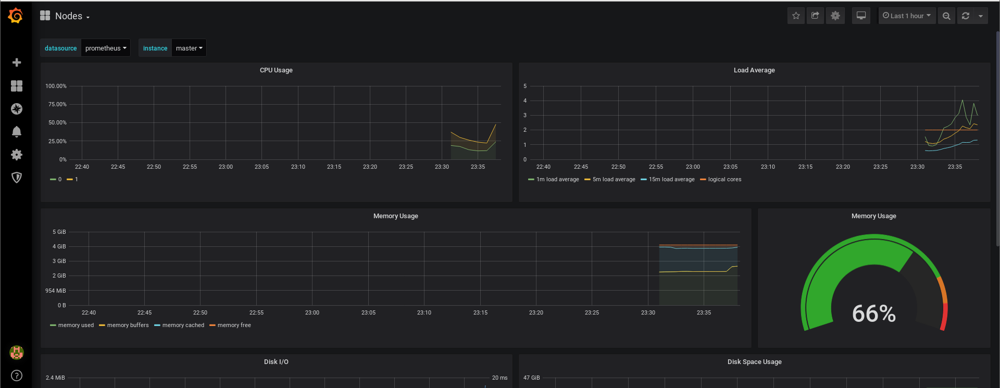

# 安装Prometheus+Grafana到K8S集群

本节使用的是CoreOS的Prometheus-Operator安装Prometheus，本例监控包括监控Etcd集群，本例部署适用于二进制和Kubeadm的安装方式，建议选择Kubernetes1.10版本以上，其他版本自行测试。

Prometheus-Operator项目地址https://github.com/coreos/prometheus-operator

## 1 安装部署Prometheus

本文基于kubernetes1.16.1(二进制)

### 1 下载源码

克隆项目仓库

```
git clone https://github.com/coreos/kube-prometheus.git
```

应用安装文件

```
kubectl apply -f kube-prometheus/manifests/setup/
```

输出信息

```
namespace/monitoring created
customresourcedefinition.apiextensions.k8s.io/alertmanagers.monitoring.coreos.com created
customresourcedefinition.apiextensions.k8s.io/podmonitors.monitoring.coreos.com created
customresourcedefinition.apiextensions.k8s.io/prometheuses.monitoring.coreos.com created
customresourcedefinition.apiextensions.k8s.io/prometheusrules.monitoring.coreos.com created
customresourcedefinition.apiextensions.k8s.io/servicemonitors.monitoring.coreos.com created
clusterrole.rbac.authorization.k8s.io/prometheus-operator created
clusterrolebinding.rbac.authorization.k8s.io/prometheus-operator created
deployment.apps/prometheus-operator created
service/prometheus-operator created
serviceaccount/prometheus-operator created
```

应用资源定义文件

```
kubectl apply -f kube-prometheus/manifests/
```

输出信息

```
alertmanager.monitoring.coreos.com/main created
secret/alertmanager-main created
service/alertmanager-main created
serviceaccount/alertmanager-main created
servicemonitor.monitoring.coreos.com/alertmanager created
secret/grafana-datasources created
configmap/grafana-dashboard-apiserver created
configmap/grafana-dashboard-cluster-total created
configmap/grafana-dashboard-controller-manager created
configmap/grafana-dashboard-k8s-resources-cluster created
configmap/grafana-dashboard-k8s-resources-namespace created
configmap/grafana-dashboard-k8s-resources-node created
configmap/grafana-dashboard-k8s-resources-pod created
configmap/grafana-dashboard-k8s-resources-workload created
configmap/grafana-dashboard-k8s-resources-workloads-namespace created
configmap/grafana-dashboard-kubelet created
configmap/grafana-dashboard-namespace-by-pod created
configmap/grafana-dashboard-namespace-by-workload created
configmap/grafana-dashboard-node-cluster-rsrc-use created
configmap/grafana-dashboard-node-rsrc-use created
configmap/grafana-dashboard-nodes created
configmap/grafana-dashboard-persistentvolumesusage created
configmap/grafana-dashboard-pod-total created
configmap/grafana-dashboard-pods created
configmap/grafana-dashboard-prometheus-remote-write created
configmap/grafana-dashboard-prometheus created
configmap/grafana-dashboard-proxy created
configmap/grafana-dashboard-scheduler created
configmap/grafana-dashboard-statefulset created
configmap/grafana-dashboard-workload-total created
configmap/grafana-dashboards created
deployment.apps/grafana created
service/grafana created
serviceaccount/grafana created
servicemonitor.monitoring.coreos.com/grafana created
clusterrole.rbac.authorization.k8s.io/kube-state-metrics created
clusterrolebinding.rbac.authorization.k8s.io/kube-state-metrics created
deployment.apps/kube-state-metrics created
role.rbac.authorization.k8s.io/kube-state-metrics created
rolebinding.rbac.authorization.k8s.io/kube-state-metrics created
service/kube-state-metrics created
serviceaccount/kube-state-metrics created
servicemonitor.monitoring.coreos.com/kube-state-metrics created
clusterrole.rbac.authorization.k8s.io/node-exporter created
clusterrolebinding.rbac.authorization.k8s.io/node-exporter created
daemonset.apps/node-exporter created
service/node-exporter created
serviceaccount/node-exporter created
servicemonitor.monitoring.coreos.com/node-exporter created
apiservice.apiregistration.k8s.io/v1beta1.metrics.k8s.io created
clusterrole.rbac.authorization.k8s.io/prometheus-adapter created
clusterrole.rbac.authorization.k8s.io/system:aggregated-metrics-reader created
clusterrolebinding.rbac.authorization.k8s.io/prometheus-adapter created
clusterrolebinding.rbac.authorization.k8s.io/resource-metrics:system:auth-delegator created
clusterrole.rbac.authorization.k8s.io/resource-metrics-server-resources created
configmap/adapter-config created
deployment.apps/prometheus-adapter created
rolebinding.rbac.authorization.k8s.io/resource-metrics-auth-reader created
service/prometheus-adapter created
serviceaccount/prometheus-adapter created
clusterrole.rbac.authorization.k8s.io/prometheus-k8s created
clusterrolebinding.rbac.authorization.k8s.io/prometheus-k8s created
servicemonitor.monitoring.coreos.com/prometheus-operator created
prometheus.monitoring.coreos.com/k8s created
rolebinding.rbac.authorization.k8s.io/prometheus-k8s-config created
rolebinding.rbac.authorization.k8s.io/prometheus-k8s created
rolebinding.rbac.authorization.k8s.io/prometheus-k8s created
rolebinding.rbac.authorization.k8s.io/prometheus-k8s created
role.rbac.authorization.k8s.io/prometheus-k8s-config created
role.rbac.authorization.k8s.io/prometheus-k8s created
role.rbac.authorization.k8s.io/prometheus-k8s created
role.rbac.authorization.k8s.io/prometheus-k8s created
prometheusrule.monitoring.coreos.com/prometheus-k8s-rules created
service/prometheus-k8s created
serviceaccount/prometheus-k8s created
servicemonitor.monitoring.coreos.com/prometheus created
servicemonitor.monitoring.coreos.com/kube-apiserver created
servicemonitor.monitoring.coreos.com/coredns created
servicemonitor.monitoring.coreos.com/kube-controller-manager created
servicemonitor.monitoring.coreos.com/kube-scheduler created
servicemonitor.monitoring.coreos.com/kubelet created
```

查看创建的Pod（等待所有pod处于Running状态）

```
kubectl get pods -n monitoring
```

输出信息

```
NAME                                  READY   STATUS             RESTARTS   AGE
alertmanager-main-0                   2/2     Running            0          2m37s
alertmanager-main-1                   2/2     Running            0          2m37s
alertmanager-main-2                   2/2     Running            0          2m37s
grafana-58dc7468d7-gzr7c              1/1     Running            0          2m35s
kube-state-metrics-78b46c84d8-7szj2   3/3     Running            0          2m34s
node-exporter-dvvcg                   2/2     Running            0          2m34s
node-exporter-t4bw2                   2/2     Running            0          2m34s
node-exporter-wrscx                   2/2     Running            0          2m34s
prometheus-adapter-5cd5798d96-pp9dw   0/1     CrashLoopBackOff   2          2m33s
prometheus-k8s-0                      3/3     Running            1          2m30s
prometheus-k8s-1                      3/3     Running            1          2m30s
prometheus-operator-99dccdc56-lf99d   1/1     Running            0          3m22s
```

有一个Pod启动失败（试了两次都是失败 解决方法，删除Pod，让它自动重启一个）

查看service

```
kubectl get service -n  monitoring
```

输出信息

```
NAME                    TYPE        CLUSTER-IP     EXTERNAL-IP   PORT(S)                      AGE
alertmanager-main       ClusterIP   10.250.0.11    <none>        9093/TCP                     7m11s
alertmanager-operated   ClusterIP   None           <none>        9093/TCP,9094/TCP,9094/UDP   7m11s
grafana                 ClusterIP   10.250.0.36    <none>        3000/TCP                     7m9s
kube-state-metrics      ClusterIP   None           <none>        8443/TCP,9443/TCP            7m9s
node-exporter           ClusterIP   None           <none>        9100/TCP                     7m8s
prometheus-adapter      ClusterIP   10.250.0.175   <none>        443/TCP                      7m7s
prometheus-k8s          ClusterIP   10.250.0.251   <none>        9090/TCP                     7m5s
prometheus-operated     ClusterIP   None           <none>        9090/TCP                     7m6s
prometheus-operator     ClusterIP   None           <none>        8080/TCP                     7m57s
```

访问grafana

firefox 10.250.0.36:3000 &

默认用户密码admin：admin

会提示修改默认密码


节点



