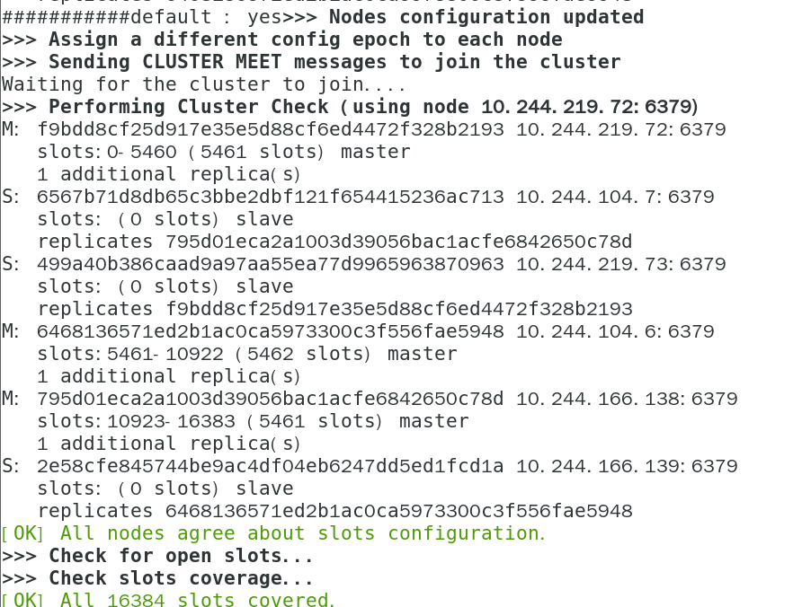

# 安装K8S集群模式到K8S集群中

本节演示安装Redis4.0.8集群模式到Kubernetes集群中，本小节安装采用的是NFS（阿里云可以采用NAS）作为持久化存储，当然也可以使用上节创建的GFS提供的动态存储，只需修改redis-cluster-ss.yaml的storageClassName即可，同时无需再创建redis-cluster-pv.yaml文件。在生产环境中，对Redis集群实现持久化部署并不是必须的，可以采用hostPath模式讲宿主机的本地目录挂载至Redis存储目录，再加上Pod互斥，不让Redis实例部署在同一个宿主机上，之后再利用节点亲和力，尽量将Redis实例部署在原有的宿主机上，此种方式和直接在宿主机上部署Redis并无太大区别，并且实现了Redis的自动容灾功能。当然，在实际使用中，也可以不对Redis进行持久化部署，因为生产环境一般采用Cluster模式部署，同时宕机的可能性较小。

## 1 各文件介绍

1 redis-cluster-configmap.yaml

使用ConfigMap配置Redis的配置文件，请按需修改

```
kind: ConfigMap
apiVersion: v1
metadata:
  name: redis-cluster-config
  namespace: public-service
  labels:
    addonmanager.kubernetes.io/mode: Reconcile
data:
    redis-cluster.conf: |
      # 节点端口
      port 6379
      # #  开启集群模式
      cluster-enabled yes
      # #  节点超时时间，单位毫秒
      cluster-node-timeout 15000
      # #  集群内部配置文件
      cluster-config-file "nodes.conf"
```

2 redis-cluster-pv.yaml文件

定义Redis的持久化文件，请按需修改

```
apiVersion: v1
kind: PersistentVolume
metadata:
  name: pv-redis-cluster-1
  namespace: public-service
spec:
  capacity:
    storage: 1Gi
  accessModes:
    - ReadWriteOnce
  volumeMode: Filesystem
  persistentVolumeReclaimPolicy: Recycle
  storageClassName: "redis-cluster-storage-class"
  nfs:
    # real share directory
    path: /k8s/redis-cluster/1
    # nfs real ip
    server: 192.168.10.10

---
apiVersion: v1
kind: PersistentVolume
metadata:
  name: pv-redis-cluster-2
  namespace: public-service
spec:
  capacity:
    storage: 1Gi
  accessModes:
    - ReadWriteOnce
  volumeMode: Filesystem
  persistentVolumeReclaimPolicy: Recycle
  storageClassName: "redis-cluster-storage-class"
  nfs:
    # real share directory
    path: /k8s/redis-cluster/2
    # nfs real ip
    server: 192.168.10.10

---
apiVersion: v1
kind: PersistentVolume
metadata:
  name: pv-redis-cluster-3
  namespace: public-service
spec:
  capacity:
    storage: 1Gi
  accessModes:
    - ReadWriteOnce
  volumeMode: Filesystem
  persistentVolumeReclaimPolicy: Recycle
  storageClassName: "redis-cluster-storage-class"
  nfs:
    # real share directory
    path: /k8s/redis-cluster/3
    # nfs real ip
    server: 192.168.10.10

---
apiVersion: v1
kind: PersistentVolume
metadata:
  name: pv-redis-cluster-4
  namespace: public-service
spec:
  capacity:
    storage: 1Gi
  accessModes:
    - ReadWriteOnce
  volumeMode: Filesystem
  persistentVolumeReclaimPolicy: Recycle
  storageClassName: "redis-cluster-storage-class"
  nfs:
    # real share directory
    path: /k8s/redis-cluster/4
    # nfs real ip
    server: 192.168.10.10

---
apiVersion: v1
kind: PersistentVolume
metadata:
  name: pv-redis-cluster-5
  namespace: public-service
spec:
  capacity:
    storage: 1Gi
  accessModes:
    - ReadWriteOnce
  volumeMode: Filesystem
  persistentVolumeReclaimPolicy: Recycle
  storageClassName: "redis-cluster-storage-class"
  nfs:
    # real share directory
    path: /k8s/redis-cluster/5
    # nfs real ip
    server: 192.168.10.10

---
apiVersion: v1
kind: PersistentVolume
metadata:
  name: pv-redis-cluster-6
  namespace: public-service
spec:
  capacity:
    storage: 1Gi
  accessModes:
    - ReadWriteOnce
  volumeMode: Filesystem
  persistentVolumeReclaimPolicy: Recycle
  storageClassName: "redis-cluster-storage-class"
  nfs:
    # real share directory
    path: /k8s/redis-cluster/6
    # nfs real ip
    server: 192.168.10.10
```

此文件为Redis集群6个实例所用的PV文件，动态存储无需创建此文件，其中path是NFS共享目录，Server为NFS服务器的地址，按需修改

3 redis-cluster-rbac.yaml

此文件定义的是一些权限，无须修改

```
apiVersion: v1
kind: ServiceAccount
metadata:
  name: redis-cluster
  namespace: public-service
---
kind: Role
apiVersion: rbac.authorization.k8s.io/v1beta1
metadata:
  name: redis-cluster
  namespace: public-service
rules:
  - apiGroups:
      - ""
    resources:
      - endpoints
    verbs:
      - get
---
kind: RoleBinding
apiVersion: rbac.authorization.k8s.io/v1beta1
metadata:
  name: redis-cluster
  namespace: public-service
roleRef:
  apiGroup: rbac.authorization.k8s.io
  kind: Role
  name: redis-cluster
subjects:
- kind: ServiceAccount
  name: redis-cluster
  namespace: public-service
```

4 redis-cluster-service.yaml文件

此文件用于定义Redis的service，用于集群节点的通信

```
kind: Service
apiVersion: v1
metadata:
  labels:
    app: redis-cluster-ss
  name: redis-cluster-ss
  namespace: public-service
spec:
  clusterIP: None
  ports:
  - name: redis
    port: 6379
    targetPort: 6379
  selector:
    app: redis-cluster-ss
```

如果开发或运维需要连接到该集群可以使用NodePort，程序连接直接使用Service的地址（name）即可

5 redis-cluster-ss.yaml文件

本例Redis的安装采用Statefulset模式，redis-cluster-ss.yaml文件定义如下

```
kind: StatefulSet
apiVersion: apps/v1beta1
metadata:
  labels:
    app: redis-cluster-ss
  name: redis-cluster-ss
  namespace: public-service
spec:
  replicas: 6
  selector:
    matchLabels:
      app: redis-cluster-ss
  serviceName: redis-cluster-ss
  template:
    metadata:
      labels:
        app: redis-cluster-ss
    spec:
      containers:
      - args:
        - -c
        - cp /mnt/redis-cluster.conf /data ; redis-server /data/redis-cluster.conf
        command:
        - sh
        image: dotbalo/redis-trib:4.0.10
        imagePullPolicy: IfNotPresent
        name: redis-cluster
        ports:
        - containerPort: 6379
          name: masterport
          protocol: TCP
        volumeMounts:
        - mountPath: /mnt/
          name: config-volume
          readOnly: false
        - mountPath: /data/
          name: redis-cluster-storage
          readOnly: false
      serviceAccountName: redis-cluster
      terminationGracePeriodSeconds: 30
      volumes:
      - configMap:
          items:
          - key: redis-cluster.conf
            path: redis-cluster.conf
          name: redis-cluster-config 
        name: config-volume
  volumeClaimTemplates:
  - metadata:
      name: redis-cluster-storage
    spec:
      accessModes:
      - ReadWriteOnce
      storageClassName: "redis-cluster-storage-class"
      resources:
        requests:
          storage: 1Gi
```

此文件用于创建Redis实例，不一定非要使用StatefulSet，采用Deployment部署也可以。本例创建6个实例，用于集群中节点的3主3从。

## 2 创建Redis命名空间

可以将公共服务都放置在同一个Namespace下，比如public-service中，然后按需修改

创建namespace：

```
kubectl create namespace public-service
```

如果需要部署到其他Namespace，需要更改当前目录中所有的文件的namespace

```
sed -i "s#public-service#<YOUR_NAMESPACE>#g" *
```

## 3创建Redis集群PV

动态PV无需此步骤，本节使用的是NFS作为PV，在实际使用中，Redis的数据不一定需要做持久化，按需配置即可

配置nfs服务器

```
mkdir -p /k8s/redis-cluster
mkdir /k8s/redis-cluster/{1..6}
```

```
echo "/k8s/redis-cluster/1 *(rw,sync,no_subtree_check,no_root_squash)" >> /etc/exports
echo "/k8s/redis-cluster/2 *(rw,sync,no_subtree_check,no_root_squash)" >> /etc/exports
echo "/k8s/redis-cluster/3 *(rw,sync,no_subtree_check,no_root_squash)" >> /etc/exports
echo "/k8s/redis-cluster/4 *(rw,sync,no_subtree_check,no_root_squash)" >> /etc/exports
echo "/k8s/redis-cluster/5 *(rw,sync,no_subtree_check,no_root_squash)" >> /etc/exports
echo "/k8s/redis-cluster/6 *(rw,sync,no_subtree_check,no_root_squash)" >> /etc/exports
```

```
systemctl restart nfs
```

## 4 创建集群

```
kubectl apply -f .
```

## 5 创建集群

redis集群模式和Redis哨兵模式有所不同，等待节点全部启动后，开始创建slot

```
v=""
```

```
for i in `kubectl get po -n public-service -o wide | awk  '{print $6}' | grep -v IP`; do v="$v $i:6379";done
kubectl exec -ti redis-cluster-ss-5 -n public-service -- redis-trib.rb create --replicas 1 $v
```



## 

# Redis 5.0部署

