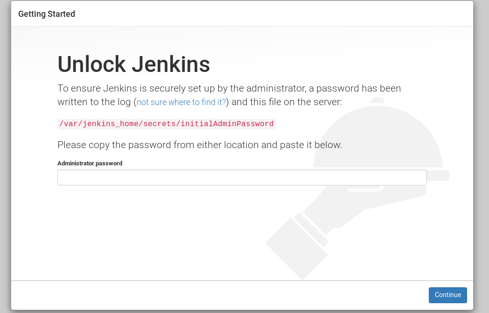
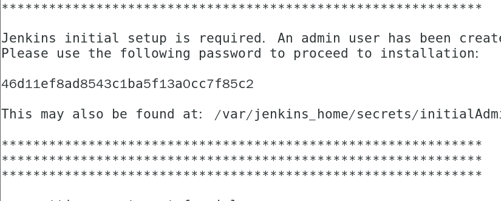

# 安装Jenkins到K8S集群中

## 1 镜像

```
docker pull jenkins/jenkins:lts-centos
```

Yaml文件中的Jenkins的image自行修改

## 	2 步骤

创建nfs目录及配置nfs服务器

```
mkdir /nfs/jenkins -p
chmod 777 -R /nfs/jenkins/
```

```
echo '/nfs/jenkins *(rw,sync)' >> /etc/exports
systemctl restart nfs 
systemctl enable nfs
```

然后写持久卷的yaml文件，此处使用nfs

```yaml
apiVersion: v1
kind: PersistentVolume
metadata:
  name: opspv
spec:
  capacity:
    storage: 10Gi
  accessModes:
  - ReadWriteMany
  persistentVolumeReclaimPolicy: Delete
  nfs:
    server: 192.168.10.10
    path: /nfs/jenkins
---
kind: PersistentVolumeClaim
apiVersion: v1
metadata:
  name: opspvc
spec:
  accessModes:
    - ReadWriteMany
  resources:
    requests:
      storage: 10Gi
```

rbac授权

```yaml
apiVersion: v1
kind: ServiceAccount
metadata:
  name: jenkins2
---
kind: ClusterRole
apiVersion: rbac.authorization.k8s.io/v1beta1
metadata:
  name: jenkins2
rules:
  - apiGroups: ["extensions", "apps"]
    resources: ["deployments"]
    verbs: ["create", "delete", "get", "list", "watch", "patch", "update"]
  - apiGroups: [""]
    resources: ["services"]
    verbs: ["create", "delete", "get", "list", "watch", "patch", "update"]
  - apiGroups: [""]
    resources: ["pods"]
    verbs: ["create","delete","get","list","patch","update","watch"]
  - apiGroups: [""]
    resources: ["pods/exec"]
    verbs: ["create","delete","get","list","patch","update","watch"]
  - apiGroups: [""]
    resources: ["pods/log"]
    verbs: ["get","list","watch"]
  - apiGroups: [""]
    resources: ["secrets"]
    verbs: ["get"]
---
apiVersion: rbac.authorization.k8s.io/v1beta1
kind: ClusterRoleBinding
metadata:
  name: jenkins2
roleRef:
  apiGroup: rbac.authorization.k8s.io
  kind: ClusterRole
  name: jenkins2
subjects:
  - kind: ServiceAccount
    name: jenkins2
    namespace: default
```

service和deployment

```yaml
---
apiVersion: apps/v1
kind: Deployment
metadata:
  name: jenkins2
spec:
  replicas: 1
  selector:
    matchLabels:
      app: jenkins2
  template:
    metadata:
      labels:
        app: jenkins2
    spec:
      terminationGracePeriodSeconds: 10
      serviceAccount: jenkins2
      containers:
      - name: jenkins
        image: harbor.devops.com/devops/jenkins
        imagePullPolicy: IfNotPresent
        ports:
        - containerPort: 8080
          name: web
          protocol: TCP
        - containerPort: 50000
          name: agent
          protocol: TCP
        resources:
          limits:
            cpu: 1000m
            memory: 1Gi
          requests:
            cpu: 500m
            memory: 512Mi
        volumeMounts:
        - name: jenkinshome
          subPath: jenkins2
          mountPath: /var/jenkins_home
        env:
        - name: LIMITS_MEMORY
          valueFrom:
            resourceFieldRef:
              resource: limits.memory
              divisor: 1Mi
        - name: JAVA_OPTS
          value: -Xmx$(LIMITS_MEMORY)m -XshowSettings:vm -Dhudson.slaves.NodeProvisioner.initialDelay=0 -Dhudson.slaves.NodeProvisioner.MARGIN=50 -Dhudson.slaves.NodeProvisioner.MARGIN0=0.85 -Duser.timezone=Asia/Shanghai
      securityContext:
        fsGroup: 1000
      volumes:
      - name: jenkinshome
        persistentVolumeClaim:
          claimName: opspvc
---
apiVersion: v1
kind: Service
metadata:
  name: jenkins2
  labels:
    app: jenkins2
spec:
  type: NodePort
  selector:
    app: jenkins2
  ports:
  - name: web
    port: 8080
    nodePort: 30080
  - name: agent
    port: 50000
    targetPort: agent
```

应用yaml文件

```
kubectl apply -f .
```

然后此时此时pod无法启动，等待/nfs/jenkins/目录下出现jenkins2目录后

原因，Jenkins的dockerfile里写的，不做就不行

```
chown 1000 -R /nfs/jenkins/
```

此时如果pod未处于running状态，可以

```
kubectl delete pod  <Pod Name>
```

等待7分钟左右




密码？

```
kubectl logs jenkins2-c785c48f5-gtj4x
```



然后根据提示点击安装插件(左边蓝色的那个)

等待全部安装完成后设置用户名和密码

### 附使用方法：

重启Jenkins：在登陆成功后，在浏览器框内地址后面输入restart然后确定即可


更新Jenkins

先根据提示下载Jenkins WAR包

将如下Jenkins工作目录下的war目录下所有内容删除

```
rm -rf /nfs/jenkins/jenkins2/war/*
```

然后将war包解压到Jenkins的war目录下

```
unzip -oq jenkins.war -d /nfs/jenkins/jenkins2/war/
```

