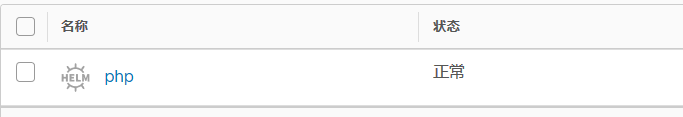

# Helm

简介略

Harbor可以存储chart包 但是需要在启动的时候加一个参数

```
./install.sh  --with-chartmuseum
```

然后创建一共项目  


然后helm安装push插件

```shell
helm plugin install https://github.com/chartmuseum/helm-push
```

然后添加仓库（项目需要设置为公开）然后还要验证密码

```
helm repo add   --username=admin --password=Harobr12345  helm  https://harbor.devops.com/chartrepo/helm
```

然后helm repo list


上传chart

```
helm push helm-test/php helm --username=admin --password=Harbor12345
```




安装chart

更新仓库

```
helm repo update
```

安装chart

```
helm install php  --username=admin --password=Harbor12345 --version 0.1.0 helm/php
```

