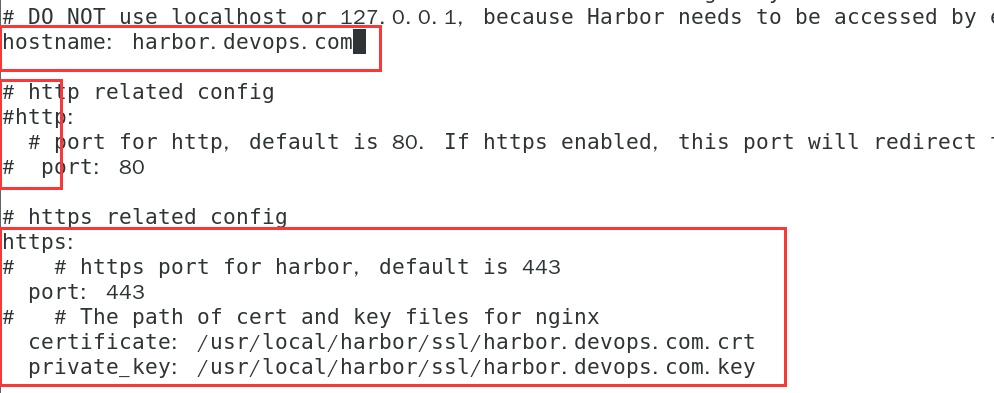
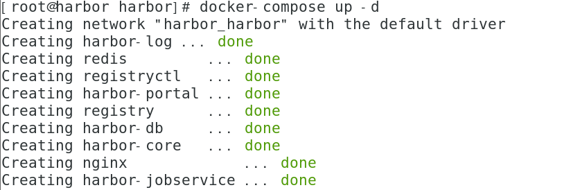
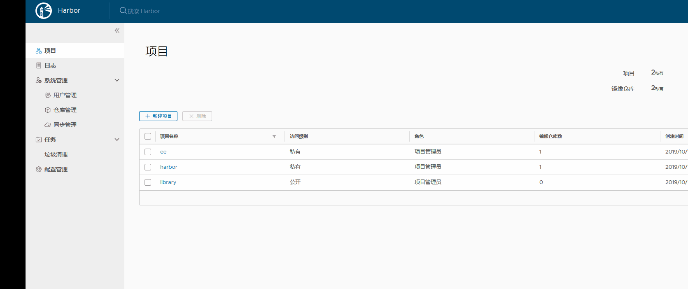
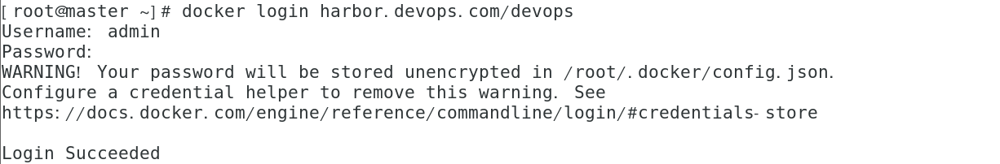
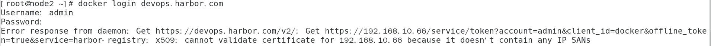

# Kubernetes持续集成环境准备


## 1 环境需要

1. kubernetes1.16集群，需要安装Helm插件
2. 独立部署的gitlab一台
3. 独立部署的jenkins一台
4. 独立部署的Harbor一台

## 2 准备Helm

[详情见helm3安装](https://github.com/mytting/kubernetes/blob/master/C-kubernetes%E5%B8%B8%E8%A7%81%E5%BA%94%E7%94%A8%E5%AE%89%E8%A3%85/D-%E5%AE%89%E8%A3%85Helm%E5%88%B0K8S%E9%9B%86%E7%BE%A4%E4%B8%AD.md)

## 3 安装Jenkins和gitlab

在下方链接中的文章中找到安装Jenkins和gitlab部分安装即可，安装完成无需其他配置

[安装jenkins和gitlab](https://github.com/mytting/linux/blob/master/jenkins%E6%8C%81%E7%BB%AD%E9%9B%86%E6%88%90%E6%8C%81%E7%BB%AD%E4%BA%A4%E4%BB%98%E6%8C%81%E7%BB%AD%E9%83%A8%E7%BD%B2%20CICD.md)

## 4 安装Harbor

[安装Harbor](https://github.com/mytting/docker/blob/master/harbor%E9%95%9C%E5%83%8F%E4%BB%93%E5%BA%93.md)

Harbor安装完成后需要进行配置https证书 配置如下

```shell
cd /usr/local/harbor/
mkdir ssl
cd ssl/
```

创建根证书

```shell
openssl req  -newkey rsa:4096 -nodes -sha256 -keyout ca.key -x509 -days 365 -out ca.crt -subj "/C=CN/L=BeiJing/O=BeiJing/CN=harbor.devops.com"
```

生成一个证书前面，定义域名为harbor.devops.com

```shell
openssl req -newkey rsa:4096 -nodes -sha256 -keyout harbor.devops.com.key -out server.csr -subj "/C=CN/L=BeiJing/O=BeiJing/CN=harbor.devops.com"
```

生成主机的证书

```shell
openssl x509 -req -days 365 -in server.csr -CA ca.crt -CAkey ca.key -CAcreateserial -out harbor.devops.com.crt
```

然后修改harbor的配置文件

```
cd ../
vi harbor.yml
```



```yaml
hostname: harbor.devops.com
https:
  port: 443
  certificate: /usr/local/harbor/ssl/harbor.devops.com.crt
  private_key: /usr/local/harbor/ssl/harbor.devops.com.key
```

将图中http选项全部注释

并配置https

然后重启Harbor

```shell
sudo ./prepare
docker-compose down -v
docker-compose up -d
```



Harbor创建项目




### kubernetes节点操作

然后在所有docker主机上将devops.harbor.com解析至harbor上

```shell
echo "192.168.10.66 harbor.devops.com" >> /etc/hosts
```

然后在所有的docker主机上面的/etc/docker/目录下创建certs.d/harbor.devops.com/目录

```shell
mkdir /etc/docker/certs.d/harbor.devops.com/ -p
```

并将ca证书拷贝到所有主机的该目录下

```shell
scp  harbor.devops.com:/usr/local/harbor/ssl/ca.crt /etc/docker/certs.d/harbor.devops.com/
```

然后把ca.cert的内容添加到/etc/pki/tls/certs/ca-bundle.crt中

```shell
cat /etc/docker/certs.d/harbor.devops.com/ca.crt  >> /etc/pki/tls/certs/ca-bundle.crt
```

重启docker

```shell
systemctl restart docker
```

然后登陆仓库（注意  此时登陆harbor中的某个项目，而不是登陆直接harbor主机）

```shell
docker login harbor.devops.com/devops
```

登陆成功



如果报如下错误



则为证书不信任错误，添加信任即可

```shell
chmod 644 /etc/pki/tls/certs/ca-bundle.crt
```

此时再次登陆

```shell
chmod 444 /etc/pki/tls/certs/ca-bundle.crt
```

所有节点都需要登陆成功