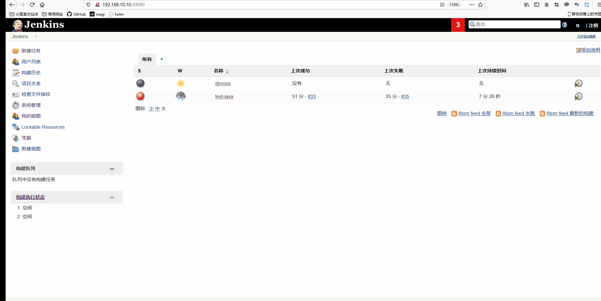
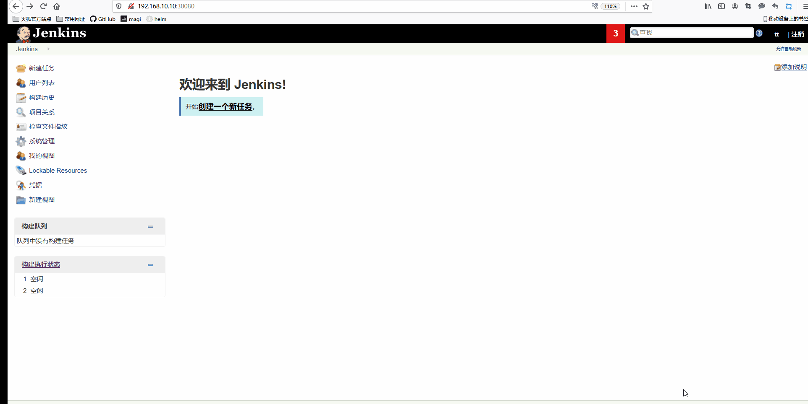
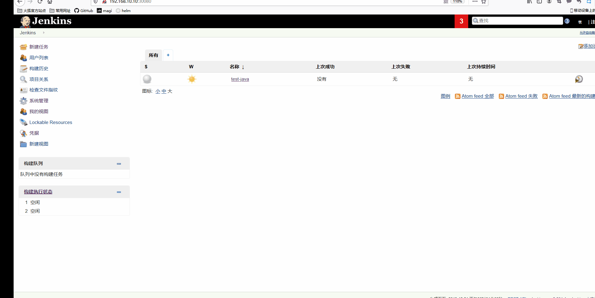

# 配置Jenkins和gitlab

[安装Jenkins见此处](https://github.com/mytting/kubernetes/blob/master/C-kubernetes%E5%B8%B8%E8%A7%81%E5%BA%94%E7%94%A8%E5%AE%89%E8%A3%85/H-%E5%AE%89%E8%A3%85Jenkins%E5%88%B0K8S%E9%9B%86%E7%BE%A4%E4%B8%AD.md)

## 1 Jenkins安装插件


## 2 Jenkins kubernetes配置

系统管理


系统配置


最下面新增一个云


然后选择添加凭据（直接可以打开桌面，然后将k8s集群中的.kube/config文件拷贝出来，注意修改文件中的集群apiserver的地址，不要为127.0.0.1，修改为对应的地址）


添加config文件


然后连接测试成功即可

下面的Jenkins地址选择service的IP地址的8080端口


然后保存

## 3 gitlab创建项目


master主机创建本地仓库测试

```
mkdir gitrepo
cd gitrepo/
ssh-keygen -t rsa -C "devops@qq.com"
git config --global user.name "devops"
git config --global user.email  "devopsi@qq.com"
```

然后将密钥复制到gitlab上


本地（master）克隆仓库并上传代码测试

```
cd devops/
echo "aaaa" > aa
git add aa
git commit -m 'test' 
git push origin master
```


## 4 新建任务(Job)

添加凭据

凭据为gitlab的私钥



添加项目



添加Harbor用户名和密码



## 5 准备镜像

```
docker pull tomcat:8-jre8-alpine
docker tag tomcat:8-jre8-alpine harbor.devops.com/devops/tomcat:8
docker push harbor.devops.com/devops/tomcat:8 
docker pull roffe/kubectl
docker tag roffe/kubectl harbor.devops.com/devops/kubectl
docker push harbor.devops.com/devops/kubectl
docker pull  maven:3.6-jdk-8-openj9
docker tag maven:3.6-jdk-8-openj9 harbor.devops.com/devops/maven
docker push harbor.devops.com/devops/maven
docker pull jenkins/jnlp-slave:alpine
docker tag jenkins/jnlp-slave:alpine harbor.devops.com/devops/jnlp-slave:alpine
docker push harbor.devops.com/devops/jnlp-slave
docker pull docker:19.03
docker tag docker:19.03 harbor.devops.com/devops/docker:19.03
docker push harbor.devops.com/devops/docker:19.03
```

然后K8S所有节点下载这几个镜像

```
docker pull harbor.devops.com/devops/docker:19.03
docker pull harbor.devops.com/devops/tomcat:8
docker pull harbor.devops.com/devops/jnlp-slave
docker pull harbor.devops.com/devops/maven
docker pull harbor.devops.com/devops/kubectl
```

