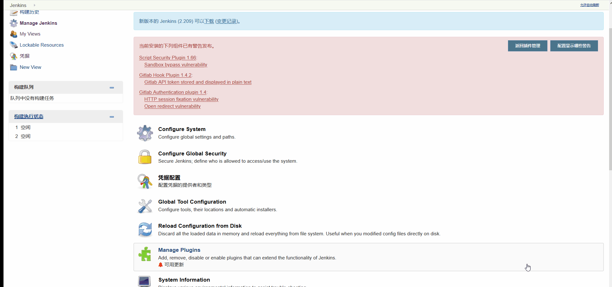
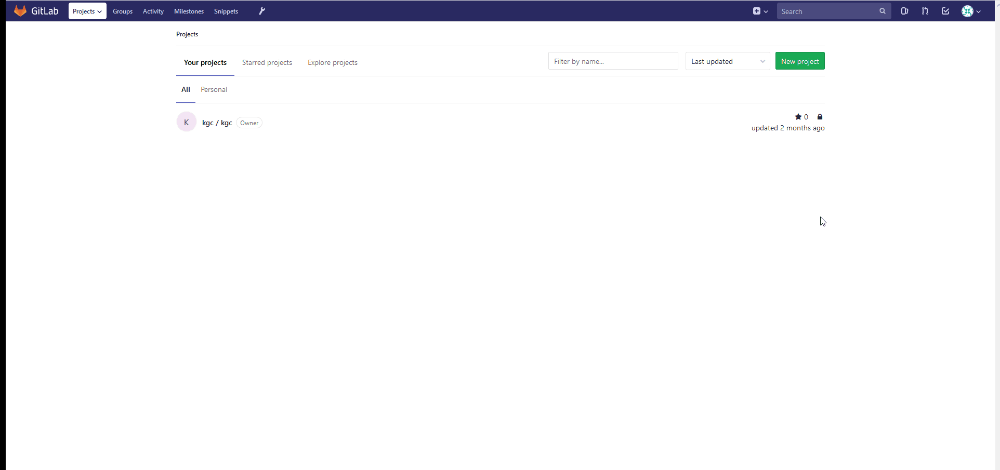
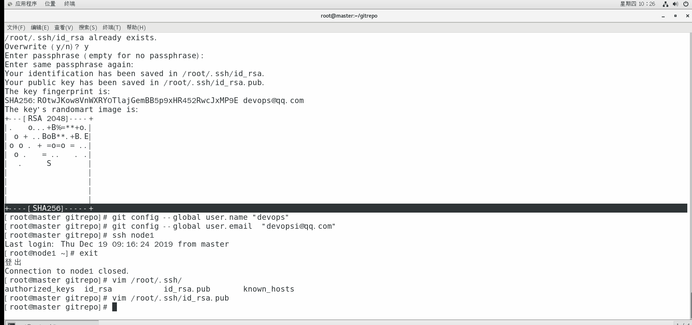
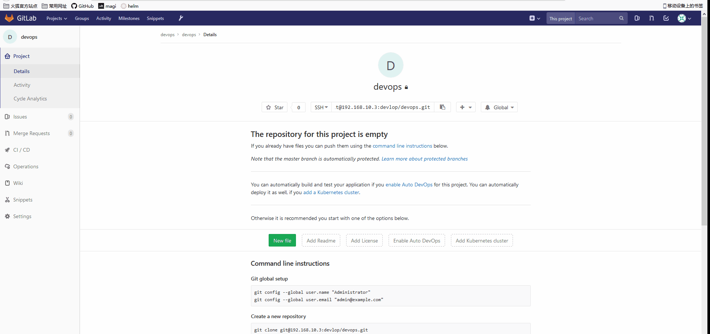
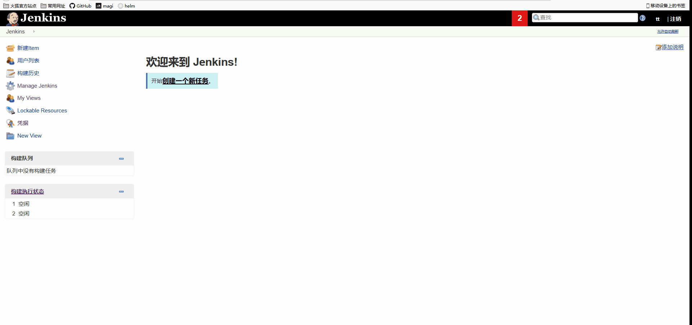

# 配置Jenkins和gitlab

## 1 Jenkins安装插件


## 2 Jenkins kubernetes配置



## 3 gitlab创建项目




master主机创建本地仓库测试

```
mkdir gitrepo
cd gitrepo/
ssh-keygen -t rsa -C "devops@qq.com"
git config --global user.name "devops"
git config --global user.email  "devopsi@qq.com"
```

然后将密钥复制到gitlab上



本地（master）克隆仓库并上传代码测试

```
cd devops/
echo "aaaa" > aa
git add aa
git commit -m 'test' 
git push origin master
```



## 4 新建任务(Job)

添加凭据

用户名和密码为gitlab的用户名和密码



添加job


## 5 准备镜像

```
docker pull tomcat:8-jre8-alpine
docker tag tomcat:8-jre8-alpine harbor.devops.com/devops/tomcat:8
docker push harbor.devops.com/devops/tomcat:8 
docker pull roffe/kubectl
docker tag roffe/kubectl harbor.devops.com/devops/kubectl
docker push harbor.devops.com/devops/kubectl
docker pull  maven:3.6-jdk-8-openj9
docker tag maven:3.6-jdk-8-openj9 harbor.devops.com/devops/maven
docker push harbor.devops.com/devops/maven
docker pull jenkins/jnlp-slave:alpine
docker tag jenkins/jnlp-slave:alpine harbor.devops.com/devops/jnlp-slave:alpine
docker push harbor.devops.com/devops/jnlp-slave
docker pull docker:19.03
docker tag docker:19.03 harbor.devops.com/devops/docker:19.03
docker push harbor.devops.com/devops/docker:19.03
```

