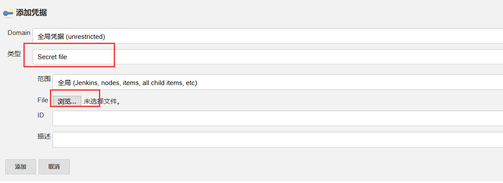

# 配置Jenkins和gitlab

[安装Jenkins见此处](https://github.com/mytting/kubernetes/blob/master/C-kubernetes%E5%B8%B8%E8%A7%81%E5%BA%94%E7%94%A8%E5%AE%89%E8%A3%85/H-%E5%AE%89%E8%A3%85Jenkins%E5%88%B0K8S%E9%9B%86%E7%BE%A4%E4%B8%AD.md)

## 1 Jenkins安装插件


## 2 Jenkins kubernetes配置

系统管理


系统配置


最下面新增一个云


然后选择添加凭据（直接可以打开桌面，然后将k8s集群中的.kube/config文件拷贝出来，注意修改文件中的集群apiserver的地址，不要为127.0.0.1，修改为对应的地址）




添加config文件


然后连接测试成功即可

下面的Jenkins地址选择service的IP地址的8080端口


然后保存

### 注：

如果采用的独立部署的Jenkins

需要在Kubernetes集群中创建无头service，以及创建对应的endpoint以使kubernetes集群内部的Jnlp可以访问到Jenkins master

示例

```yaml
apiVersion: v1
kind: Service
metadata:
  name: jenkins-host
spec:
  ports:
  - protocol: TCP
    port: 8080
    targetPort: 8080
    name: jenkins
  - name: slave
    protocol: TCP
    port: 50000
    targetPort: 50000
---
apiVersion: v1
kind: Endpoints
metadata:
  name: jenkins-host
subsets:
  - addresses:
    - ip: 192.168.10.2
    ports:
    - port: 8080
      name: jenkins
    - port: 50000
      name: slave
```

上述kubernetes云处的Jenkins地址一栏的配置为此service的http://<serviceIP>:8080


### 然后Jenkins master需要配置安全代理端口50000(Jnlp镜像的默认配置为50000)


