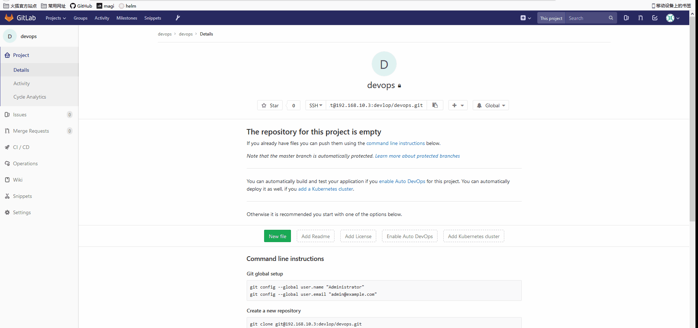
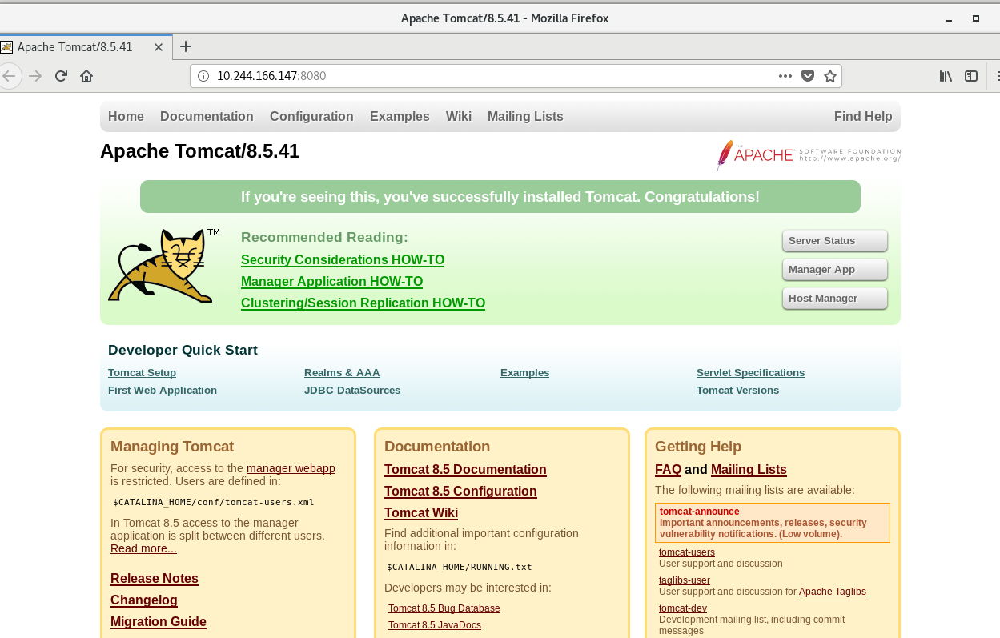

# 自动化构建Java应用

本节演示自动构建Java应用，使用的是Tomcat。由于步骤是按照公司内部代码编写的，因此请将Dockerfile和Jenkinsfile放置于目标公司代码的根目录，然后进行测试，或者使用其他项目测试，本示例只是为了演示相关步骤和流水线（pipline）的编写

## 3 gitlab创建项目


master主机创建本地仓库测试

```
mkdir gitrepo
cd gitrepo/
ssh-keygen -t rsa -C "devops@qq.com"
git config --global user.name "devops"
git config --global user.email  "devopsi@qq.com"
```

然后将密钥复制到gitlab上


本地（master）克隆仓库并上传代码测试

```
cd devops/
echo "aaaa" > aa
git add aa
git commit -m 'test' 
git push origin master
```



## 4 新建任务(Job)

添加凭据

凭据为gitlab的私钥


添加项目


添加Harbor用户名和密码


## 5 准备镜像

```
docker pull tomcat:8-jre8-alpine
docker tag tomcat:8-jre8-alpine harbor.devops.com/devops/tomcat:8
docker push harbor.devops.com/devops/tomcat:8 
docker pull bitnami/kubectl:$(kubectl version  | awk -F, '{print $3}' | awk -F: '{print $2}' | awk -F\" '{print $2}' | tail -1 | awk -F v '{print $2}')
docker tag bitnami/kubectl:$(kubectl version  | awk -F, '{print $3}' | awk -F: '{print $2}' | awk -F\" '{print $2}' | tail -1 | awk -F v '{print $2}') harbor.devops.com/devops/kubectl
docker push harbor.devops.com/devops/kubectl
docker pull  maven:3.6-jdk-8-openj9
docker tag maven:3.6-jdk-8-openj9 harbor.devops.com/devops/maven
docker push harbor.devops.com/devops/maven
docker pull jenkins/jnlp-slave:alpine
docker tag jenkins/jnlp-slave:alpine harbor.devops.com/devops/jnlp-slave:alpine
docker push harbor.devops.com/devops/jnlp-slave
docker pull docker:19.03
docker tag docker:19.03 harbor.devops.com/devops/docker:19.03
docker push harbor.devops.com/devops/docker:19.03
```

### 然后K8S所有节点下载这几个镜像

```
docker pull harbor.devops.com/devops/docker:19.03
docker pull harbor.devops.com/devops/tomcat:8
docker pull harbor.devops.com/devops/jnlp-slave
docker pull harbor.devops.com/devops/maven
docker pull harbor.devops.com/devops/kubectl
```


## 6创建deployment和Secret

```
kubectl create secret docker-registry harbor --docker-server=harbor.devops.com --docker-username=admin --docker-email=tt@qq.com --docker-password=Harbor12345
```


```
apiVersion: apps/v1
kind: Deployment
metadata:
  name: test-java
  labels:
    app: test-java
    env: test
spec:
  selector:
    matchLabels:
      app: test-java
  replicas: 4
  strategy:
    type: RollingUpdate
    rollingUpdate:
      maxUnavailable: 1
      maxSurge: 2
  minReadySeconds: 5
  template:
    metadata:
      labels:
        app: test-java
    spec:
      containers:
        - name: test-java
          image: harbor.devops.com/devops/tomcat:8
          imagePullPolicy: IfNotPresent

          # volumeMounts:
          #  - name: openldap-data
          #    mountPath: /var/lib/ldap
          #    subPath: data
          #  - name: openldap-data
          #    mountPath: /etc/ldap/slapd.d
          #    subPath: config
          #  - name: openldap-data
          #    mountPath: /container/service/slapd/assets/certs
          #    subPath: certs
          #  - name: secret-volume
          #    mountPath: /container/environment/01-custom
          #  - name: container-run
          #    mountPath: /container/run
          ports:
            - containerPort: 8080
              name: tomcat
            # - name: ssl-ldap-port
            #  containerPort: 636
          livenessProbe:
            tcpSocket:
              port: tomcat
            initialDelaySeconds: 20
            periodSeconds: 10
            failureThreshold: 10
          readinessProbe:
            tcpSocket:
              port: tomcat
            initialDelaySeconds: 20
            periodSeconds: 10
            failureThreshold: 10
      imagePullSecrets:
        - name: harbor
      #volumes:
      #  - name: openldap-data
      #    persistentVolumeClaim:
      #      claimName: openldap-data
      #  - name: "secret-volume"
      #    secret:
      #      secretName: "ldap-secret"
      #  - name: container-run
      #    emptyDir: {}
```

先创建Deployment

##  7定义Dockerfile

```
ROM harbor.devops.com/devops/tomcat:8
RUN rm -rf /usr/local/tomcat/webapps/* && mkdir /usr/local/tomcat/webapps/ROOT -p
COPY ./ROOT /usr/local/tomcat/webapps/ROOT
CMD [ "sh", "-c", "catalina.sh run" ]
```


## 3 定义Jenkinsfile

```
def label = "worker-${UUID.randomUUID().toString()}"

podTemplate(label: label, containers: [
  containerTemplate(name: 'jnlp', image:  'jenkins/jnlp-slave:3.35-5-alpine', args: '${computer.jnlpmac} ${computer.name}'),
  containerTemplate(name: 'docker', image: 'harbor.devops.com/devops/docker:19.03',  command: 'cat', ttyEnabled: true),
  containerTemplate(name: 'maven', image: 'harbor.devops.com/devops/maven:latest', command: 'cat', ttyEnabled: true),
  containerTemplate(name: 'kubectl', image: 'harbor.devops.com/devops/kubectl', command: 'cat', ttyEnabled: true)
],
volumes: [
  hostPathVolume(mountPath: '/var/run/docker.sock', hostPath: '/var/run/docker.sock'),
  hostPathVolume(mountPath: '/root/.kube/config', hostPath: '/root/.kube/config'),
  hostPathVolume(mountPath: '/etc/hosts', hostPath: '/etc/hosts'),
]) {
  node(label) {
    def myRepo = checkout scm
    def gitCommit = myRepo.GIT_COMMIT
    def gitBranch = myRepo.GIT_BRANCH
    def shortGitCommit = "${gitCommit[0..10]}"
    def previousGitCommit = sh(script: "git rev-parse ${gitCommit}~", returnStdout: true)
    def JOB_NAME = "test-java"
    def BUILD_NAME = "dxh"
    def APP_IMAGE_URL = "harbor.devops.com/devops/"
    def NS = "default"
    def PROJECT = "trustee-task"
    stage('build') {
      try {
        container('maven') {
          sh """
            mkdir ROOT -p
            mvn clean install
            cd ROOT && jar -xvf ../target/*.war
            """
        }
      }
      catch (exc) {
        println "Failed to build - ${currentBuild.fullDisplayName}"
        throw(exc)
      }
    }
    stage('Create Docker images') {
      container('docker') {
        withCredentials([[$class: 'UsernamePasswordMultiBinding',
          credentialsId: 'HARBOR_USER',
          usernameVariable: 'HARBOR_USER',
          passwordVariable: 'HARBOR_PASSWORD']]) {
          sh """
            docker login -u ${HARBOR_USER} -p ${HARBOR_PASSWORD} ${APP_IMAGE_URL}
            docker build -t ${APP_IMAGE_URL}${JOB_NAME}:${BUILD_NAME} .
            docker push ${APP_IMAGE_URL}${JOB_NAME}:${BUILD_NAME}
            """
          }
        }
      }
    stage('Run kubectl') {
      container('kubectl') {
        sh """
            kubectl set image deployment/${JOB_NAME} ${JOB_NAME}=${APP_IMAGE_URL}${JOB_NAME}:${BUILD_NAME} -n ${NS} --record
            kubectl get pod -n ${NS} -l app=${JOB_NAME} -o wide
           """
      }
    }
    }
  }
```

将源码中的src目录和pom文件拷贝到本地仓库内，并上传到gitlab上

```
git　clone https://github.com/mytting/kubernetes.git
```

将代码中的所有数据传到本地仓库内，并上传至gitlab

然后立即构建


构建完成之前访问Pod



构建完成后访问


harbor镜像仓库


持续集成完毕