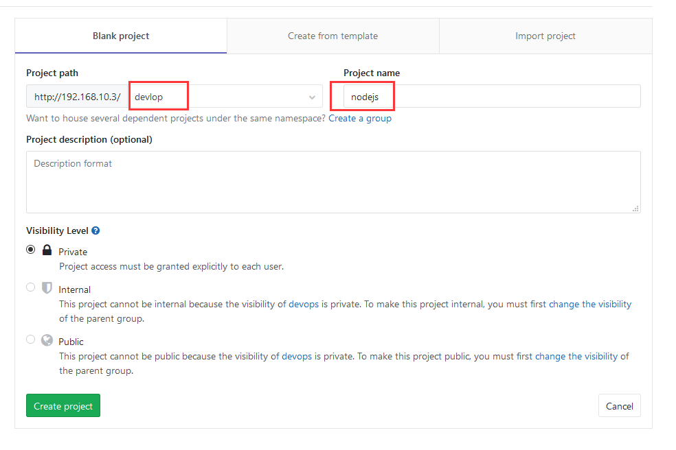
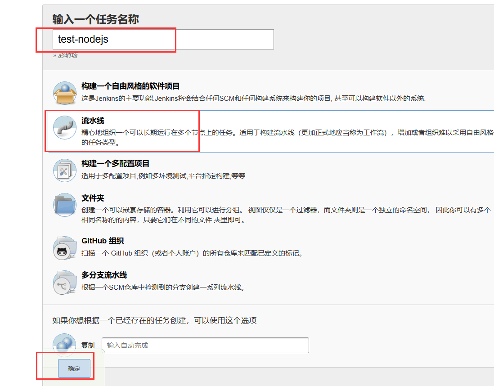
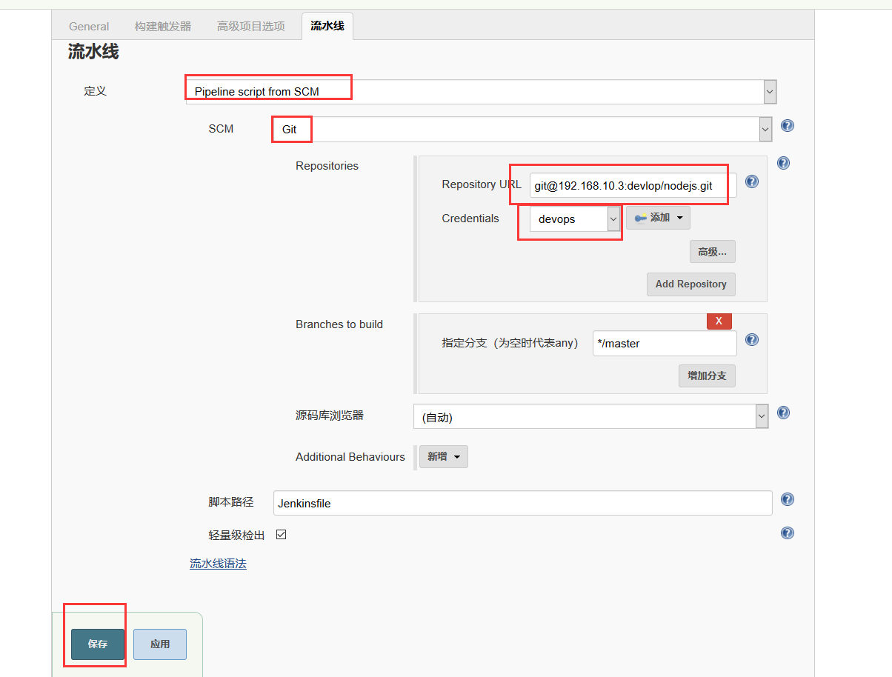
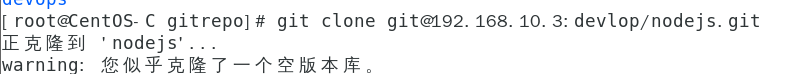
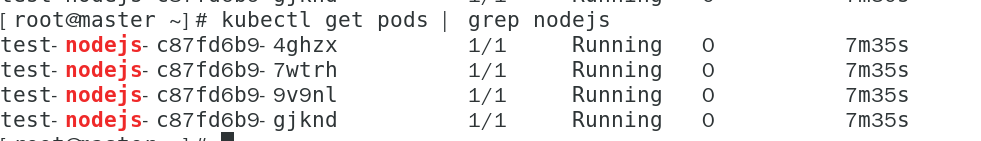
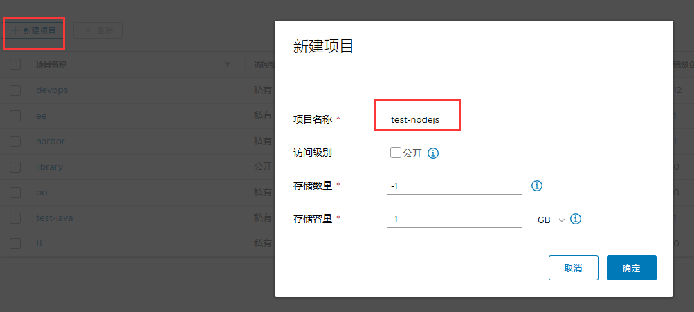
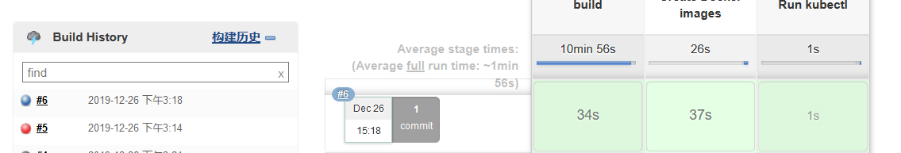
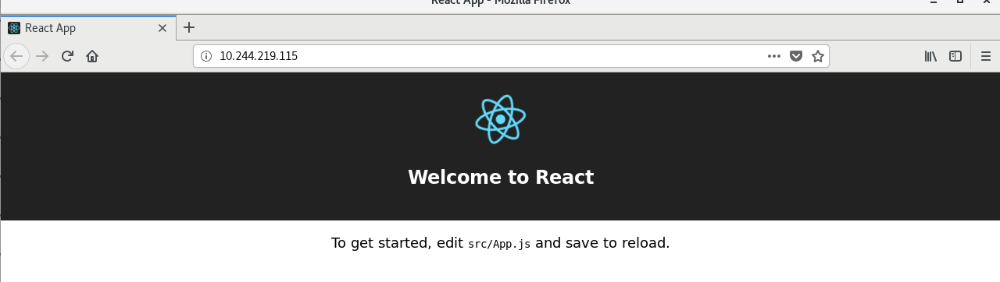

# 自动构建NodeJS应用

本节介绍自动化构建NodeJS应用，其构建方式和自动化java基本相同，重点是更改Deployment，Jenkinsfile和Dockerfile

## 1 创建GItlab项目



## 2 创建Jenkins Job




克隆到本地仓库



## 3  在本地仓库定义Dockerfile

如果NodeJS仅仅作为前端，在使用NPM进行编译后，一般在dist目录会生成相应的html文件，可以直接使用Nginx进行部署

```
FROM harbor.devops.com/devops/nginx:tt
COPY ./build /usr/local/nginx/html
ENTRYPOINT ["nginx"]
CMD ["-g","daemon off;"]
```

此文件使用的是mytting/chang:nginx作为基础镜像，之后将dist的html文件拷贝到Nginx的html目录中，再启动Nginx即可访问

## 4 在kubernetes中定义Deployment

```yaml
apiVersion: apps/v1
kind: Deployment
metadata:
  name: test-nodejs
  labels:
    app: test-nodejs
    env: test
spec:
  selector:
    matchLabels:
      app: test-nodejs
  replicas: 4
  strategy:
    type: RollingUpdate
    rollingUpdate:
      maxUnavailable: 1
      maxSurge: 2
  minReadySeconds: 5
  template:
    metadata:
      labels:
        app: test-nodejs
    spec:
      containers:
        - name: test-nodejs
          image: harbor.devops.com/devops/nginx:tt
          imagePullPolicy: IfNotPresent

          # volumeMounts:
          #  - name: openldap-data
          #    mountPath: /var/lib/ldap
          #    subPath: data
          #  - name: openldap-data
          #    mountPath: /etc/ldap/slapd.d
          #    subPath: config
          #  - name: openldap-data
          #    mountPath: /container/service/slapd/assets/certs
          #    subPath: certs
          #  - name: secret-volume
          #    mountPath: /container/environment/01-custom
          #  - name: container-run
          #    mountPath: /container/run
          ports:
            - containerPort: 80
              name: web
            # - name: ssl-ldap-port
            #  containerPort: 636
          livenessProbe:
            tcpSocket:
              port: web
            initialDelaySeconds: 20
            periodSeconds: 10
            failureThreshold: 10
          readinessProbe:
            tcpSocket:
              port: web
            initialDelaySeconds: 20
            periodSeconds: 10
            failureThreshold: 10
      imagePullSecrets:
        - name: harbor
      #volumes:
      #  - name: openldap-data
      #    persistentVolumeClaim:
      #      claimName: openldap-data
      #  - name: "secret-volume"
      #    secret:
      #      secretName: "ldap-secret"
      #  - name: container-run
      #    emptyDir: {}
```



## 5 准备镜像

```
docker pull node:6.15.1-alpine
docker tag node:6.15.1-alpine harbor.devops.com/devops/nodejs:6
docker push harbor.devops.com/devops/nodejs:6
```

## 6 准备Harbor项目



## 7 在本地仓库定义Jenkinsfile

```
def label = "worker-${UUID.randomUUID().toString()}"

podTemplate(label: label, containers: [
  containerTemplate(name: 'jnlp', image:  'jenkins/jnlp-slave:3.35-5-alpine', args: '${computer.jnlpmac} ${computer.name}'),
  containerTemplate(name: 'docker', image: 'harbor.devops.com/devops/docker:19.03',  command: 'cat', ttyEnabled: true),
  containerTemplate(name: 'node6', image: 'harbor.devops.com/devops/nodejs:6', command: 'cat', ttyEnabled: true),
  containerTemplate(name: 'kubectl', image: 'harbor.devops.com/devops/rofekubectl:latest', command: 'cat', ttyEnabled: true)
],
volumes: [
  hostPathVolume(mountPath: '/var/run/docker.sock', hostPath: '/var/run/docker.sock'),
  hostPathVolume(mountPath: '/root/.kube/config', hostPath: '/root/.kube/config'),
  hostPathVolume(mountPath: '/etc/hosts', hostPath: '/etc/hosts'),
]) {
  node(label) {
    def myRepo = checkout scm
    def gitCommit = myRepo.GIT_COMMIT
    def gitBranch = myRepo.GIT_BRANCH
    def shortGitCommit = "${gitCommit[0..10]}"
    def previousGitCommit = sh(script: "git rev-parse ${gitCommit}~", returnStdout: true)
    def JOB_NAME = "${JOB_NAME}"
    def JOB_NUMBER = "${BUILD_NUMBER}"
    def HARBOR_ADDRESS = "harbor.devops.com"
    def APP_IMAGE_URL = "${HARBOR_ADDRESS}/${JOB_NAME}/"
    def NS = "default"
    stage('build') {
      try {
        container('node6') {
          sh """
            npm install
            npm run build
            """
        }
      }
      catch (exc) {
        println "Failed to build - ${currentBuild.fullDisplayName}"
        throw(exc)
      }
    }
    stage('Create Docker images') {
      container('docker') {
        withCredentials([[$class: 'UsernamePasswordMultiBinding',
          credentialsId: 'HARBOR_USER',
          usernameVariable: 'HARBOR_USER',
          passwordVariable: 'HARBOR_PASSWORD']]) {
          sh """
            docker login -u ${HARBOR_USER} -p ${HARBOR_PASSWORD} ${APP_IMAGE_URL}
            docker build -t ${APP_IMAGE_URL}${JOB_NAME}:${JOB_NUMBER} .
            docker tag ${APP_IMAGE_URL}${JOB_NAME}:${JOB_NUMBER} ${APP_IMAGE_URL}${JOB_NAME}:latest
            docker push ${APP_IMAGE_URL}${JOB_NAME}:latest
            docker push ${APP_IMAGE_URL}${JOB_NAME}:${JOB_NUMBER}
            """
          }
        }
      }
    stage('Run kubectl') {
      container('kubectl') {
        sh """
            kubectl set image deployment/${JOB_NAME} ${JOB_NAME}=${APP_IMAGE_URL}${JOB_NAME}:${JOB_NUMBER} -n ${NS} --record
            kubectl get pod -n ${NS} -l app=${JOB_NAME} -o wide
           """
      }
    }
    }
  }

```


## 8 准备源码

```
https://github.com/jenkins-docs/simple-node-js-react-npm-app.git
```

将源码的package.json  public  src三个目录移动到本地仓库中

提交源码 构建测试

构建可能会很慢 因为npm install的时候下载依赖会消耗很长时间，我是在服务器上针对源码先npm install了一下

然后会生成node_modules目录，将此目录拷贝到本地仓库中，并上传，然后就跳过了npm install的一步




