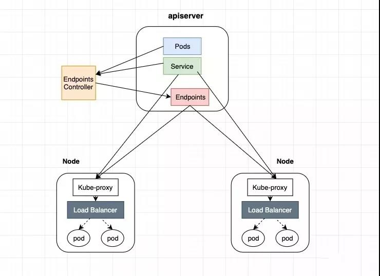
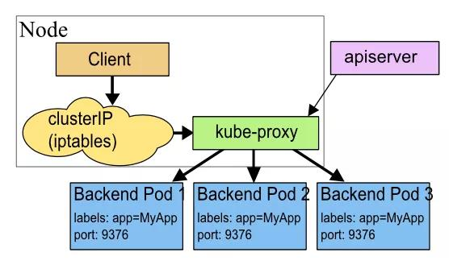
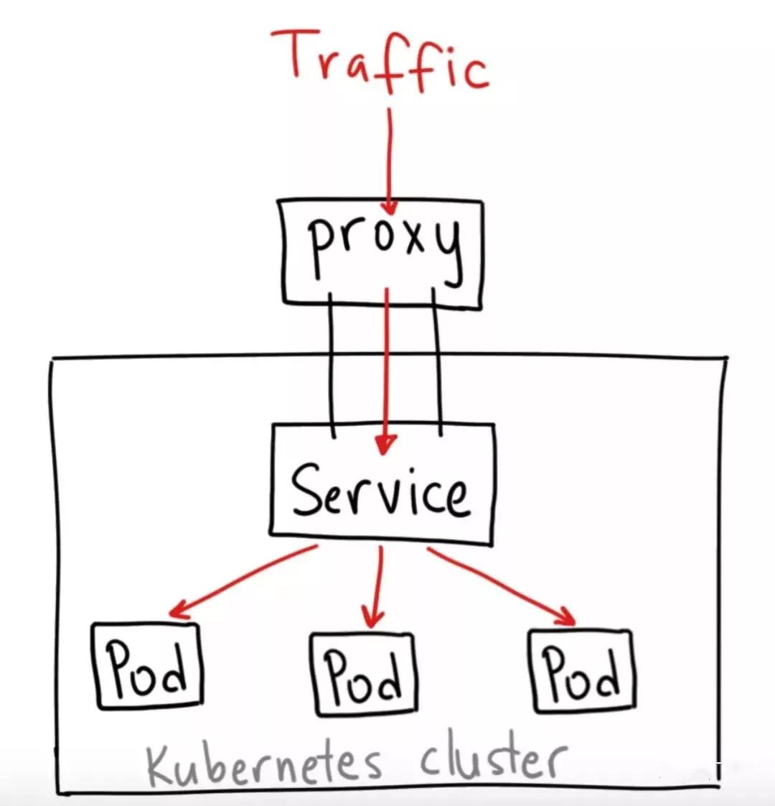
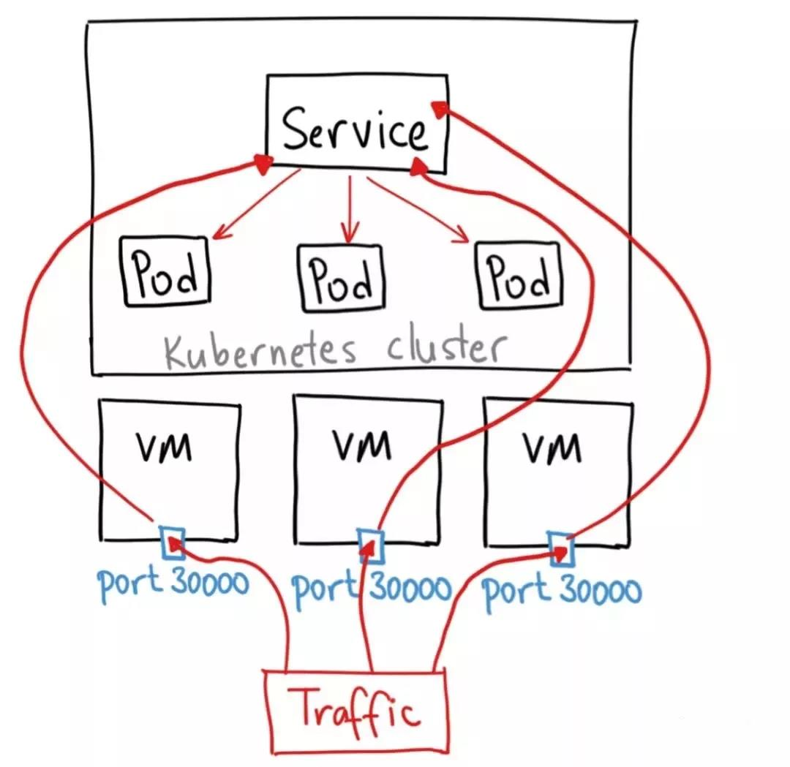
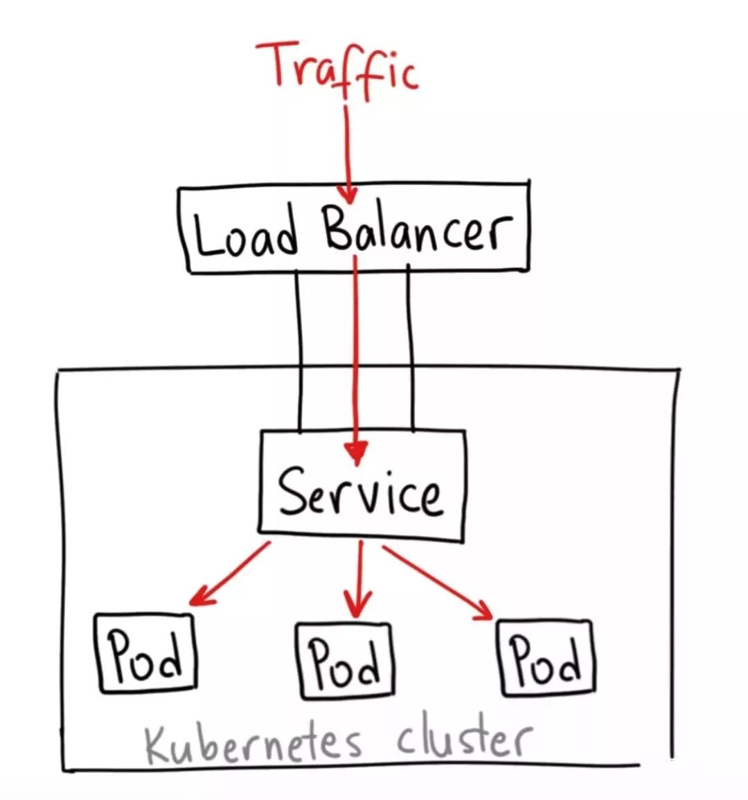
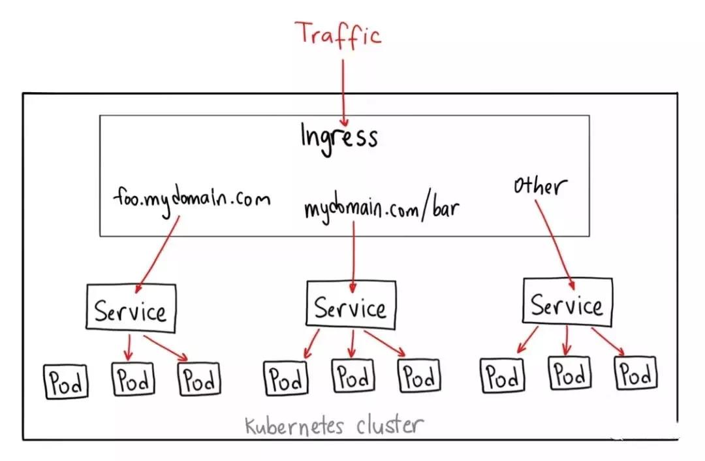
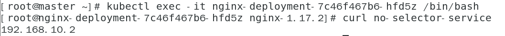
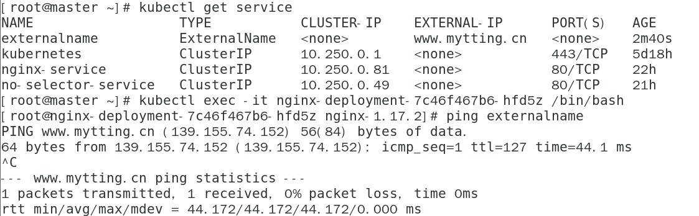

# Service

##  1 为什么需要 service:

在 kubernetes  中，当创建带有多个副本的 deployment 时，kubernetes 会创建出多个 pod，此时即一个服务后端有多个容器，那么在 kubernetes  中负载均衡怎么做，容器漂移后 ip 也会发生变化，如何做服务发现以及会话保持？这就是 service 的作用。

service 是一组具有相同 label pod 集合的抽象，集群内外的各个服务可以通过 service 进行互相通信，当创建一个 service 对象时也会对应创建一个 endpoint 对象，endpoint 是用来做容器发现的，service 只是将多个 pod 进行关联，实际的路由转发都是由 kubernetes  中的 kube-proxy 组件来实现，因此，service 必须 kube-proxy 使用，kube-proxy 组件可以运行在 kubernetes 集群中的每一个节点上也可以只运行在单独的几个节点上，其会根据 service 和 endpoints 的变动来改变节点上 iptables 或者 ipvs 中保存的路由规则。

## 2  service 的工作原理



endpoints controller 是负责生成和维护所有 endpoints 对象的控制器，监听 service 和对应 pod 的变化，更新对应 service 的 endpoints 对象。当用户创建 service 后 endpoints controller 会监听 pod 的状态，当 pod 处于 running 且准备就绪时，endpoints controller 会将 pod ip 记录到 endpoints 对象中，因此，service 的容器发现是通过 endpoints 来实现的。而 kube-proxy 会监听 service 和 endpoints 的更新并调用其代理模块在主机上刷新路由转发规则。 

##  3 **service 的负载均衡** 

上文已经提到 service 实际的路由转发都是由 kube-proxy 组件来实现的，service 仅以一种 VIP（ClusterIP） 的形式存在，kube-proxy 主要实现了集群内部从 pod 到 service 和集群外部从 nodePort 到 service 的访问，kube-proxy 的路由转发规则是通过其后端的代理模块实现的，kube-proxy 的代理模块目前有四种实现方案，userspace、iptables、ipvs、kernelspace，其发展历程如下所示：

- kubernetes v1.0：services 仅是一个“4层”代理，代理模块只有 userspace
- kubernetes v1.1：Ingress API 出现，其代理“7层”服务，并且增加了 iptables 代理模块
- kubernetes v1.2：iptables 成为默认代理模式
- kubernetes v1.8：引入 ipvs 代理模块
- kubernetes v1.9：ipvs 代理模块成为 beta 版本
- kubernetes v1.11：ipvs 代理模式 GA


在每种模式下都有自己的负载均衡策略，下文会详解介绍。

**userspace 模式**

在 userspace 模式下，访问服务的请求到达节点后首先进入内核 iptables，然后回到用户空间，由 kube-proxy 转发到后端的 pod，这样流量从用户空间进出内核带来的性能损耗是不可接受的，所以也就有了 iptables 模式。

为什么 userspace 模式要建立 iptables 规则，因为 kube-proxy 监听的端口在用户空间，这个端口不是服务的访问端口也不是服务的 nodePort，因此需要一层 iptables 把访问服务的连接重定向给 kube-proxy 服务。



**ipvs 模式**

当集群规模比较大时，iptables 规则刷新会非常慢，难以支持大规模集群，因其底层路由表的实现是链表，对路由规则的增删改查都要涉及遍历一次链表，ipvs 的问世正是解决此问题的，ipvs 是 LVS 的负载均衡模块，与 iptables 比较像的是，ipvs 的实现虽然也基于 netfilter 的钩子函数，但是它却使用哈希表作为底层的数据结构并且工作在内核态，也就是说 ipvs 在重定向流量和同步代理规则有着更好的性能，几乎允许无限的规模扩张。


ipvs 支持三种负载均衡模式：DR模式（Direct Routing）、NAT 模式（Network Address Translation）、Tunneling（也称 ipip 模式）。三种模式中只有 NAT 支持端口映射，所以 ipvs 使用 NAT 模式。linux 内核原生的 ipvs 只支持 DNAT，当在数据包过滤，SNAT 和支持 NodePort 类型的服务这几个场景中ipvs 还是会使用 iptables。


此外，ipvs 也支持更多的负载均衡算法，例如：

- rr：round-robin/轮询
- lc：least connection/最少连接
- dh：destination hashing/目标哈希
- sh：source hashing/源哈希
- sed：shortest expected delay/预计延迟时间最短
- nq：never queue/从不排队


userspace、iptables、ipvs 三种模式中默认的负载均衡策略都是通过 round-robin 算法来选择后端 pod 的，在 service 中可以通过设置 service.spec.sessionAffinity 的值实现基于客户端 ip 的会话亲和性，service.spec.sessionAffinity 的值默认为"None"，可以设置为 "ClientIP"，此外也可以使用 service.spec.sessionAffinityConfig.clientIP.timeoutSeconds 设置会话保持时间。kernelspace 主要是在 windows 下使用的，本文暂且不谈。

## 4  **service 的类型** 

 service 支持的类型也就是 kubernetes 中服务暴露的方式，默认有四种 ClusterIP、NodePort、LoadBalancer、ExternelName，此外还有 Ingress，下面会详细介绍每种类型 service  的具体使用场景。 

### 1 ClusterIP

ClusterIP 类型的 service 是 kubernetes 集群默认的服务暴露方式，它只能用于集群内部通信，可以被各 pod 访问，其访问方式为：

#### pod ---> ClusterIP:ServicePort --> (iptables)DNAT --> PodIP:containePort

可以应用于比如LNMP的数据库和php 它们不需要被外部访问

 ClusterIP Service 类型的结构如下图所示： 

 

### 2  NodePort

如果你想要在集群外访问集群内部的服务，可以使用这种类型的 service，NodePort 类型的 service 会在集群内部署了 kube-proxy 的节点打开一个指定的端口，之后所有的流量直接发送到这个端口，然后会被转发到 service 后端真实的服务进行访问。Nodeport 构建在 ClusterIP 上，其访问链路如下所示：

#### client ---> NodeIP:NodePort ---> ClusterIP:ServicePort ---> (iptables)DNAT ---> PodIP:containePort

其对应具体的 iptables 规则会在后文进行讲解。

NodePort service 类型的结构如下图所示：



### 3LoadBalancer

LoadBalancer 类型的 service 通常和云厂商的 LB 结合一起使用，用于将集群内部的服务暴露到外网，云厂商的 LoadBalancer 会给用户分配一个 IP，之后通过该 IP 的流量会转发到你的 service 上。


LoadBalancer service 类型的结构如下图所示：



### 4 ExternelName

通过 CNAME 将 service 与 externalName 的值(比如：foo.bar.example.com)映射起来，这种方式用的比较少。


### 5Ingress

Ingress 其实不是 service 的一个类型，但是它可以作用于多个 service，被称为 service 的 service，作为集群内部服务的入口，Ingress 作用在七层，可以根据不同的 url，将请求转发到不同的 service 上。


Ingress 的结构如下图所示：




## 5 **service 的服务发现** 

虽然 service 的 endpoints 解决了容器发现问题，但不提前知道 service 的 Cluster IP，怎么发现 service 服务呢？service 当前支持两种类型的服务发现机制，一种是通过环境变量，另一种是通过 DNS。在这两种方案中，建议使用后者。


**环境变量**

当一个 pod 创建完成之后，kubelet 会在该 pod 中注册该集群已经创建的所有 service 相关的环境变量，但是需要注意的是，在 service 创建之前的所有 pod 是不会注册该环境变量的，所以在平时使用时，建议通过 DNS 的方式进行 service 之间的服务发现。


**DNS**

可以在集群中部署 CoreDNS 服务(旧版本的 kubernetes 群使用的是 kubeDNS)， 来达到集群内部的 pod 通过DNS 的方式进行集群内部各个服务之间的通讯。

当前 kubernetes 集群默认使用 CoreDNS 作为默认的 DNS 服务，主要原因是 CoreDNS 是基于 Plugin 的方式进行扩展的，简单，灵活，并且不完全被Kubernetes所捆绑。


##  6 Service的使用

### 1  定义Service

一个Service在kubernetes中是一个REST对象。像所有REST对象一样，Service的定义可以基于POST方式，请求APIServer创建新的实例。

Service的Yaml规范

```
apiVersion: v1
kind: Service
matadata:                                #元数据
  name: string                           #service的名称
  namespace: string                      #命名空间
  labels:                                #自定义标签属性列表
    - name: string
  annotations:                           #自定义注解属性列表
    - name: string
spec:                                    #详细描述
  selector: []                           #label selector配置，将选择具有label标签的Pod作为管理 范围
  type: string                           #service的类型，指定service的访问方式，默认为clusterIp
  clusterIP: string                      #虚拟服务地址
  sessionAffinity: string                #是否支持session
  ports:                                 #service需要暴露的端口列表
  - name: string                         #端口名称
    protocol: string                     #端口协议，支持TCP和UDP，默认TCP
    port: int                            #服务监听的端口号
    targetPort: int                      #需要转发到后端Pod的端口号
    nodePort: int                        #当type = NodePort时，指定映射到物理机的端口号
  status:                                #当spce.type=LoadBalancer时，设置外部负载均衡器的地址
    loadBalancer:                        #外部负载均衡器
      ingress:                           #外部负载均衡器
        ip: string                       #外部负载均衡器的Ip地址值
        hostname: string                 #外部负载均衡器的主机名
```

现在有一组Pod，他们暴露了80端口，同时具有nginx=nginx标签，

```
kubectl get pods --show-labels 
NAME                                READY   STATUS    RESTARTS   AGE     LABELS
nginx-deployment-7c46f467b6-hfd5z   1/1     Running   1          4d19h   nginx=nginx,pod-template-hash=7c46f467b6
nginx-deployment-7c46f467b6-tgh9n   1/1     Running   1          4d19h   nginx=nginx,pod-template-hash=7c46f467b6
nginx-deployment-7c46f467b6-w44r5   1/1     Running   1          4d19h   nginx=nginx,pod-template-hash=7c46f467b6
```

可以定义Service如下

```
apiVersion: v1
kind: Service
metadata:
  name: nginx-service
spec:
  selector:
    nginx: nginx
  ports:
  - protocol: TCP
    port: 80
    targetPort: 80
```

说明：

- selector：选择Pod的标签
- port：80 Service的端口
- targtePort：80 重定向到Pod的80端口

应用yaml文件

```
kubectl apply -f service-nginx.yaml
```

输出信息

```
service/nginx-service created
```

查看Service

```
kubectl get service
```

输出信息

```
NAME            TYPE        CLUSTER-IP    EXTERNAL-IP   PORT(S)   AGE
kubernetes      ClusterIP   10.250.0.1    <none>        443/TCP   4d19h
nginx-service   ClusterIP   10.250.0.81   <none>        80/TCP    5s
```

访问nginx-service

如果配置了将客户端的DNS指向coredns 则可以直接访问service的名字

如果没有配置 可以访问Cluster IP

访问验证 自动轮询

```
[root@master ~]# curl 10.250.0.81
222
[root@master ~]# curl 10.250.0.81
111
[root@master ~]# curl 10.250.0.81
33333
```

### 2 定义没有Selector的Service

Service抽象了该如何访问Kubernetes Pod,但也能抽象其他类型的backend，例如：

- 希望在生产环境中访问外部的数据库集群。
- 希望在Service指向另一个NameSpace中或其他集群中的服务。
- 正在将工作负载转移到Kubernetes集群，和运行Kubernetes集群之外的backend。

在任何这些场景中，都能定义没有Selector的Service：

```
apiVersion: v1
kind: Service
metadata:
  name: no-selector-service
spec:
  ports:
  - protocol: TCP
    port: 80
    targetPort: 80
```

由于这个Service没有Selector，就不会创建相关的Endpoints对象，可以手动将Service映射到指定的Endpoints：

```
apiVersion: v1
kind: Endpoints
metadata:
  name: no-selector-service
subsets:
  - addresses:
    - ip: 192.168.10.2
    ports:
    - port: 80
```

注意：

- Endpoints的名字要和上面创建的Service的名字相同
- Endpoint IP地址不能是loopback(127.0.0.1/8),link-local(169.254.0.0/16)或者link-local多播地址(224.0.0.0/24)

应用之后进入Pod访问

访问灭有Selector的Service与有Selector的Service的原理相同。请求将被路由到用户定义的Endpoint，该示例为192.168.10.2



ExternalName Service是Service的特例，它没有Selector，也没有定义任何端口和Endpoint，它通过返回该外部服务的别名来提供服务。

比如当查询主机nginx-service.service时，集群的DNS服务将返回一个值为my.database.example.com的CHAME记录，然后内部Pod便可以访问公网的域名：

```
apiVersion: v1
kind: Service
metadata:
  name: externalname
  namespace: default
spec:
  type: ExternalName
  externalName: www.mytting.cn
```

如下图所示，139.155.74.152为笔者的公网域名



## 7 多端口Service

在许多情况下，Service可能需要暴露多个端口，对于这种情况Kubernetes支持Service定义多个端口，但使用多个端口时，必须提供所有端口的名称，例如

```
apiVersion: v1
kind: Service
metadata:
  name: duoport
spec:
  selector:
    app: nginx
  ports:
  - name: http
    protocol: TCP
    port: 80
    targetPort: 80
  - name: https
    protocol: TCP
    port: 443
    targetPort: 443
```

## 8 发布服务/服务类型

对于应用程序的某些部分(例如前端)，一般要将服务公开到集群外部供用户访问。但这种情况下都是用Ingress通过域名进行访问。

以NodePort为例，如果将type自动设置为NodePort，则Kuberentes将从--service-node-port-range参数指定的范围(默认为30000-32767)中自动分配端口,也可以手动指定NodePort，并且每个节点将代理该端口到Service

一般格式如下

```
apiVersion: v1
kind: Service
metadata:
  name: nodeport
spec:
  type: NodePort
  ports:
  - port: 443
    targetPort: 443
    nodePort: 30001
  selector:
   app: nginx
```

