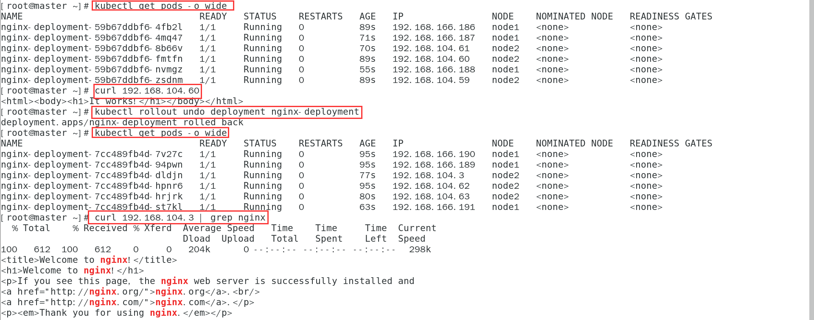

# Deployment

## 创建第一个deployment

写yaml文件（deployment的yaml文件较pod较为负载一些）

```
apiVersion: apps/v1
kind: Deployment
metadata:
  name: nginx-deployment		# deployment的名称
  labels:
    nginx: nginx			    # 标签用于选择节点使用 先确保节点有这个标签
spec:
  replicas: 3					# 副本数
  selector:  # 定义deployment如何找到要管理的pod与template的label标签相对应
    matchLabels:
      nginx: nginx
  template:
    metadata:
      labels:
        nginx: nginx  # nginx使用label（标签）标记pod
    spec:	# 表示pod运行一个名字为nginx-deployment的容器
      containers:
        - name: nginx-deployment
          image: nginx   # 使用的镜像
```

应用yaml文件

```
kubectl apply -f deploy.yaml
```

输出信息

```
deployment.apps/nginx-deployment created
```

查看创建的deployment

```
kubectl get deployments -o wide
```

输出信息

```
NAME               READY   UP-TO-DATE   AVAILABLE   AGE   CONTAINERS         IMAGES   SELECTOR
nginx-deployment   3/3     3            3           10m   nginx-deployment   nginx    nginx=nginx
```

查看创建的pod

```
kubectl get pods --show-labels
```

输出信息

```
nginx-deployment-76b9f6868b-chx2l   1/1     Running   0          13m   nginx=nginx,pod-template-hash=76b9f6868b
nginx-deployment-76b9f6868b-ggwdw   1/1     Running   0          13m   nginx=nginx,pod-template-hash=76b9f6868b
nginx-deployment-76b9f6868b-s66hn   1/1     Running   0          13m   nginx=nginx,pod-template-hash=76b9f6868b
```

## 更新deployment

一般对应用程序升级或者版本跌打时，会通过Deployment对pod进行滚动更新

并且仅当deployment的pod模板（即spec 或者 template）更改时 才会触发Deployment更新 例如更新label（标签）或者容器的image（镜像）

示例

修改镜像：

```
kubectl set image deployment nginx-deployment nginx-deployment=httpd --record
```

 set image  修改资源的镜像

deployment  指定资源的类型

nginx-deployment  资源的名字

nginx-deployment=httpd 修改资源的镜像=镜像名字  

--record  声明 加上 这一条的 更新记录可以被保存 如果更新有问题 可以进行回滚操作 如果不加 则无法进行回滚操作


输出信息

```
deployment.apps/nginx-deployment image updated
```

检查是否替换为httpd

访问其中一个pod的ip

```
curl 192.168.166.154
```

输出信息为典型的apache输出信息

```
<html><body><h1>It works!</h1></body></html>
```

### 第二种方法 edit

```
kubectl edit deployments.apps nginx-deployment
```

修改内容

```
    36     metadata:
     37       creationTimestamp: null
     38       labels:
     39         node: nginx
     40     spec:
     41       containers:
     42       - image: nginx  # 只修改这一处
     43         imagePullPolicy: Always
     44         name: nginx-deployment
     45         resources: {}

```

保存退出

输出信息

```
deployment.apps/nginx-deployment edited
```

然后再次访问其中一个pod的ip

```
curl 192.168.104.24
```

输出信息

```
<!DOCTYPE html>
<html>
<head>
<title>Welcome to nginx!</title>
<style>
    body {
        width: 35em;
        margin: 0 auto;
        font-family: Tahoma, Verdana, Arial, sans-serif;
    }
</style>
</head>
<body>
<h1>Welcome to nginx!</h1>
<p>If you see this page, the nginx web server is successfully installed and
working. Further configuration is required.</p>

<p>For online documentation and support please refer to
<a href="http://nginx.org/">nginx.org</a>.<br/>
Commercial support is available at
<a href="http://nginx.com/">nginx.com</a>.</p>

<p><em>Thank you for using nginx.</em></p>
</body>
</html>
```

为典型的nginx页面


### 查看这个Deployment的历史操作

```
kubectl rollout history deployment nginx-deployment
```

输出信息

```
deployment.apps/nginx-deployment 
REVISION  CHANGE-CAUSE
2         kubectl set image deployment nginx-deployment nginx-deployment=httpd --record=true
3         kubectl set image deployment nginx-deployment nginx-deployment=httpd --record=true
```

### 回滚Deployment

当新版本不稳定时，可以对其进行回滚操作，默认情况下，所有Deployment的rollout历史都保留在系统中，可以随时回滚

为了验证 我们再进行几次更新

```
kubectl set image deployment/nginx-deployment nginx-deployment=htppd
deployment.apps/nginx-deployment image updated
kubectl set image deployment/nginx-deployment nginx-deployment=nginx
deployment.apps/nginx-deployment image updated
```

查看部署历史

```
 kubectl rollout history deployment nginx-deployment
```

输出信息

```
deployment.apps/nginx-deployment 
REVISION  CHANGE-CAUSE
12        kubectl set image deployment nginx-deployment nginx-deployment=httpd --record=true
14        kubectl set image deployment nginx-deployment nginx-deployment=httpd --record=true
15        kubectl set image deployment nginx-deployment nginx-deployment=httpd --record=true
```

查看某次更新的详细信息 使用--revision指定版本号

指定的版本号必须是近两次的因为它只保留近两次的更新

例如

```
kubectl rollout history deployment/nginx-deployment  --revision=7
```

输出信息

```
deployment.apps/nginx-deployment with revision #7
Pod Template:
  Labels:	node=nginx
	pod-template-hash=7cc489fb4d
  Annotations:	kubernetes.io/change-cause: kubectl set image deployment nginx-deployment nginx-deployment=nginx --record=true
  Containers:
   nginx-deployment:
    Image:	nginx
    Port:	<none>
    Host Port:	<none>
    Environment:	<none>
    Mounts:	<none>
  Volumes:	<none>
```

所以现在的镜像应该为nginx

使用  回滚到上一个版本

```
kubectl rollout undo deployment nginx-deployment
```

输出信息

```
deployment.apps/nginx-deployment rolled back
```

验证



回退到指定版本

16为之前的版本（必须是可以查到的历史版本）

```
kubectl rollout undo deployment nginx-deployment --to-revision=16
```

然后访问pod测试

## 扩展Deployment

当公司访问量变大，三个Pod已无法支撑业务时，可以对其进行扩展

使用kubectl scale 动态调整Pod的副本数，比如增加Pod为5个

```
kubectl scale deployment nginx-deployment --replicas=10
```

输出信息

```
deployment.apps/nginx-deployment scaled
```

查看Pod 此时已经变成了10个

```
kubectl get pods -o wide
```

输出信息

```
NAME                                READY   STATUS    RESTARTS   AGE   IP                NODE    NOMINATED NODE   READINESS GATES
nginx-deployment-59b67ddbf6-24cfr   1/1     Running   0          53s   192.168.166.147   node1   <none>           <none>
nginx-deployment-59b67ddbf6-2vt7d   1/1     Running   0          22h   192.168.166.144   node1   <none>           <none>
nginx-deployment-59b67ddbf6-85rlx   1/1     Running   0          22h   192.168.104.12    node2   <none>           <none>
nginx-deployment-59b67ddbf6-dwgfk   1/1     Running   0          22h   192.168.166.140   node1   <none>           <none>
nginx-deployment-59b67ddbf6-f94lr   1/1     Running   0          53s   192.168.166.146   node1   <none>           <none>
nginx-deployment-59b67ddbf6-hb94x   1/1     Running   0          53s   192.168.104.18    node2   <none>           <none>
nginx-deployment-59b67ddbf6-ntbb9   1/1     Running   0          22h   192.168.104.20    node2   <none>           <none>
nginx-deployment-59b67ddbf6-rhncv   1/1     Running   0          22h   192.168.166.141   node1   <none>           <none>
nginx-deployment-59b67ddbf6-tdvgt   1/1     Running   0          53s   192.168.104.19    node2   <none>           <none>
nginx-deployment-59b67ddbf6-v5p5t   1/1     Running   0          22h   192.168.104.10    node2   <none>           <none>
```


## 暂停和恢复Deployment更新

deployment支持暂停更新，用于对Deployment进行多次修改操作

使用kubectl rollout pause 暂停对Deployment更新

设置了暂停更新后  执行的更新操作则不生效 

恢复了deployment更新后 执行的更新操作生效

```
kubectl rollout pause deployment nginx-deployment
```

输出信息

```
deployment.apps/nginx-deployment paused
```

对其进行更新操作验证

```
kubectl set image deployment nginx-deployment nginx-deployment=httpd --record
```

无输出信息

查看更新历史

```
kubectl rollout history deployment nginx-deployment
```

输出信息

```
deployment.apps/nginx-deployment 
REVISION  CHANGE-CAUSE
3         kubectl set image deployment nginx-deployment nginx-deployment=nginx --record=true
4         kubectl set image deployment nginx-deployment nginx-deployment=httpd --record=true
```

可以看到更新被记录

访问pod验证

```
curl 192.168.104.29
```

输出信息依然是nginx 可以看到并没有更新

```
<html><body><h1>It works!</h1></body></html>
```

### 通过kubectl rollout resume恢复deployment更新

```
kubectl rollout resume deployment nginx-deployment 
```

输出信息

```
deployment.apps/nginx-deployment resumed
```

可以看到恢复更新的deployment创建了一个新的rs（复制集）

```
NAME                          DESIRED   CURRENT   READY   AGE
nginx-deployment-59b67ddbf6   6         6         6       13m
nginx-deployment-7cc489fb4d   0         0         0       14m
```

查看deployment的详细信息可以看到image已经变成了httpd（即暂停更新中的过程的那次更新）

```
kubectl describe deployments.apps nginx-deployment
```

输出信息 18行为image（镜像）

```
Name:                   nginx-deployment
Namespace:              default
CreationTimestamp:      Mon, 28 Oct 2019 18:06:31 +0800
Labels:                 node=nginx
Annotations:            deployment.kubernetes.io/revision: 4
                        kubectl.kubernetes.io/last-applied-configuration:
                          {"apiVersion":"apps/v1","kind":"Deployment","metadata":{"annotations":{},"labels":{"node":"nginx"},"name":"nginx-deployment","namespace":"...
                        kubernetes.io/change-cause: kubectl set image deployment nginx-deployment nginx-deployment=httpd --record=true
Selector:               node=nginx
Replicas:               6 desired | 6 updated | 6 total | 6 available | 0 unavailable
StrategyType:           RollingUpdate
MinReadySeconds:        0
RollingUpdateStrategy:  25% max unavailable, 25% max surge
Pod Template:
  Labels:  node=nginx
  Containers:
   nginx-deployment:
    Image:        httpd
    Port:         <none>
    Host Port:    <none>
    Environment:  <none>
    Mounts:       <none>
  Volumes:        <none>
Conditions:
  Type           Status  Reason
  ----           ------  ------
  Available      True    MinimumReplicasAvailable
  Progressing    True    NewReplicaSetAvailable
OldReplicaSets:  <none>
NewReplicaSet:   nginx-deployment-59b67ddbf6 (6/6 replicas created)
Events:
  Type    Reason             Age                 From                   Message
  ----    ------             ----                ----                   -------
  Normal  ScalingReplicaSet  16m                 deployment-controller  Scaled up replica set nginx-deployment-7cc489fb4d to 6
  Normal  ScalingReplicaSet  14m                 deployment-controller  Scaled up replica set nginx-deployment-59b67ddbf6 to 2
  Normal  ScalingReplicaSet  14m                 deployment-controller  Scaled down replica set nginx-deployment-7cc489fb4d to 5
  Normal  ScalingReplicaSet  14m                 deployment-controller  Scaled up replica set nginx-deployment-59b67ddbf6 to 3
  Normal  ScalingReplicaSet  14m                 deployment-controller  Scaled down replica set nginx-deployment-7cc489fb4d to 4
  Normal  ScalingReplicaSet  14m                 deployment-controller  Scaled up replica set nginx-deployment-59b67ddbf6 to 4
  Normal  ScalingReplicaSet  14m                 deployment-controller  Scaled down replica set nginx-deployment-7cc489fb4d to 3
  Normal  ScalingReplicaSet  14m                 deployment-controller  Scaled up replica set nginx-deployment-59b67ddbf6 to 5
  Normal  ScalingReplicaSet  14m                 deployment-controller  Scaled down replica set nginx-deployment-7cc489fb4d to 2
  Normal  ScalingReplicaSet  10m (x17 over 14m)  deployment-controller  (combined from similar events): Scaled up replica set nginx-deployment-59b67ddbf6 to 3
```

访问pod还是nginx（不知道为什么）

然后我又设置镜像为httpd 然后没有变化

再次设置为nginx时pod发生重启 

然后访问pod 为nginx

### 更新pod时的注意事项

1. 清理策略：再默认情况下，revision保留10个旧的ReplicaSet，其余的将在后台进行垃圾回收，可以在.spec.revisionHistoryLimit设置保留RelicaSet的个数，当设置为0时 不保留历史记录
2. 更新策略：
   - .spec.strategy.type==Recreate,表示重建，先删掉旧的Pod
   - .spec.startegy.type==RollingUpdate，表示滚动更新，可以指定maxUnavailable和maxSurge来控制滚动更新过程
     - .spec.strategy.rolloutingUpdate.maxUnavailable,指定在回滚更新时最大不可用的Pod数量，可选字段，默认为25%，可以设置为数字或百分比，如果maxSurge为0，则该值不能为0
     - .spec.strategy.rollingUpdate.maxSurge可以超过期望值的最大Pod数，可选字段，默认为25%,可以设置成数字或百分比，如果maxUnavailable为0，则该值不能为0
   - Ready策略：.spec.minReadySeconds是可选参数，指定新创建的Pod应该在没有任何容器崩溃的情况下为Ready（就绪）状态的最小秒数，默认为0，即一旦被创建就视为可用，通常和容器探针连用