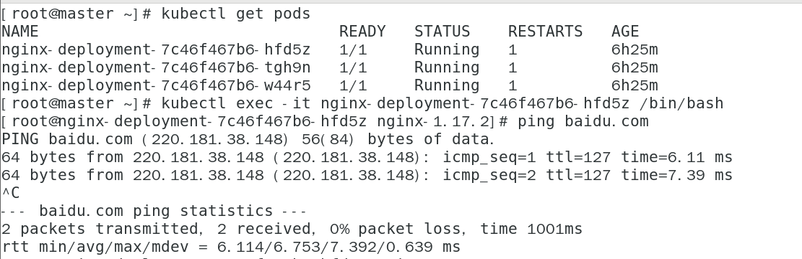

# kubernetes

本文档是kubernetes1.16.1二进制安装的第九篇

## 注意 本文所有操作均在master节点执行

### [上一篇 部署工作节点](https://github.com/mytting/kubernetes/blob/master/%E4%BA%8C%E8%BF%9B%E5%88%B6%E5%AE%89%E8%A3%851.16.1/v1.16.1-H%20%E9%83%A8%E7%BD%B2%E5%B7%A5%E4%BD%9C%E8%8A%82%E7%82%B9.md)

本文主要介绍部署网络 dns 插件

本文的网络插件选用的是calico 以容器的方式运行
本文的dns'插件选用的是coredns以容器的方式运行

本文所有操作均在master主节点上执行

## 1 下载calico网络插件的yaml文件

1.16版本的kubernetes calico网络插件应选用3.9及以上的版本

本文选用3.10

```
curl https://docs.projectcalico.org/v3.10/manifests/calico.yaml -O
```

## 2  修改网络插件yaml文件内容

```
sed -i 's|192.168.0.0|10.244.0.0|' calico.yaml
```

## 3 应用yaml文件

```
kubectl apply -f calico.yaml
```

查看pod状态

```
kubectl get pods -n kube-system
```

输出信息

```
NAME                                       READY   STATUS    RESTARTS   AGE
calico-kube-controllers-6d85fdfbd8-8v2hs   1/1     Running   0          7m40s
calico-node-984fd                          1/1     Running   0          7m40s
calico-node-n5kn8                          1/1     Running   0          7m40s
calico-node-q4p7c                          1/1     Running   0          7m40s
```

网络插件安装成功

## 安装coredns插件

克隆GitHub仓库

```
git clone https://github.com/coredns/deployment.git
```

执行

```
cd deployment/kubernetes/
```

```
./deploy.sh -i 10.250.0.10 | kubectl apply -f -
```

ip为开头写的集群dns的IP

输出信息

```
./deploy.sh:行37: jq: 未找到命令
./deploy.sh:行69: jq: 未找到命令
serviceaccount/coredns created
clusterrole.rbac.authorization.k8s.io/system:coredns created
clusterrolebinding.rbac.authorization.k8s.io/system:coredns created
configmap/coredns created
deployment.apps/coredns created
service/kube-dns created
```

报错忽略

查看pod

```
kubectl get pods -n kube-system
```

输出信息

```
NAME                                       READY   STATUS    RESTARTS   AGE
calico-kube-controllers-6d85fdfbd8-8v2hs   1/1     Running   0          91m
calico-node-984fd                          1/1     Running   0          91m
calico-node-n5kn8                          1/1     Running   0          91m
calico-node-q4p7c                          1/1     Running   0          91m
coredns-68567cdb47-6j7bb                   1/1     Running   0          5m31s
coredns-68567cdb47-7nwcg                   1/1     Running   0          5m31s
```

可以看到calico网络和coredns插件都好了


### 验证

进入pod内部 pingbaidu.com

如果能ping同 则插件部署完毕



# 集群部署完毕

